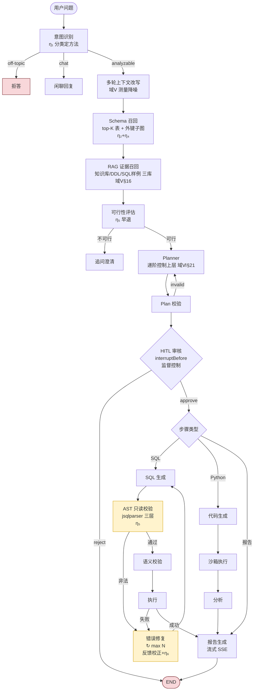

中文 | English (TODO)

# Spring AI Alibaba Graph 问数 Agent 落地实施计划

> 本文是 [`NL2SQL_AGENT_CYBERNETICS.md`](./NL2SQL_AGENT_CYBERNETICS.md)「为什么这样选」的**可执行续篇**：把控制论蓝图落到具体的节点、状态、循环边、里程碑与验收度量上。
>
> 资料来源：[`docs/research/`](../research/) 8 张源码级参考卡片 + 当前 DataAgent 的 StateGraph 实现（见 [`ARCHITECTURE.md`](../ARCHITECTURE.md)）。
>
> 一条总原则：**抄设计（机制），不抄代码（语言）**。8 个参考项目多为 Python，但其机制几乎都可在 Java + Spring AI Alibaba Graph 上等价复刻。

---

## 目录

- [0. 定位与范围](#0-定位与范围)
- [1. 技术栈决策](#1-技术栈决策)
- [2. 节点拓扑](#2-节点拓扑)
- [3. 关键能力实施（抄谁 + 怎么做）](#3-关键能力实施抄谁--怎么做)
- [4. 实施顺序（里程碑）](#4-实施顺序里程碑)
- [5. 评测（η₇）](#5-评测η₇)
- [6. 风险与置信度](#6-风险与置信度)

---

## 0. 定位与范围

**这是什么**：在当前 DataAgent（Java 17 / Spring AI Alibaba Graph，已有 StateGraph + HITL + Python 分析 + MCP）之上，**增量**构建生产级问数 Agent 的实施计划。

**这不是什么**：不是从零重写。DataAgent 已是 9 项目中最完整的路线②实现——本计划只补「生产硬门槛」与「自适应能力」两块短板（控制论 η₅ 排序结论）。

**两条原则**：
1. **先稳后优（η₅）**：M1 安全/稳定性 > M2 召回精度 > M3 自适应 > M4 生产化。绝不先调精度再补安全。
2. **抄设计不抄代码**：见 §1.2 对照表。

---

## 1. 技术栈决策

### 1.1 为什么 Spring AI Alibaba Graph（η₁ 推导）

问数流程**固定**（意图→检索→生成→执行→报告），非开放探索 → 确定性编排优于 LLM 自主 tool calling。Spring AI Alibaba Graph 提供：

| 能力 | 控制论对应 | 路线①开环 agent 是否具备 |
| :--- | :--- | :--- |
| `StateGraph` + 条件边 | 有限自动机（域Ⅵ§17） | ❌ |
| `interruptBefore` | 监督控制（HITL） | ❌ |
| 状态快照恢复 | 可恢复执行 | ❌ |
| 循环边 + State 字段 | 误差反馈闭环（域Ⅲ） | 仅隐式 |
| 节点级 Observability | η₇ 可验证 | ❌ |

### 1.2 抄设计不抄代码（Python → Java / Spring AI 等价表）

| 参考项目（Python） | 机制 | Java / Spring AI 等价复刻 |
| :--- | :--- | :--- |
| SQLBot `check_sql_read()`（sqlglot） | AST 只读三层校验 | **`jsqlparser`**：`CCJSqlParserUtil.parse` + `StatementVisitor` 判节点类型 + 自定义函数黑名单 |
| QueryWeaver `heal_and_execute` | 自愈×3 + attempts 累积错误 | **StateGraph 循环边** + `State.attempts` 字段，循环内把新错误追加进 messages |
| QueryWeaver FalkorDB | 表/列双向量 + FK 邻域 + 桥接表 | **Spring AI VectorStore**（表/列双索引）+ 外键关系子图（Neo4j 或内存图）+ shortest-path 找桥接表 |
| vanna ChromaDB 三库 | question/sql/ddl/docs 分库 | **Spring AI VectorStore × 多 collection**（`sql_examples` / `ddl` / `docs`） |
| SQLBot `row_permission` | LLM 改写 row filter + 系统变量 | 语言无关：prompt 注入权限上下文 + AST 改写 WHERE |
| SQLBot g2-ssr | LLM 产配置 JSON，独立服务渲染 | 保留 g2-ssr Node 微服务（语言无关），或前端 ECharts 直渲染 |
| LangSmith trace | 全链路 trace | **Spring AI Observability** + OTel / Langfuse（DataAgent 已接） |

---

## 2. 节点拓扑

### 2.1 完整 StateGraph（控制论标注 + 重试回环）



> **图例**：黄=重试/校验节点，红=终态。`HEAL → SQLGEN` 是误差反馈闭环（带 `attempts ≤ N` 抗饱和）。`interruptBefore` 在 HITL 处冻结图。

### 2.2 节点清单（职责 / 状态键 / 抄谁 / 依据）

| 节点 | 职责 | 关键 State 键 | 抄谁 | 控制论依据 |
| :--- | :--- | :--- | :--- | :--- |
| 意图识别 | 分类 闲聊/可分析/不可行 | `intent` | — | η₁ |
| 上下文改写 | 多轮指代消解 | `rewritten_query` | langchain-sql-guide（记忆） | 域Ⅴ 降噪 |
| Schema 召回 | top-K 表 + 外键子图 | `schema_tables`,`fk_subgraph` | **QueryWeaver** | η₂+η₄ |
| RAG 证据召回 | 知识库/DDL/SQL 样例 | `evidence` | **vanna**（三库） | 域Ⅴ§16 |
| 可行性评估 | 早退判定 | `feasible` | — | η₅ |
| Planner | 生成步骤计划 | `plan` | QueryWeaver（多步计划） | 域Ⅵ§21 |
| Plan 校验 | 计划合法性 | — | — | 闭环校正 |
| HITL 审核 | 人在回路 | `human_feedback` | —（已有） | 监督控制 |
| SQL 生成 | NL→SQL | `sql` | vanna（few-shot） | — |
| **AST 只读校验** | 三层防御 | — | **SQLBot** | η₅ |
| 语义校验 | SQL 是否回答了问题 | — | — | 控制精度 |
| 执行 | 跑 SQL | `result` | — | — |
| **错误修复** | 自愈重写 | `attempts`,`errors` | **QueryWeaver** | 域Ⅲ+η₆ |
| 代码生成 / 沙箱 / 分析 | Python 深度分析 | — | —（已有） | 容错（域Ⅵ§19） |
| 报告生成 | 流式 SSE | `report` | SQLBot（g2-ssr 配置） | — |

> 加粗 = 本计划**新增 / 重点补强**的节点。

### 2.3 共享状态空间（KeyStrategy）

```java
// 关键 State 字段（在已有基础上，本计划新增）
StateKey<Integer> ATTEMPTS;    // 自愈重试计数（抗饱和）
StateKey<List<String>> ERRORS; // 累积错误（自愈用，借鉴 QueryWeaver）
StateKey<String> SQL_HASH;     // 成功 SQL 指纹（训练库反哺去重用）
StateKey<RowPerm> ROW_PERM;    // 行级权限上下文
```

---

## 3. 关键能力实施（抄谁 + 怎么做）

### 3.1 SQL 安全护栏 ← SQLBot（M1，最高优先）

**抄**：`check_sql_read()` 三层防御 + 表名白名单。
**怎么做（Java）**：

```java
// 伪代码：用 jsqlparser 复刻三层
Statement stmt = CCJSqlParserUtil.parse(sql);
// ① 首词白名单：只允许 Select / CreateTableAs / ...
// ② 危险模式正则：DANGEROUS_PATTERNS（pg_sleep, xp_cmdshell...）
// ③ AST 节点类型：拦截 Insert/Update/Delete/Drop/Merge/Truncate
//    + Anonymous 函数名比对 DS_SPECIFIC_DANGEROUS_FUNCTIONS（按方言）
// 表名白名单：AST 重解析真实表名 ⊆ schema_tables，不信 LLM 自报
TablesNamesFinder finder = new TablesNamesFinder();
List<String> realTables = finder.getTableList(stmt);
if (!schemaTables.containsAll(realTables)) throw new IllegalSqlException();
```

**抄源**：[sqlbot.md](../research/sqlbot.md) `check_sql_read()` L777-842 / `extract_tables_from_sql()` L71。

### 3.2 自愈重试闭环 ← QueryWeaver（M1）

**抄**：`heal_and_execute` ×3，循环内累积错误。
**怎么做（StateGraph）**：SQL 执行失败 → 条件边跳「错误修复」→ 把新 error 追加进 `ERRORS` + `ATTEMPTS++` → 回 `SQL 生成`。`ATTEMPTS >= maxSqlRetry` 则终止返回 `final_error`。每轮独立 trace，便于归因。
**抄源**：[queryweaver.md](../research/queryweaver.md) `heal_and_execute`。

### 3.3 Schema 召回 ← QueryWeaver FalkorDB（M2）

**抄**：表/列双向量 + FK 邻域 + `allShortestPaths` 找桥接表。
**怎么做**：表名/列名/注释分别建 Spring AI VectorStore 索引；召回 top-K 后，用外键关系子图扩展（FK 邻域 + ≤6 跳桥接表）。**只把相关表 DDL 注入 prompt**，不塞全量。
**抄源**：[queryweaver.md](../research/queryweaver.md) §图检索 schema。

### 3.4 SQL 样例训练库 ← vanna（M3，最大收益）

**抄**：三库训练反哺。
**怎么做**：新增 `sql_examples(question, sql, agent_id, dialect)` 表 + 向量索引；执行成功的 SQL 反哺入库（按 `SQL_HASH` 去重）；查询时作为第三路召回注入 few-shot。**这是让系统越用越准的关键（域Ⅴ§16 在线辨识）**。
**抄源**：[vanna.md](../research/vanna.md) `train()` / 三库 collection。

### 3.5 行级权限 ← SQLBot（M4）

**抄**：LLM 改写 row filter + 系统变量注入 + 防注入。
**怎么做**：根据 `ROW_PERM`（用户/租户维度）在 AST 层注入 WHERE 条件，改写产物仍过 §3.1 只读校验。多租户硬门槛。
**抄源**：[sqlbot.md](../research/sqlbot.md) `transFilterTree()` / `build_table_filter()`。

### 3.6 HITL（已有，保留）

DataAgent 已用 `interruptBefore` + `updateState` 实现监督控制，无需改动。破坏性操作（若放开 DML）应转 HITL 二次确认（借鉴 QueryWeaver）。

### 3.7 图表渲染 ← SQLBot g2-ssr（M4）

**抄**：LLM 只产图表配置 JSON，渲染下沉独立服务。
**怎么做**：保留/引入 g2-ssr Node 微服务（语言无关），或前端 ECharts 直接渲染 JSON 配置。避免 LLM 生成完整图表代码。

### 3.8 可观测 ← DataAgent 已有 + LangSmith 思路

Spring AI Observability + Langfuse 节点级 trace（已接）。补：把 `attempts`/`errors`/`schema_tables` 作为 trace 字段，便于归因（借鉴 text-to-sql-agent 的 LangSmith 全链路 trace）。

---

## 4. 实施顺序（里程碑，按 η₅ 先稳后优）

| 里程碑 | 能力 | 抄谁 | 验收度量（η₇） | 工期估 |
| :--- | :--- | :--- | :--- | :--- |
| **M0 基线** | 当前 DataAgent | — | 已具备 StateGraph+HITL+Python+MCP | ✅ |
| **M1 稳定性硬门槛** | AST 只读护栏 + 表名白名单 + 自愈闭环 + 全局有界（重试/超时/行数/成本） | SQLBot + QueryWeaver | 危险 SQL 100% 拦截；自愈成功率↑；零发散（无超时/死循环） | 🔴 大 |
| **M2 召回精度** | Schema 图召回 + 外键子图 | QueryWeaver | 多表 JOIN 场景召回 F1↑；token 预算↓ | 🟡 中 |
| **M3 自适应** | SQL 样例训练库（三库反哺） | vanna | 同题二次命中率↑；准确率随样本单调上升 | 🟡 中（收益最大） |
| **M4 生产化** | 行级权限 + 图表渲染下沉 + trace 字段补全 | SQLBot + QueryWeaver | 多租户隔离通过；图表渲染稳定；trace 可归因 | 🟡 中 |

> **顺序不可乱**：M1 必须先于 M2/M3。没有安全护栏的自愈 = 让 LLM 反复改 SQL 去打生产库（违反 η₅）。

---

## 5. 评测（η₇）

**没有评测集，就不要做 M2/M3 的调优**（盲调）。建议建立：

| 维度 | 度量 | 对应里程碑 |
| :--- | :--- | :--- |
| 执行成功率 | 生成 SQL 能否执行通过 | M1 |
| 安全性 | 危险 SQL 拦截率（红队用例集） | M1 |
| 终止性 | 有限步收敛、无死循环/超时 | M1 |
| 召回 F1 | schema 召回相关表的比例（人工标注集） | M2 |
| 语义正确率 | 结果是否回答了问题（人工标注集） | M2/M3 |
| 自适应增益 | 同题二次命中率随样本量曲线 | M3 |
| 成本 | 平均 token / 耗时 | 全程 |

---

## 6. 风险与置信度

| 项 | 风险 | 置信度 | 缓解 |
| :--- | :--- | :--- | :--- |
| `jsqlparser` 对 7 方言的覆盖 | 中（部分方言 AST 不全） | Medium | 方言不全时降级到正则黑名单兜底 |
| FalkorDB 图检索的运维成本 | 中（多一个图依赖） | Medium | 先用内存图/外键子图，量大了再上 Neo4j |
| 训练库数据治理 | 中（脏 SQL 反哺会污染） | High | 只反哺执行成功 + 人工审核开关；按 `SQL_HASH` 去重 |
| 行权限改写的正确性 | 高（改错=越权） | Medium | 改写产物过只读校验 + 集成测试覆盖多租户用例 |
| pgai 停维影响 | — | High | 不纳入选型（仅借鉴 semantic catalog 思路到应用层） |

---

> **结语**：本计划把控制论蓝图（η₁ 分类 → η₅ 先稳 → η₄ 主导 → η₆ 有界 → η₇ 可验证）落成了 M1→M4 的可执行顺序。**M1 三件套（AST 护栏 / 自愈 / 有界）是生产硬门槛，优先于一切精度优化**；M3 训练库是相对各竞品最大的差异化收益。每个里程碑都用评测度量验收，拒绝盲调。
>
> 控制论推导见 [NL2SQL_AGENT_CYBERNETICS.md](./NL2SQL_AGENT_CYBERNETICS.md)；源码细节见 [`docs/research/`](../research/)。
