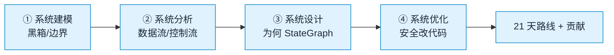

中文 | English (TODO)

# 工程化系统思维入门与二次开发指南

> 本文面向**第一次接触这个项目的新手**，目标有两个：
>
> 1. 用**工程化、系统化**的思维方式看懂 DataAgent 这个项目，把“一团代码”变成“一个可控的系统”；
> 2. 在看懂之后，知道**从哪里下手继续开发**，并且改得安全、改得专业。
>
> 本文的讲解主线借鉴了钱学森《工程控制论》的核心方法论：**系统建模 → 系统分析 → 系统设计 → 系统优化**，并强调三条工程铁律——**稳定性第一、分类定方法、反馈闭环**。这套思维不只适用于控制工程，同样是读懂和改造任何复杂软件系统的通用心智模型。

---

## 目录

- [0. 先建立心智：什么是“工程化系统思维”](#0-先建立心智什么是工程化系统思维)
- [1. 系统建模：把项目看成一个“黑箱”](#1-系统建模把项目看成一个黑箱)
- [2. 系统分析：拆开黑箱，看清数据流与控制流](#2-系统分析拆开黑箱看清数据流与控制流)
- [3. 系统设计：为什么它长这个样子](#3-系统设计为什么它长这个样子)
- [4. 系统优化：如何安全地继续开发](#4-系统优化如何安全地继续开发)
- [5. 新手阅读路线图（21 天）](#5-新手阅读路线图21-天)
- [6. 二次开发实战清单](#6-二次开发实战清单)
- [7. 工程准则与常见陷阱](#7-工程准则与常见陷阱)
- [8. 附录：术语表与速查](#8-附录术语表与速查)

---

## 0. 先建立心智：什么是“工程化系统思维”

很多新手读代码的方式是“打开一个文件，从第一行往下看”。这就像想了解一辆汽车，却从一颗螺丝开始研究。**工程化系统思维**要求你反过来：先看整体，再看局部；先看目的，再看实现；先看稳定，再看性能。

工程控制论给了一套非常好用的四步法，我们把它们“翻译”成软件工程语言：

| 工程控制论步骤 | 控制工程含义 | 在本项目里你要做的事 |
| :--- | :--- | :--- |
| **① 系统建模** | 确定系统的输入、输出、边界、组成环节 | 搞清楚 DataAgent 接收什么、产出什么、由哪些子系统组成 |
| **② 系统分析** | 研究状态的运动规律（信号怎么流动） | 搞清楚一个用户问题在代码里走了哪条路径 |
| **③ 系统设计** | 改变运动规律的方法（综合/校正） | 理解为什么用 StateGraph、为什么分层、为什么有反馈 |
| **④ 系统优化** | 在稳定前提下追求更优性能 | 知道哪些参数可调、哪些模块可换、怎么改才不翻车 |

贯穿这四步的三条铁律：

1. **稳定性第一**：一个会“发散”（死循环、无限重试、崩溃）的系统，性能再好也没用。DataAgent 里到处是“重试次数上限”“可行性判断”“语义一致性校验”，这些都是为了保证系统**收敛**。
2. **分类定方法**：先判断你在处理的是哪一类问题（线性/非线性、确定/随机），再选工具。在软件里就是先判断“这是配置问题、还是逻辑问题、还是数据问题”，再决定怎么改。
3. **反馈闭环**：任何需要“自我修正”的能力，都必须有反馈回路。DataAgent 的 SQL 失败重试、Python 失败重试、人工反馈，都是反馈闭环。

> 把这三条记住，你后面看任何模块都会有一个“坐标系”。

### 0.1 学习路线一眼看懂



> 更细的实现级图解见 [`SYSTEM_DESIGN_TOP_DOWN.md`](./SYSTEM_DESIGN_TOP_DOWN.md)。


---

## 1. 系统建模：把项目看成一个“黑箱”

建模的第一步不是看代码，而是问三个问题：**它处理什么输入？它产出什么输出？它的边界在哪里？**

### 1.1 一句话定义系统

> **DataAgent 是一个“自然语言 → 数据洞察”的转换系统。**

用户说一句话（“上个月销售额最高的三个品类是什么？”），系统去查数据库，必要时跑 Python 做统计分析，最后给出带图表的报告。

### 1.2 输入 / 输出 / 边界

```
                  ┌─────────────────────────────────────────────┐
   输入(被控量)   │                                             │
  自然语言问题 ──▶│              DataAgent 系统                  │──▶ 输出(响应)
  多轮对话上下文 │   (StateGraph 工作流 + 管理后台 + 前端)       │   SQL 结果 / 分析 / 报告
  人工反馈     ──▶│                                             │──▶ SSE 流式 token
                  └─────────────────────────────────────────────┘
                       ▲           ▲            ▲
                       │           │            │
                  业务数据库    向量库(RAG)    LLM(大模型)      ← 外部依赖(环境)
                  管理数据库    Python执行器   Langfuse(监控)
```

**边界（boundary）** 是工程思维里极重要的概念：边界之外的东西，系统**假设**它是什么样，但不负责控制它。DataAgent 假设：

- LLM 会返回符合格式的结果（所以需要“语义一致性校验”来兜底）；
- 业务数据库是可连、可读的（所以数据源配置错了，流程会在早期失败）；
- 向量库里召回的内容是相关的（所以有相似度阈值）。

> **新手第一课**：遇到 bug，先判断它发生在边界**之内**还是**之外**。LLM 返回乱码是边界外不可控，但系统没做校验导致崩溃，是边界内设计缺失——后者才是你要修的。

### 1.3 三大子系统

项目根目录有三个一级模块，这就是系统的物理分解：

| 目录 | 角色 | 技术栈 |
| :--- | :--- | :--- |
| `data-agent-management/` | **后端（大脑）**：StateGraph 工作流、API、配置管理 | Java 17、Spring Boot 3.4、Spring AI Alibaba 1.1 |
| `data-agent-frontend-nuxt/` | **前端（脸面）**：用户交互、流式展示、配置后台 | Nuxt 4、Vue 3、Vuetify 3、Pinia |
| `docker-file/` | **部署（躯壳）**：容器化、依赖编排 | Docker、docker-compose |

这对应工程控制论里的**分层**思想：前端是“人机接口层”，后端是“控制运算层”，部署是“执行与环境层”。各层只通过明确约定的接口通信（REST + SSE），不互相越界。

> 详细的环境搭建与启动顺序，见 [`QUICK_START.md`](./QUICK_START.md)。

---

## 2. 系统分析：拆开黑箱，看清数据流与控制流

建模之后，要分析“一个信号在系统里怎么流动”。这是读懂项目的**关键一步**，建议你反复看这一节。

### 2.1 两条流：数据流 vs 控制流

软件系统里永远有两条流，分清它们你就不晕了：

- **数据流**：一个用户问题（字符串）经过哪些加工，变成最终结果。
- **控制流**：谁决定下一步走哪个节点（成功走 A、失败走 B、重试走 C）。

DataAgent 用 **StateGraph（状态图）** 把这两条流统一在一起：**节点（Node）处理数据，调度器（Dispatcher）做控制决策，共享状态（State）在节点间传递数据。**

### 2.2 StateGraph：系统的“被控对象”

StateGraph 是整个后端的心脏。它由 **16 个节点**和若干**条件边**组成，定义在 `DataAgentConfiguration.java` 里：

```java
// 文件: data-agent-management/src/main/java/com/alibaba/cloud/ai/dataagent/config/DataAgentConfiguration.java
StateGraph stateGraph = new StateGraph(NL2SQL_GRAPH_NAME, keyStrategyFactory)
    .addNode(INTENT_RECOGNITION_NODE, ...)   // 意图识别
    .addNode(EVIDENCE_RECALL_NODE, ...)      // 证据召回(RAG)
    .addNode(QUERY_ENHANCE_NODE, ...)        // 查询重写
    .addNode(SCHEMA_RECALL_NODE, ...)        // schema 召回
    .addNode(TABLE_RELATION_NODE, ...)       // 表关系
    .addNode(FEASIBILITY_ASSESSMENT_NODE, ...)// 可行性判断
    .addNode(SQL_GENERATE_NODE, ...)         // SQL 生成
    .addNode(PLANNER_NODE, ...)              // 计划生成
    .addNode(PLAN_EXECUTOR_NODE, ...)        // 计划执行/校验
    .addNode(SQL_EXECUTE_NODE, ...)          // SQL 执行
    .addNode(PYTHON_GENERATE_NODE, ...)      // Python 代码生成
    .addNode(PYTHON_EXECUTE_NODE, ...)       // Python 执行
    .addNode(PYTHON_ANALYZE_NODE, ...)       // Python 结果分析
    .addNode(REPORT_GENERATOR_NODE, ...)     // 报告生成
    .addNode(SEMANTIC_CONSISTENCY_NODE, ...) // 语义一致性校验
    .addNode(HUMAN_FEEDBACK_NODE, ...);      // 人工反馈
```

**用工程控制论的眼光看，每个节点就是一个“环节”（传递函数），Dispatcher 就是“比较器/决策器”，整张图就是一个带反馈的控制系统。** 这种视角的好处是：你可以套用控制论的稳定性、反馈、鲁棒性概念来理解代码里的设计。

### 2.3 主流程：一个问题的一生

下面这张图（节选自 [`ARCHITECTURE.md`](./ARCHITECTURE.md)）就是一个问题从输入到输出的完整生命周期。**这是本项目最重要的一张图，新手务必看懂每一框。**

```
Start
  │
  ▼
意图识别 ──no──▶ End (闲聊/无需分析)
  │yes
  ▼
证据召回(RAG) ──▶ 查询重写 ──▶ schema 召回 ──▶ 表关系 ──┐
   ▲                                               │ 关系不对? 重试
   └───────────────────────────────────────────────┘
                          │
                          ▼
                    可行性判断 ──no──▶ End (回答不了)
                          │yes
                          ▼
                    计划生成(Planner)
                          │
                          ▼
                  计划校验 ──invalid──▶ 回到计划生成
                          │
                    ┌─────┴─────┐  人工反馈开关
                    ▼           │
               人工审核        │   reject ▶ 回到计划生成
                    │approve    │
                    ▼           │
              ┌─ 选择下一步 ──┘
              │     │
   ┌──────────┤     └──────────┐
   ▼          ▼                 ▼
 SQL步骤   Python步骤        报告步骤
   │          │                 │
 生成▶校验▶执行  生成▶执行▶分析     生成报告
 失败重试      失败重试            │
   │          │                 ▼
   └────选择下一步 ◀────────────┘
                │
                ▼
               End
```

**用控制论读这张图，你会看到 4 类“反馈回路”：**

| 回路 | 作用 | 控制论对应 |
| :--- | :--- | :--- |
| **表关系重试** | `TableRelationNode` 关系不对 → 回到自己 | 局部闭环校正 |
| **SQL 生成-执行重试** | 执行失败/语义不一致 → 回到 `SqlGenerateNode` | 带误差反馈的闭环，重试次数有上限（抗饱和） |
| **Python 重试** | 执行失败 → 回到 `PythonGenerateNode` | 同上 |
| **人工反馈** | 计划生成后暂停，等人 approve/reject | 人在回路（human-in-the-loop）闭环 |

> **关键观察**：所有重试都有**次数上限**（见 `application.yml` 的 `max-sql-retry-count` 等）。这不是随便写的数字，而是工程控制论里的**抗饱和（anti-windup）**——没有上限的重试会让系统发散，有上限才能保证“要么成功，要么体面地失败”。

### 2.4 共享状态：节点之间怎么传数据

节点之间不直接互相调用，而是读写一个**共享状态字典**。每个 key 的合并策略在 `DataAgentConfiguration` 的 `keyStrategyFactory` 里声明，绝大多数是 `KeyStrategy.REPLACE`（后写覆盖前写）：

```java
keyStrategyHashMap.put(INPUT_KEY, KeyStrategy.REPLACE);            // 用户输入
keyStrategyHashMap.put(EVIDENCE, KeyStrategy.REPLACE);             // RAG 证据
keyStrategyHashMap.put(SQL_GENERATE_OUTPUT, KeyStrategy.REPLACE);  // 生成的 SQL
keyStrategyHashMap.put(SQL_GENERATE_COUNT, KeyStrategy.REPLACE);   // 重试计数器
// ... 共 40+ 个 key
```

**这是非常重要的一条工程经验**：用共享状态解耦节点，节点就可以单独测试、单独替换、单独重排。这就像控制工程里用“状态空间”表示系统——每个状态变量独立可观测。

### 2.5 控制器入口：一个请求从 API 到图

前端发来的请求从 REST/SSE 进入，路径是：

```
前端 (axios/SSE)
  → GraphController (controller/)
    → GraphServiceImpl (service/graph/)
      → MultiTurnContextManager (拼多轮上下文)
        → CompiledGraph.fluxStream (驱动 StateGraph)
          → 各节点依次执行
```

`GraphServiceImpl` 是“总调度”，负责把 HTTP 请求翻译成图的输入、把图的输出流式吐回前端。人工反馈的“暂停-恢复”也是在这里用 `interruptBefore(HUMAN_FEEDBACK_NODE)` + `threadId` 实现的。

### 2.6 外部依赖：系统与环境的接口

DataAgent 不是孤立运行的，它依赖 6 类外部系统，每一类都被**抽象成接口**，方便替换（这叫“依赖倒置”，是工程化的基本功）：

| 外部系统 | 抽象/接口 | 默认实现 | 可替换为 |
| :--- | :--- | :--- | :--- |
| 大模型 | `ChatModel`/`EmbeddingModel` | OpenAI 兼容（`spring-ai-openai`） | Qwen、Deepseek 等任意 OpenAI 兼容 |
| 模型管理 | `AiModelRegistry` | 运行时动态切换 | — |
| 业务数据库 | `connector/impls/*` | MySQL | PostgreSQL/Oracle/SQLServer/H2/达梦/Hive |
| 向量库 | `VectorStore` | `SimpleVectorStore`(内存) | PGVector/Milvus/Elasticsearch |
| Python 执行 | `CodePoolExecutorService` | Local | Docker |
| 可观测性 | `LangfuseService` | Langfuse | 自部署 Langfuse |

> **新手第二课**：每次看到一个 `*Service` 接口 + `*Impl` 实现，就是一处“可替换点”。这是你未来扩展系统最安全的抓手（见 [§4](#4-系统优化如何安全地继续开发)）。

---

## 3. 系统设计：为什么它长这个样子

分析回答了“怎么走”，设计才回答“为什么这么走”。新手最容易跳过这一步，结果只会抄、不会改。

### 3.1 为什么是 StateGraph，而不是一串 if-else

想象一下，如果用一串 `if-else` 写这个流程：意图识别完调证据召回，证据召回完调查询重写……代码会变成一个几百行的“长函数”，任何一处改动都要通读全局。

StateGraph 把**“做什么”（节点）**和**“何时做”（边/调度器）**分开：

- 加一个节点 = 加一行 `addNode`；
- 改流程顺序 = 改一行 `addEdge`；
- 加条件分支 = 写一个 `Dispatcher`。

这对应工程控制论里的**模块化（最少自由度）原则**：每个节点只管一件事，复杂行为从简单模块的**组合**中涌现，而不是塞进一个大函数。

### 3.2 为什么把 LLM 调用、数据库、向量库都抽象成接口

因为它们都是**边界外的不可控因素**。LLM 可能改版、数据库可能换、向量库可能升级。把它们藏在一个稳定接口后面，核心工作流就**不依赖**它们的具体实现——这就是控制论里说的“对模型失配的鲁棒性”。

> `AiModelRegistry` 就是典型例子：它让你在运行时切换 Qwen / Deepseek，而工作流代码一行都不用改。

### 3.3 为什么有那么多“校验”和“重试”

因为 LLM 是**概率性**的：同一个问题，它可能这次生成对的 SQL，下次生成错的。一个工程上可靠的系统，不能假设“LLM 永远对”，而要假设“LLF 会错，错了我要能兜住”。

所以你看到：

- `SemanticConsistencyNode`：校验生成的 SQL 和原问题语义是否一致；
- `max-sql-retry-count`：执行失败重试，但有上限；
- `FeasibilityAssessmentNode`：在动手之前先判断“这问题能不能答”，答不了就早退。

这三者共同构成了系统的**稳定性保障**——对应控制论的“先稳后优”。没有它们，系统会在某些输入上发散（无限重试、反复生成错误 SQL、烧光 token）。

### 3.4 为什么前端要 SSE 流式

因为 LLM 生成是**慢**的（几秒到几十秒）。如果用普通 HTTP，用户要盯着空白页等半分钟，体验极差。SSE（Server-Sent Events）让后端边生成边推，前端边收边显示。

这不是技术炫耀，而是**对环境约束（LLM 慢）的工程回应**。控制论里叫“对扰动的补偿”。

### 3.5 为什么有“人工反馈”这一步

有些场景（金融、医疗、生产决策）不能让 AI 全自动跑，必须人确认计划再执行。`HumanFeedbackNode` 用 `interruptBefore` 把图“冻结”住，等人 approve/reject，再恢复或回退。

这是**人在回路（human-in-the-loop）**的经典实现，也是控制论里“监督控制”的体现：机器做日常决策，人在关键节点把关。

---

## 4. 系统优化：如何安全地继续开发

这一节是“继续开发这个项目”的实战指南。核心原则：**先稳后优、最小改动、可验证。**

### 4.1 改动风险评估三原则

每次动手前，先问自己三个问题（直接套用工程控制论的 P1 准则）：

1. **它会动共享状态的 key 吗？** 动了 = 高风险，要全局搜索所有读写点。
2. **它会动图的拓扑（加/删节点、改边）吗？** 动了 = 中风险，要重新验证所有路径。
3. **它只在一个节点/服务内部改实现吗？** 是 = 低风险，但要补测试。

### 4.2 低风险切入点（推荐新手第一次贡献）

这些改动**不动图、不动状态 key**，是最安全的练手区：

| 切入点 | 涉及文件 | 难度 | 价值 |
| :--- | :--- | :--- | :--- |
| 新增一个数据源类型 | `connector/impls/` 加一个子包 | ★★☆ | 扩大适用面 |
| 替换/新增向量库 | 改 `pom.xml` + `application.yml` | ★★☆ | 生产可用性 |
| 调一个 Prompt 模板 | `prompt/PromptConstant.java` | ★☆☆ | 直接提升效果 |
| 加一个配置项 | `properties/DataAgentProperties.java` | ★☆☆ | 灵活性 |
| 前端加一个配置页面 | `app/pages/system/` 下仿照已有页面 | ★★☆ | 可用性 |
| 补单元测试 | `src/test/` | ★★☆ | 工程质量 |

> **做法**：先读一个已有实现（比如 `connector/impls/mysql/`），照葫芦画瓢。保持包结构、命名、注释风格一致。

### 4.3 中风险扩展点（有一定经验后）

| 切入点 | 风险点 | 建议 |
| :--- | :--- | :--- |
| 在图里加一个新节点 | 要同时加 `addNode` + `addEdge`/`Dispatcher` + 状态 key | 先在本地用单元测试跑通单节点，再接线 |
| 替换 Python 执行器策略 | 影响安全（沙箱） | 先读懂 `CodePoolExecutorService` 的并发模型 |
| 改 RAG 召回策略 | 影响所有下游节点效果 | 用一组固定问题做 A/B 对比 |
| 前端改 SSE 处理逻辑 | 影响流式体验 | 保留旧实现，用开关切换 |

### 4.4 高风险改造（慎重）

| 切入点 | 为什么危险 |
| :--- | :--- |
| 改共享状态的 key 名或合并策略 | 全局影响，容易引入隐蔽 bug |
| 改图的入口/出口（`GraphServiceImpl`） | 影响所有请求 |
| 改人工反馈的 interrupt/resume 机制 | 状态机复杂，易死锁 |
| 升级 Spring AI / Spring Boot 大版本 | API 可能不兼容 |

> 对高风险改动，**一定先开 issue 讨论，写设计文档，再写代码**。这是工程化和“野路子”最大的区别。

### 4.5 一个完整的“加节点”演练（中级任务示例）

假设你想加一个“SQL 安全审计节点”，在 SQL 执行前检查有没有危险操作（DROP/DELETE）。推荐步骤：

```
① 建模：输入 = 生成的 SQL，输出 = 是否安全 + 原因
② 设计状态 key：SQL_SECURITY_CHECK_OUTPUT (REPLACE)
③ 写节点：workflow/node/SqlSecurityCheckNode.java（仿 SqlGenerateNode）
④ 写调度器：workflow/dispatcher/SqlSecurityCheckDispatcher.java
⑤ 接线：在 DataAgentConfiguration 里 addNode + 改 addEdge
⑥ 测试：单节点单测 + 端到端跑一个 DROP 问题
⑦ 文档：更新 ARCHITECTURE.md 的流程图
```

这七步就是**系统建模→分析→设计→优化**的完整闭环在代码里的落地。

---

## 5. 新手阅读路线图（21 天）

不要试图一次看懂全部。按下面的顺序，每天 1-2 小时，3 周你就能独立做小改动。

### 第 1 周：建立全局观（只读，不动手）

| 天 | 读什么 | 你应该获得的认知 |
| :--- | :--- | :--- |
| D1 | [`README.md`](../README.md) + [`QUICK_START.md`](./QUICK_START.md) | 知道项目是干嘛的，能把它跑起来 |
| D2 | [`ARCHITECTURE.md`](./ARCHITECTURE.md) 总体架构图 | 能画出三大子系统、6 类外部依赖 |
| D3 | [`ARCHITECTURE.md`](./ARCHITECTURE.md) 运行时主流程图 | 能默写一个问题的 16 步流程 |
| D4 | `pom.xml`（根 + management） | 知道技术栈版本、依赖管理 |
| D5 | 后端包树（`find ... -type d`） | 记住 controller/service/workflow/config 四大区 |
| D6 | 前端 `app/` 目录 + 前端 README | 知道 pages/services/stores 的分工 |
| D7 | [`DEVELOPER_GUIDE.md`](./DEVELOPER_GUIDE.md) 配置手册 | 知道每个配置项大概管什么 |

### 第 2 周：钻进核心（读核心代码）

| 天 | 读什么 | 重点理解 |
| :--- | :--- | :--- |
| D8 | `DataAgentConfiguration.java` | StateGraph 怎么装配、key 策略 |
| D9 | `GraphController.java` + `GraphServiceImpl.java` | 请求怎么进、结果怎么出 |
| D10 | `IntentRecognitionNode` + `IntentRecognitionDispatcher` | 一个节点+调度器的标准写法 |
| D11 | `EvidenceRecallNode` + `AgentVectorStoreService` | RAG 召回怎么工作 |
| D12 | `SqlGenerateNode` + `SqlExecuteNode` | SQL 生成-执行-重试闭环 |
| D13 | `PlannerNode` + `PlanExecutorNode` + `HumanFeedbackNode` | 多步计划 + 人工反馈 |
| D14 | `ReportGeneratorNode` | 结果怎么变成报告 |

### 第 3 周：动手（做一个小贡献）

| 天 | 做什么 |
| :--- | :--- |
| D15 | 选一个低风险切入点（见 [§4.2](#42-低风险切入点推荐新手第一次贡献)） |
| D16 | 读一个最相似的已有实现，照着写 |
| D17 | 本地跑通，写/补单元测试 |
| D18 | 跑 `./mvnw checkstyle:check` 和格式化（项目用 spring-javaformat） |
| D19 | 对照 [`CONTRIBUTING-zh.md`](../CONTRIBUTING-zh.md) 准备 PR |
| D20 | 自查清单（见 [§6](#6-二次开发实战清单)） |
| D21 | 提 PR，写清楚“改了什么、为什么、怎么验证” |

---

## 6. 二次开发实战清单

每次提 PR 前，过一遍这个清单（它是工程化思维的“出厂检验”）：

### 6.1 建模清单（改之前）

- [ ] 我能用一句话说清这次改动要解决什么问题（输入/输出）
- [ ] 我画了改动前后的数据流草图
- [ ] 我判断了风险等级（低/中/高，见 [§4.1](#41-改动风险评估三原则)）

### 6.2 分析清单（读代码时）

- [ ] 我找到了所有读写相关状态 key 的地方（全局搜索）
- [ ] 我确认了改动不会破坏现有的重试/反馈闭环
- [ ] 我检查了对外接口（API/配置项）的向后兼容性

### 6.3 设计清单（写代码时）

- [ ] 我遵循了现有的分层（controller→service→mapper）
- [ ] 新接口都有抽象（面向接口编程）
- [ ] 命名、注释、缩进和项目风格一致（Java 用 4 空格、Google Style；前端用 2 空格、PascalCase 组件名）
- [ ] 没有硬编码（魔法数字进了配置或常量）

### 6.4 优化清单（验证时）

- [ ] 单元测试覆盖了新逻辑
- [ ] `./mvnw verify`（含 checkstyle）通过
- [ ] 端到端跑了一个真实问题，结果符合预期
- [ ] 我更新了相关文档（ARCHITECTURE/DEVELOPER_GUIDE/配置表）

### 6.5 交付清单（提 PR 时）

- [ ] PR 描述含：改了什么 / 为什么 / 怎么验证 / 风险点
- [ ] 关联了相关 issue
- [ ] 没有 `console.log` / `print` / 调试代码残留
- [ ] 没有提交本地配置（密码、密钥、绝对路径）

---

## 7. 工程准则与常见陷阱

### 7.1 七条工程准则（对应控制论七则）

| # | 准则 | 在本项目的体现 |
| :-: | :--- | :--- |
| ① | **分类定方法** | 先分清是配置/逻辑/数据问题，再动手 |
| ② | **最少自由度** | 一个节点只做一件事；一个 PR 只解决一个问题 |
| ③ | **线性化有效区间** | 你的改动在什么前提下成立？写进注释/文档 |
| ④ | **主导因素优先** | 先解决阻塞最大的问题，别陷入细节优化 |
| ⑤ | **先稳后优** | 先保证不崩溃/不发散，再谈性能 |
| ⑥ | **有限区间** | 重试、超时、限流都要有上限 |
| ⑦ | **近似可验证** | 任何改动都要能被测试或人工验证 |

### 7.2 新手常见陷阱（避坑指南）

| 陷阱 | 后果 | 正确做法 |
| :--- | :--- | :--- |
| 假设 LLM 永远返回正确格式 | 偶发崩溃 | 所有 LLM 输出都要 try-catch + 校验 |
| 重试不加次数上限 | 烧 token、死循环 | 复用 `max-sql-retry-count` 模式 |
| 在节点里直接调别的节点 | 耦合死、无法测试 | 只通过共享状态通信 |
| 改了状态 key 没全局搜索 | 隐蔽 bug | 用 IDE 的“查找用法”全量检查 |
| 把密钥写进 `application.yml` 并提交 | 安全事故 | 用环境变量/`application-local.yml` |
| 前端用 `any` 类型 | 类型系统形同虚设 | 严格类型，前端 README 有规定 |
| 跳过 checkstyle 直接提 PR | CI 挂、被打回 | 本地先 `./mvnw validate` |
| 改完不更新文档 | 后人踩坑 | 改了行为就改文档 |

### 7.3 调试思维（当系统“不听话”时）

遇到 bug，按这个顺序排查（控制论的“故障定位法”）：

1. **复现**：能稳定复现吗？记录最小复现路径。
2. **定位边界**：是前端、后端、还是外部依赖（LLM/DB）的问题？
3. **分段验证**：在后端，先确认是哪个节点出错（看 Langfuse trace）。
4. **假设-验证**：提出一个假设，改一处，验证结果。
5. **最小修复**：只改引起 bug 的那一行，别顺手重构。

> Langfuse 是你的“示波器”。学会看 trace，调试效率会翻倍。配置见 [`ADVANCED_FEATURES.md`](./ADVANCED_FEATURES.md)。

---

## 8. 附录：术语表与速查

### 8.1 术语表

| 术语 | 含义 |
| :--- | :--- |
| **StateGraph** | 状态图，本项目的工作流引擎，由节点+边组成 |
| **Node（节点）** | 图中的一个处理步骤，如 `SqlGenerateNode` |
| **Dispatcher（调度器）** | 决定下一步走哪个节点的条件逻辑 |
| **共享状态 / Key** | 节点间传递数据的字典，如 `SQL_GENERATE_OUTPUT` |
| **NL2SQL** | Natural Language to SQL，自然语言转 SQL |
| **RAG** | Retrieval-Augmented Generation，检索增强生成 |
| **SSE** | Server-Sent Events，服务端推送，用于流式输出 |
| **HITL** | Human-in-the-loop，人在回路 |
| **MCP** | Model Context Protocol，模型上下文协议 |
| **SimpleVectorStore** | 默认的内存向量库，可替换 |

### 8.2 关键文件速查表

| 想了解 | 看这个文件 |
| :--- | :--- |
| 图怎么装配 | `data-agent-management/.../config/DataAgentConfiguration.java` |
| 请求入口 | `.../controller/GraphController.java` |
| 图的驱动 | `.../service/graph/GraphServiceImpl.java` |
| 任意一个节点的写法 | `.../workflow/node/SqlGenerateNode.java` |
| 任意一个调度器的写法 | `.../workflow/dispatcher/SqlGenerateDispatcher.java` |
| 模型切换 | `.../service/aimodelconfig/AiModelRegistry.java` |
| 向量检索 | `.../service/vectorstore/AgentVectorStoreService.java` |
| 数据源连接 | `.../connector/impls/<数据库类型>/` |
| 全部配置项 | `.../properties/DataAgentProperties.java` + `application.yml` |
| 前端 API 封装 | `data-agent-frontend-nuxt/app/services/` |
| 前端页面 | `data-agent-frontend-nuxt/app/pages/` |

### 8.3 常用命令

```bash
# 后端
cd data-agent-management
./mvnw spring-boot:run            # 启动开发
./mvnw verify                     # 构建+测试+checkstyle
./mvnw checkstyle:check           # 只查代码规范

# 前端
cd data-agent-frontend-nuxt
pnpm install
pnpm dev                          # 启动开发
pnpm build                        # 构建
pnpm gen:ctx                      # 生成 AI 上下文文档
```

### 8.4 文档导航（配套阅读）

| 文档 | 用途 |
| :--- | :--- |
| [`QUICK_START.md`](./QUICK_START.md) | 环境搭建、首次启动 |
| [`ARCHITECTURE.md`](./ARCHITECTURE.md) | 详细架构与时序图 |
| [`SYSTEM_DESIGN_TOP_DOWN.md`](./SYSTEM_DESIGN_TOP_DOWN.md) | 从顶层目标到代码落地的系统实现讲解 |
| [`DEVELOPER_GUIDE.md`](./DEVELOPER_GUIDE.md) | 开发环境、配置手册、编码规范 |
| [`ADVANCED_FEATURES.md`](./ADVANCED_FEATURES.md) | API Key、MCP、Langfuse、Python 执行器 |
| [`KNOWLEDGE_USAGE.md`](./KNOWLEDGE_USAGE.md) | 语义模型、业务知识、智能体知识 |

---

> **结语**：工程化系统思维不是玄学，它就是“先全局后局部、先稳定后优化、先建模后动手、每步可验证”的工作习惯。把这个项目当成你的训练器材，每读一个模块都问一遍“它在系统里的角色是什么、它的边界在哪、它的反馈回路是什么”，三个月后你会发现自己看任何复杂系统都不再发怵。
>
> 祝你玩得开心，也欢迎在贡献中把这套思维传递给下一个新手。
