中文 | English (TODO)

# DataAgent 系统设计：从顶层目标到代码落地（图解版）

> 本文与 [`ENGINEERING_SYSTEM_THINKING.md`](./ENGINEERING_SYSTEM_THINKING.md) 配套：
>
> - 那篇讲**怎么用工程化思维学项目**（心智、路线图、改代码清单）
> - 本文讲**系统怎么被设计出来、又怎么落到代码**（顶层 → 分层 → 工作流 → 节点 → 反馈 → 前端）
>
> 讲解主线采用工程控制论：**系统建模 → 系统分析 → 系统设计 → 系统综合（实现）**。
> 全文用 **Mermaid 图**把抽象概念画出来，方便新手“先看图、再对代码”。

---

## 目录

1. [顶层：系统要解决什么问题](#1-顶层系统要解决什么问题)
2. [分层：物理模块与逻辑分层](#2-分层物理模块与逻辑分层)
3. [控制模型：把 StateGraph 看成控制系统](#3-控制模型把-stategraph-看成控制系统)
4. [主链路：一次请求从 UI 到节点](#4-主链路一次请求从-ui-到节点)
5. [状态空间：共享状态如何设计](#5-状态空间共享状态如何设计)
6. [节点与调度器：环节 + 比较器](#6-节点与调度器环节--比较器)
7. [反馈与稳定性：重试、校验、人工回路](#7-反馈与稳定性重试校验人工回路)
8. [边界系统：模型、库、向量、Python、可观测](#8-边界系统模型库向量python可观测)
9. [前端落地：SSE 与流式体验](#9-前端落地sse-与流式体验)
10. [从设计决策到代码位置速查](#10-从设计决策到代码位置速查)
11. [二次开发决策树](#11-二次开发决策树)
12. [一张总图 + 阅读顺序](#12-一张总图--阅读顺序)

---

## 1. 顶层：系统要解决什么问题

### 1.1 一句话定义

> **DataAgent = 自然语言 → 可执行计划 → 查询/分析 → 可读报告** 的闭环系统。

它不是单纯的 Text-to-SQL 工具，而是一个带反馈的“数据分析控制系统”。

### 1.2 为什么需要这么复杂

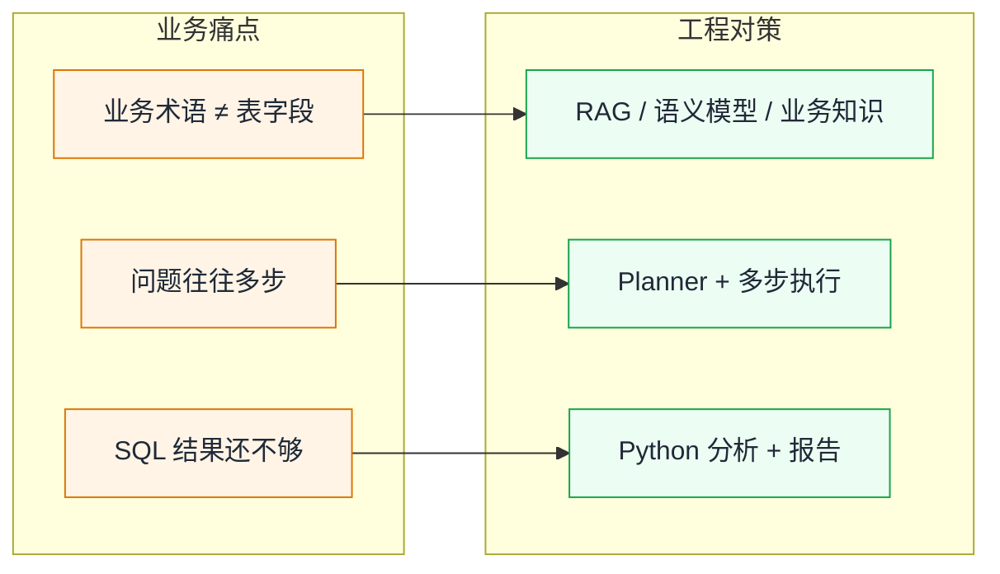

### 1.3 黑箱模型（输入 / 输出 / 扰动）

先把系统当成黑箱，只关心边界上的信号：

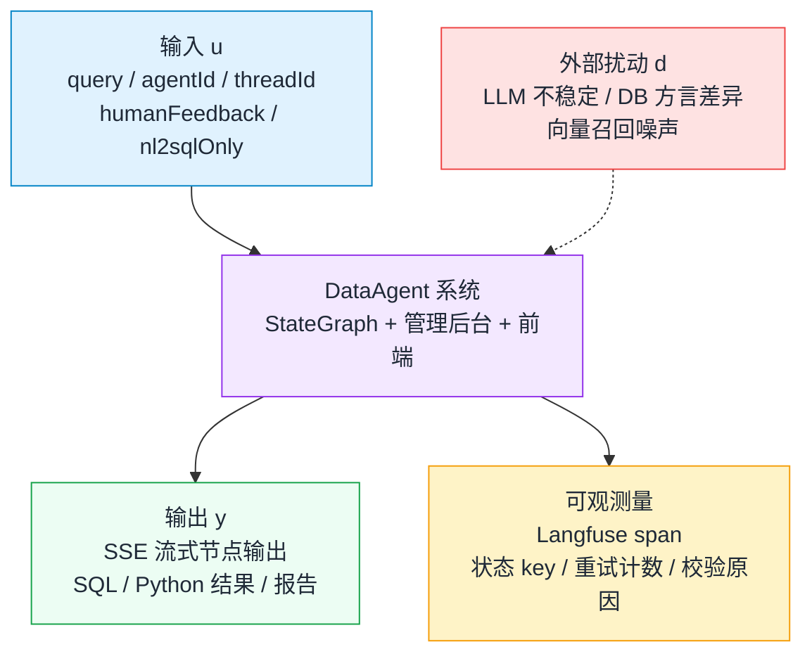

工程控制论对照：

| 控制论角色 | 在本项目中 |
| :--- | :--- |
| 被控对象 | StateGraph 工作流 |
| 控制器 | Dispatcher + 校验节点 + 人工反馈 |
| 传感器 | SQL 结果、语义一致性、可行性、Langfuse |
| 执行器 | LLM 调用、SQL 执行器、Python 执行器 |

### 1.4 顶层质量指标（先稳后优）

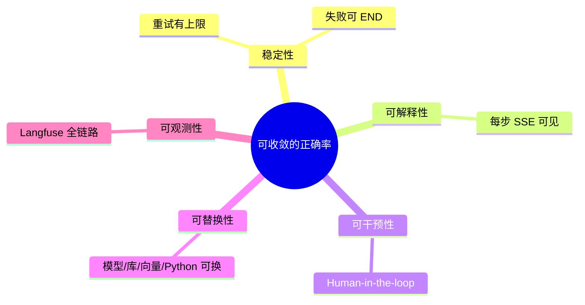

---

## 2. 分层：物理模块与逻辑分层

### 2.1 仓库物理分解

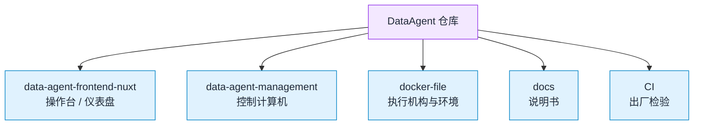

| 目录 | 角色 | 控制论类比 |
| :--- | :--- | :--- |
| `data-agent-frontend-nuxt/` | 人机接口、流式展示 | 操作台 |
| `data-agent-management/` | 工作流、API、服务 | 控制计算机 |
| `docker-file/` | 容器与依赖编排 | 机房 / 执行机构 |
| `docs/` | 知识沉淀 | 说明书 |
| `CI/` | checkstyle 等门禁 | 出厂检验 |

### 2.2 后端逻辑分层（由外到内）

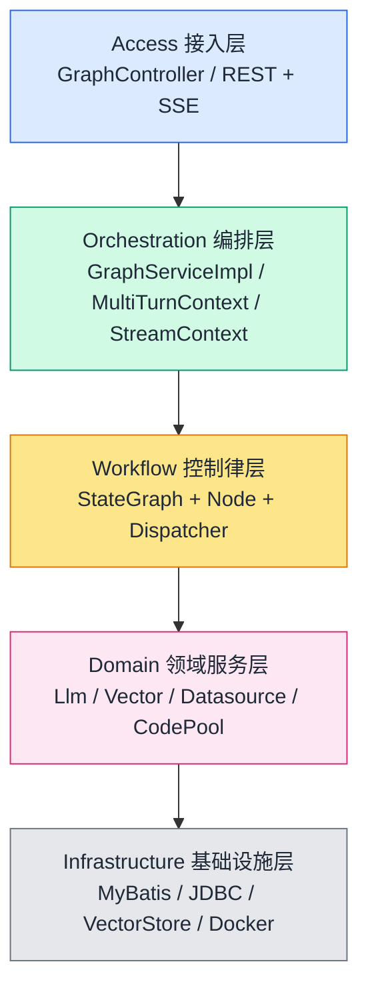

**原则：上层只依赖下层接口。**  
换 Qwen/Deepseek、换 PGVector/ES，工作流尽量不动 —— 这就是对“模型失配”的鲁棒性。

### 2.3 包结构映射

后端主包：`com.alibaba.cloud.ai.dataagent`

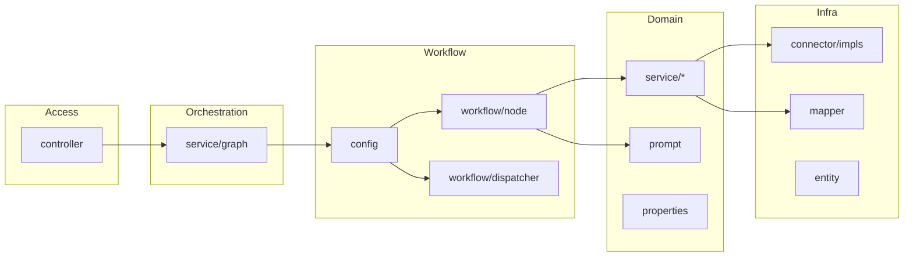

| 包 | 职责 |
| :--- | :--- |
| `controller` | HTTP/SSE 入口 |
| `service/graph` | 图驱动、流上下文、多轮上下文 |
| `workflow/node` | 处理环节（NodeAction） |
| `workflow/dispatcher` | 条件路由（EdgeAction） |
| `config` | Bean 装配、StateGraph 接线 |
| `service/*` | LLM、向量、数据源、Python、MCP |
| `connector/impls/*` | 多数据库方言 |
| `properties` | 可调参数（重试、阈值） |
| `prompt` | Prompt 模板 |

---

## 3. 控制模型：把 StateGraph 看成控制系统

### 3.1 为什么用图，而不是长函数

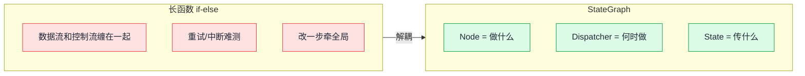

| 概念 | 代码角色 | 控制论角色 |
| :--- | :--- | :--- |
| Node | `*Node implements NodeAction` | 环节 / 执行机构 |
| Dispatcher | `*Dispatcher implements EdgeAction` | 比较器 / 切换逻辑 |
| OverAllState | 共享状态字典 | 状态空间 x |
| KeyStrategy | 状态合并策略 | 状态更新律 |
| CompiledGraph | 可运行图 | 闭环系统 |

### 3.2 图在哪里定义与编译

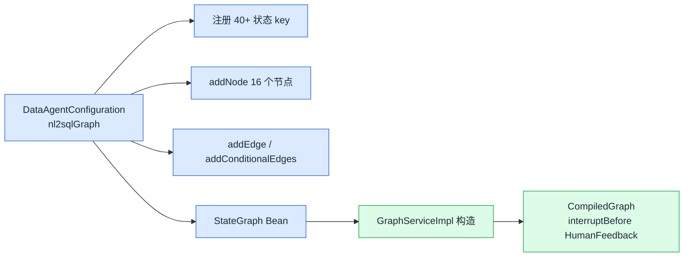

关键代码：

- 装配：`config/DataAgentConfiguration.java`
- 编译：`service/graph/GraphServiceImpl.java`

```java
this.compiledGraph = stateGraph.compile(
    CompileConfig.builder().interruptBefore(HUMAN_FEEDBACK_NODE).build()
);
```

### 3.3 16 节点功能分区（总览图）

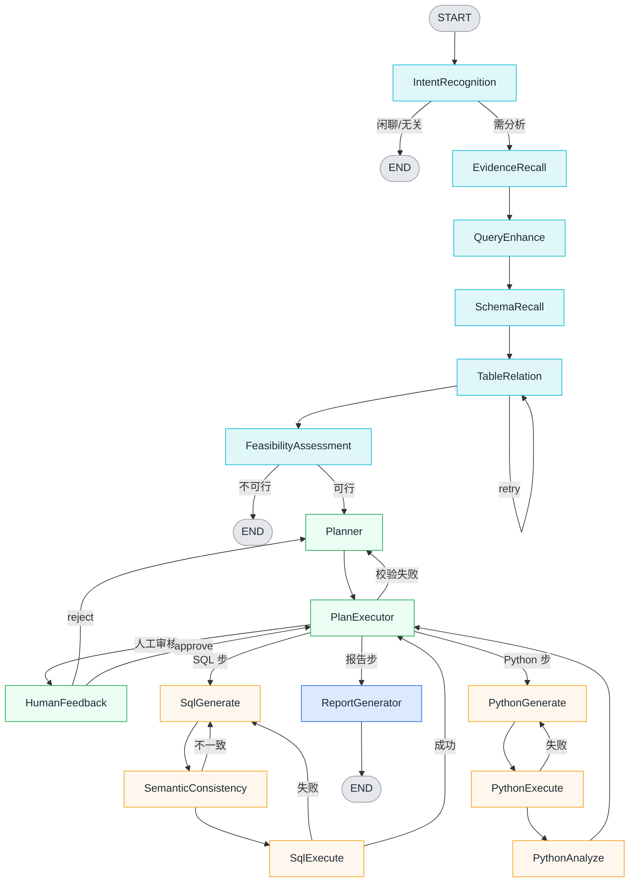

四段结构 = **先稳后优**：

1. 感知：能不能做、需要什么证据  
2. 规划：怎么做（可人工把关）  
3. 执行：局部闭环校正  
4. 输出：报告收口  

---

## 4. 主链路：一次请求从 UI 到节点

### 4.1 端到端时序图

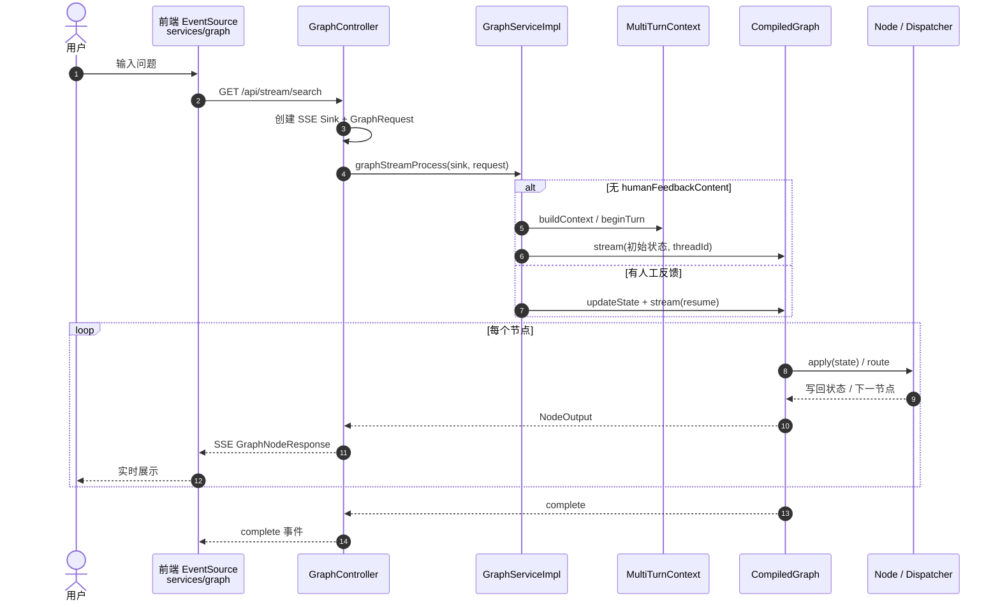

### 4.2 调用链（文件级）

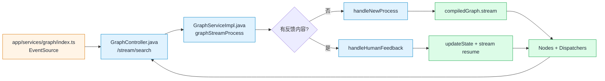

### 4.3 初始状态注入

`handleNewProcess` 写入图的初始 Map：

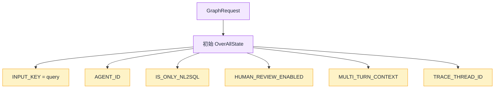

之后每个节点只读自己需要的 key，再写回结果 key。

---

## 5. 状态空间：共享状态如何设计

### 5.1 节点不直接调用，只读写状态

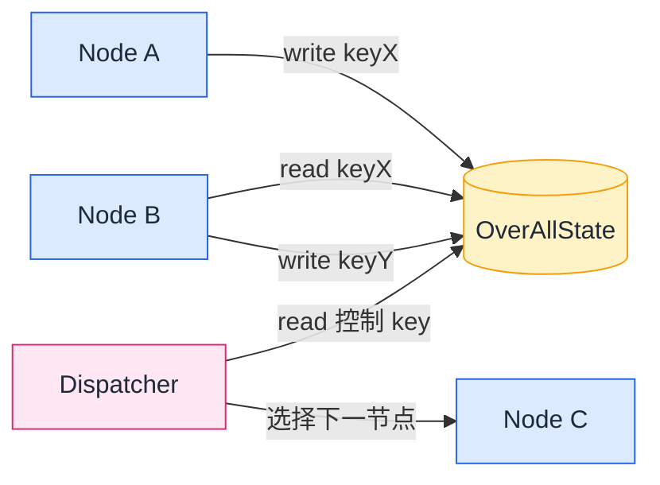

好处：可单测、可重排、可恢复（HITL 中断后从快照继续）。

### 5.2 Key 分类图

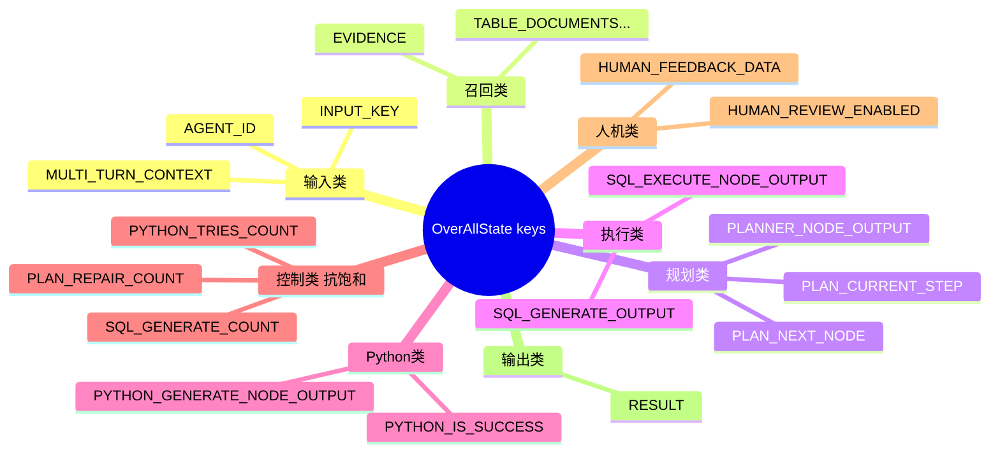

合并策略几乎全是 `KeyStrategy.REPLACE`（后写覆盖前写）。

> **二次开发铁律**：新 key 必须在 `DataAgentConfiguration` 注册，并全局搜索读写点。

---

## 6. 节点与调度器：环节 + 比较器

### 6.1 节点标准模板（IntentRecognition）

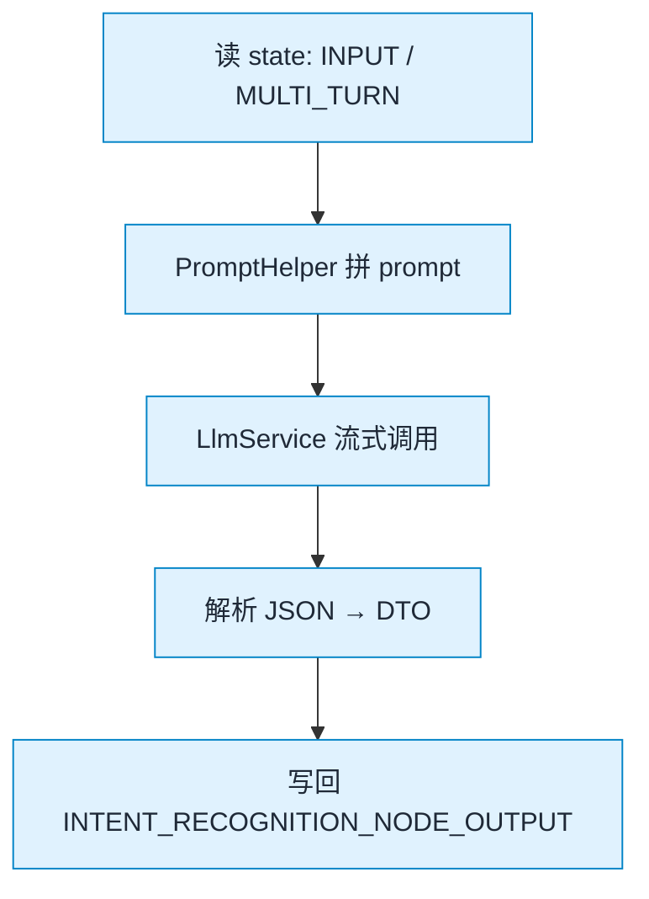

文件：`workflow/node/IntentRecognitionNode.java`

### 6.2 调度器标准模板（SqlGenerateDispatcher）

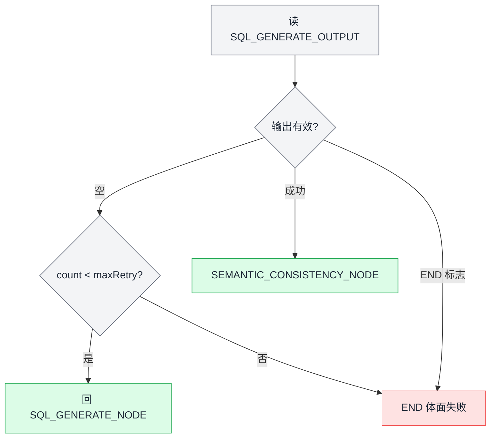

控制论关键词：误差检测 → 反馈 → **抗饱和（上限）**。

### 6.3 PlanExecutor = 主控制器

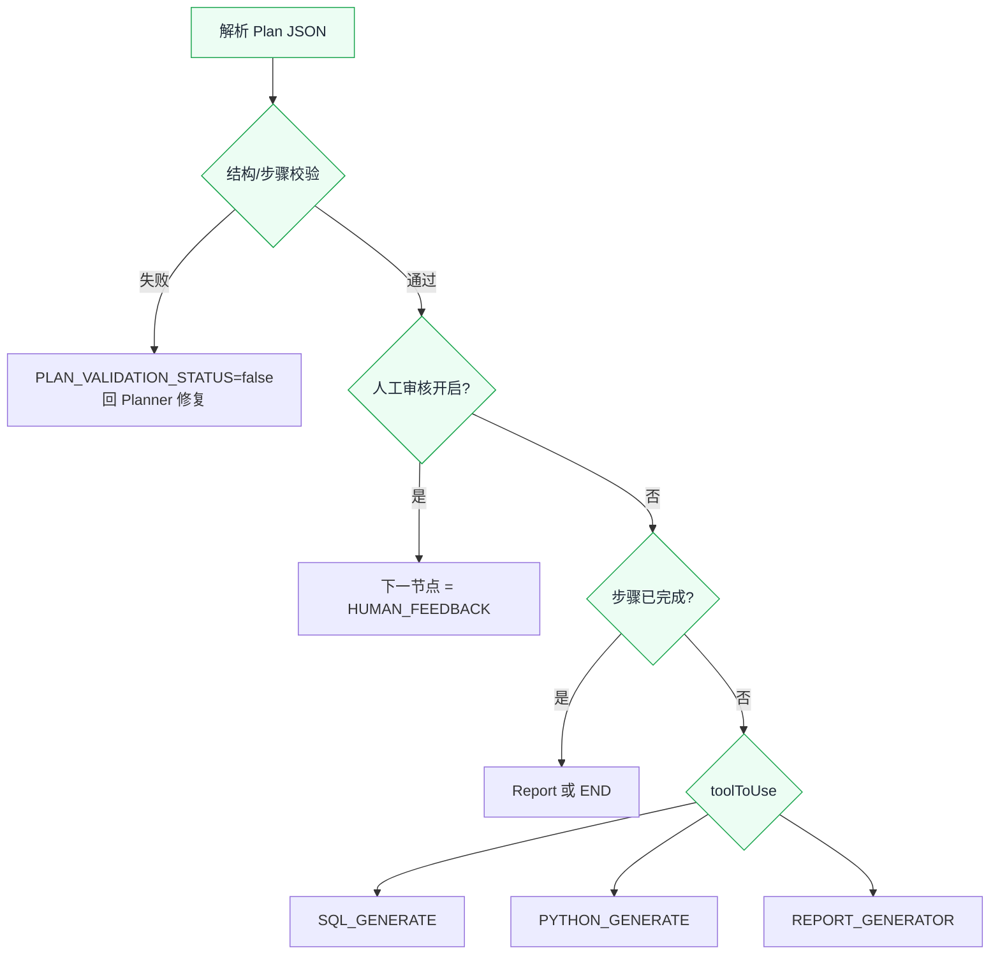

配套：`PlanExecutorDispatcher` 中 `MAX_REPAIR_ATTEMPTS = 2`。

### 6.4 控制律全集（条件边一览）

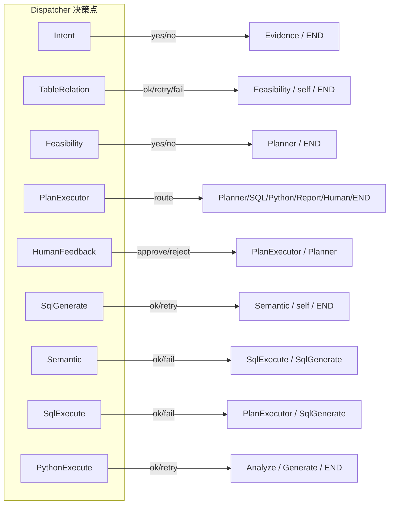

| 源节点 | Dispatcher | 可能去向 |
| :--- | :--- | :--- |
| IntentRecognition | IntentRecognitionDispatcher | Evidence / END |
| TableRelation | TableRelationDispatcher | Feasibility / END / 自环 |
| Feasibility | FeasibilityAssessmentDispatcher | Planner / END |
| PlanExecutor | PlanExecutorDispatcher | Planner / SQL / Python / Report / Human / END |
| HumanFeedback | HumanFeedbackDispatcher | Planner / PlanExecutor / Human / END |
| SqlGenerate | SqlGenerateDispatcher | SqlGenerate / Semantic / END |
| SemanticConsistency | SemanticConsistenceDispatcher | SqlGenerate / SqlExecute |
| SqlExecute | SQLExecutorDispatcher | SqlGenerate / PlanExecutor |
| PythonExecute | PythonExecutorDispatcher | Analyze / Generate / END |

---

## 7. 反馈与稳定性：重试、校验、人工回路

### 7.1 开环 vs 闭环

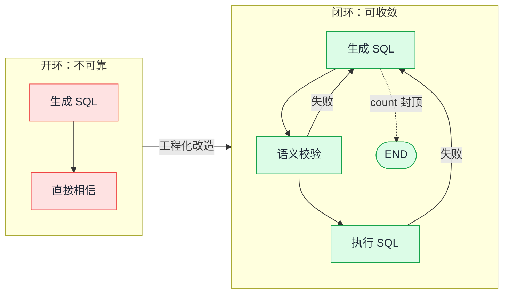

### 7.2 多回路总览

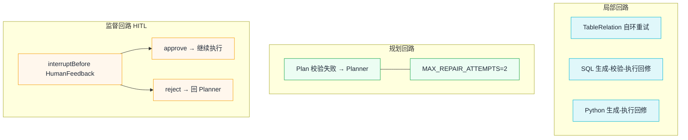

| 回路 | 触发 | 回到 | 上限 |
| :--- | :--- | :--- | :--- |
| 表关系修复 | 关系失败 | TableRelation | 重试计数 |
| 计划修复 | 校验失败 | Planner | `MAX_REPAIR_ATTEMPTS=2` |
| SQL 修复 | 生成/语义/执行失败 | SqlGenerate | `max-sql-retry-count` |
| Python 修复 | 执行失败 | PythonGenerate | code-executor 配置 |
| 人工反馈 | 需审核 | 暂停 → approve/reject | reject 回 Planner |

### 7.3 HITL 暂停 / 恢复时序

```mermaid
sequenceDiagram
  participant GS as GraphServiceImpl
  participant G as CompiledGraph
  participant HF as HumanFeedbackNode
  participant FE as 前端
  participant U as 用户

  Note over G: compile 时 interruptBefore(HUMAN_FEEDBACK)
  GS->>G: stream(新请求)
  G->>HF: 计划通过且开启审核
  HF-->>FE: 等待反馈（流暂停）
  U->>FE: approve / reject + 意见
  FE->>GS: 再次请求带 humanFeedbackContent
  GS->>G: updateState(HUMAN_FEEDBACK_DATA)
  GS->>G: stream(null, resumeConfig)
  G-->>FE: 继续执行或回 Planner
```

### 7.4 体面失败

重试耗尽 → 走 END → SSE 告知前端。  
**可预期的失败** 比 “假成功 / 死循环” 更安全。

---

## 8. 边界系统：模型、库、向量、Python、可观测

边界外不可完全控，策略是 **接口隔离 + 可替换实现**：

```mermaid
flowchart TB
  WF[Workflow 层<br/>Node / Dispatcher]
  WF --> LLM[LlmService / AiModelRegistry]
  WF --> VS[AgentVectorStoreService]
  WF --> DS[Datasource / connector]
  WF --> PY[CodePoolExecutorService]
  WF --> OBS[LangfuseService]

  LLM --> L1[Qwen / Deepseek / OpenAI 兼容]
  VS --> V1[Simple / PGVector / ES / Milvus]
  DS --> D1[MySQL / PG / Oracle / ...]
  PY --> P1[Local / Docker]
  OBS --> O1[Langfuse Cloud / 自部署]

  classDef core fill:#F3E8FF,stroke:#9333EA,color:#1F2937;
  classDef bound fill:#E0F2FE,stroke:#0284C7,color:#1F2937;
  classDef impl fill:#F3F4F6,stroke:#6B7280,color:#1F2937;
  class WF core; class LLM,VS,DS,PY,OBS bound; class L1,V1,D1,P1,O1 impl;
```

| 边界 | 抽象 | 默认可替换 |
| :--- | :--- | :--- |
| 大模型 | `LlmService` + `AiModelRegistry` | 任意 OpenAI 兼容 |
| 数据源 | `connector/impls/*` | MySQL/PG/Oracle/... |
| 向量库 | `VectorStore` | Simple → PGVector/ES/Milvus |
| Python | `CodePoolExecutorService` | Local / Docker |
| 可观测 | `LangfuseService` | Cloud / 自部署 |

---

## 9. 前端落地：SSE 与流式体验

### 9.1 为什么必须流式

```mermaid
flowchart LR
  subgraph Block[阻塞 HTTP]
    B1[等 30 秒空白页] --> B2[体验差]
  end
  subgraph Stream[SSE 流式]
    S1[边生成边推] --> S2[边收边渲染]
  end
  Block -->|工程补偿| Stream
```

### 9.2 前端分层

```mermaid
flowchart TB
  P[pages 路由页面] --> C[components/chat UI]
  C --> S[stores/chat 会话状态]
  C --> SV[services/graph EventSource]
  C --> CP[composables/useTypewriter 渲染平滑]
  SV --> API[后端 /api/stream/search]

  classDef ui fill:#FFF4E6,stroke:#D97706,color:#1F2937;
  classDef data fill:#E0F2FE,stroke:#0284C7,color:#1F2937;
  class P,C ui; class S,SV,CP,API data;
```

| 层 | 路径 | 职责 |
| :--- | :--- | :--- |
| pages | `app/pages/**` | 路由 |
| components | `app/components/chat/**` | 聊天/报告 UI |
| services | `app/services/graph/index.ts` | EventSource |
| stores | `app/stores/chat.ts` | 会话状态、节流 |
| composables | `app/composables/useTypewriter.ts` | 解耦到达率与渲染率 |

---

## 10. 从设计决策到代码位置速查

```mermaid
flowchart LR
  D1[用 StateGraph] --> C1[DataAgentConfiguration]
  D2[节点只写状态] --> C2[workflow/node/*]
  D3[Dispatcher 路由] --> C3[workflow/dispatcher/*]
  D4[重试有上限] --> C4[SqlGenerateDispatcher<br/>PlanExecutorDispatcher]
  D5[HITL 中断] --> C5[GraphServiceImpl compile]
  D6[SSE 可观察] --> C6[GraphController + EventSource]
  D7[边界可替换] --> C7[connector / vectorstore / code]
```

| 设计决策 | 为什么 | 落到哪里 |
| :--- | :--- | :--- |
| StateGraph | 解耦数据流/控制流 | `DataAgentConfiguration.nl2sqlGraph` |
| 节点只写状态 | 可测可恢复 | `workflow/node/*` |
| Dispatcher 路由 | 控制律可审计 | `workflow/dispatcher/*` |
| 重试上限 | 抗饱和 | Sql/Plan/Python Dispatcher + properties |
| 先可行性后规划 | 少烧 token | `FeasibilityAssessmentNode` |
| 语义一致性 | 抗幻觉 | `SemanticConsistencyNode` |
| interruptBefore | 监督控制 | `GraphServiceImpl` |
| SSE | 长任务可观察 | `GraphController` + 前端 |
| 接口化依赖 | 边界鲁棒 | connector / vectorstore / aimodelconfig |

---

## 11. 二次开发决策树

```mermaid
flowchart TD
  Q1{改动影响什么?}
  Q1 -->|只 UI 展示| FE[frontend components/services]
  Q1 -->|只路由条件| DISP[某个 Dispatcher]
  Q1 -->|只某步算法| NODE[对应 Node + Prompt]
  Q1 -->|换外部系统| BOUND[connector / vector / model]
  Q1 -->|改全局流程| CFG[DataAgentConfiguration<br/>中高风险]

  CFG --> CHK{会动状态 key?}
  CHK -->|是| HIGH[高风险：全局搜索读写点]
  CHK -->|否| MID[中风险：补边 + 单测 + 端到端]

  FE --> TEST[验证]
  DISP --> TEST
  NODE --> TEST
  BOUND --> TEST
  HIGH --> TEST
  MID --> TEST
  TEST --> T1[单测]
  TEST --> T2[黄金问题端到端]
  TEST --> T3[失败路径]
  TEST --> T4[Langfuse trace]
```

五步清单：

1. **顶层**：改输入、输出，还是控制律？是否影响稳定性？  
2. **定层**：UI / Dispatcher / Node / 边界 / 图装配？  
3. **定状态**：新 key？谁写谁读？要不要计数上限？  
4. **验证**：单测 → 端到端 → 故意失败 → Langfuse  
5. **回写文档**：流程变了就更新架构图与本文  

---

## 12. 一张总图 + 阅读顺序

### 12.1 总览

```mermaid
flowchart TB
  U[用户] --> FE[前端 EventSource]
  FE <-->|SSE| CTL[GraphController]
  CTL --> GS[GraphServiceImpl]
  GS --> MT[MultiTurnContext]
  GS --> LF[Langfuse]
  GS --> CG[CompiledGraph<br/>interruptBefore HF]

  CG --> SENSE[感知召回<br/>Intent/Evidence/Schema/Feasibility]
  CG --> PLAN[规划+HITL<br/>Planner/PlanExecutor/Human]
  CG --> EXEC[执行闭环<br/>SQL / Python 回修]
  EXEC --> PLAN
  PLAN --> REP[Report] --> END([END])
  SENSE --> PLAN

  EXEC --> EXT[边界: LLM / DB / Vector / Python]

  classDef user fill:#FFF4E6,stroke:#D97706,color:#1F2937;
  classDef core fill:#E0F2FE,stroke:#0284C7,color:#1F2937;
  classDef wf fill:#DCFCE7,stroke:#16A34A,color:#1F2937;
  classDef ext fill:#FCE7F3,stroke:#DB2777,color:#1F2937;
  class U,FE user; class CTL,GS,MT,LF,CG core; class SENSE,PLAN,EXEC,REP,END wf; class EXT ext;
```

### 12.2 推荐阅读顺序

1. 本文第 1–3 章（先建立坐标系）  
2. [`ARCHITECTURE.md`](./ARCHITECTURE.md)（官方架构图）  
3. `config/DataAgentConfiguration.java`（图装配）  
4. `controller/GraphController.java` + `service/graph/GraphServiceImpl.java`  
5. `workflow/node/IntentRecognitionNode.java`（节点模板）  
6. `PlanExecutorNode` + `PlanExecutorDispatcher`（主控制）  
7. `SqlGenerateDispatcher`（重试控制律）  
8. `app/services/graph/index.ts`（前端 SSE）  
9. [`ENGINEERING_SYSTEM_THINKING.md`](./ENGINEERING_SYSTEM_THINKING.md)（学习与贡献）  
10. [`DEVELOPER_GUIDE.md`](./DEVELOPER_GUIDE.md)（配置旋钮）  

### 12.3 工程控制论映射

| 工程控制论 | 本项目实现 |
| :--- | :--- |
| 分类定方法 | 意图识别 / 可行性评估 |
| 状态空间 | `OverAllState` + KeyStrategy |
| 反馈控制 | SQL/Python/Plan 重试边 |
| 抗饱和 | max retry / MAX_REPAIR_ATTEMPTS |
| 稳定性优先 | 先校验再执行，失败可 END |
| 复合控制 | 自动重试 + 人工反馈 |
| 对扰动鲁棒 | LLM/DB/向量接口化 |
| 可观测 | SSE + Langfuse |
| 最少自由度 | 一节点一事 |
| 工程实践检验 | 端到端 + CI |

---

## 读懂实现的四个验收问题

你能回答下面四个问题，就算真正读懂了：

```mermaid
flowchart TB
  Q1[1. 一次请求的输入状态是什么?]
  Q2[2. Dispatcher 在哪些点切换?]
  Q3[3. 出错反馈回到哪里? 如何不发散?]
  Q4[4. 换边界系统时哪些代码可不动?]
  Q1 --> Q2 --> Q3 --> Q4 --> OK[可以开始安全地二次开发]
```

---

> **收束**：先看图建立系统图像，再下钻到 Node/Dispatcher/State。  
> 工程化不是玄学，就是 **先全局后局部、先稳定后优化、每步可验证**。
