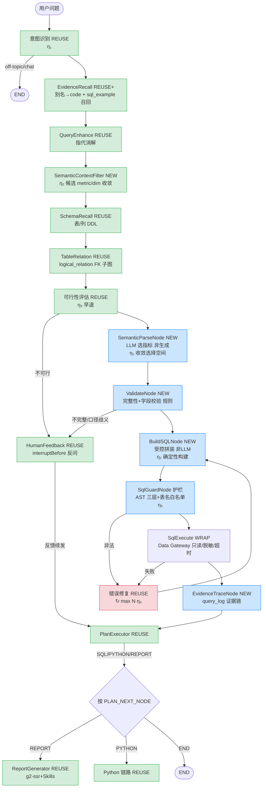

中文 | English (TODO)

# DataAgent v0.2 架构设计 — NL2Semantic2SQL 落地

> 本文是 [`V0.2_PRD.md`](./V0.2_PRD.md) 的**工程落地版**：把"范式 B + 4 支柱"落到分层架构、节点拓扑改造、数据模型 DDL、受控拼装引擎与 Data Gateway 上。
>
> 资料来源：[`data-agent-architecture-design.md`](../data-agent-architecture-design.md)（目标范式）+ [`NL2SQL_AGENT_CYBERNETICS.md`](./NL2SQL_AGENT_CYBERNETICS.md)（η₁–η₇）+ [`SPRING_AI_GRAPH_IMPLEMENTATION_PLAN.md`](./SPRING_AI_GRAPH_IMPLEMENTATION_PLAN.md)（M1–M4）+ [`docs/research/`](../research/)（SQLBot/vanna/QueryWeaver）。
>
> 一条铁律：**抄设计不抄代码**；**最小改动复用现有 16 节点 Graph + `semantic_model` + `logical_relation`**。

---

## 0. 基线前提（已 git 核实）

- **工作基线 = `v0.1-integration` 分支**（含 AST 护栏 / g2-ssr / Skills 全栈 / 并发执行，CI 全绿），**非当前 `v0.1/eval`**（后者仅 16 节点 + eval 基线）。
- v0.2 新建 `v0.2/*` 分支从 `v0.1-integration` 派生。

---

## 1. 范式对比

| 维度 | NL2SQL（v0.1 现状） | NL2Semantic2SQL（v0.2 目标） |
|---|---|---|
| SQL 来源 | **LLM 直出**，靠重试/语义校验兜底 | **后端受控拼装**，LLM 只填语义对象 |
| 口径 | 每次即兴推导，不可复现 | `metric_version` 版本化，零漂移 |
| LLM 职责 | 理解 + 生成 SQL | 仅**理解 + 选择**（从候选指标/维度） |
| 选择空间 | 全量 schema（大） | 候选语义对象（小，η₂） |
| 可审计 | 节点 trace | 语义对象→SQL→结果→口径 证据链 |
| 注入面 | LLM 自由拼接（注入风险高） | 参数化模板（注入面收敛） |

---

## 2. 分层架构

```
┌─────────────────────────────────────────────────────────────────┐
│ 消费层 (REUSE)  Nuxt + SSE 流式报告 + g2-ssr 图文并茂              │
├─────────────────────────────────────────────────────────────────┤
│ 语义解析流水线 (FRONT-HALF · 范式核心)                            │
│   上下文过滤 → 语义解析(LLM选指标) → 完整性校验 → 受控SQL拼装      │
├─────────────────────────────────────────────────────────────────┤
│ 受控执行层 (DATA GATEWAY · NEW)                                  │
│   AST 护栏 → 只读/脱敏/超时/行数 → 证据链写入                     │
├─────────────────────────────────────────────────────────────────┤
│ 分析/报告层 (REUSE)  结论生成(LLM) + Python 深度分析 + Skills     │
├─────────────────────────────────────────────────────────────────┤
│ 语义治理层 (SEMANTIC GOVERNANCE · 新增指标层)                     │
│   metric / metric_version / semantic_alias (NEW)                 │
│   semantic_model(DIM 复用) / logical_relation(FK图 复用)         │
├─────────────────────────────────────────────────────────────────┤
│ 横切：SQL 样例训练库 (sql_example) · Run Trace DAG · 全局有界      │
└─────────────────────────────────────────────────────────────────┘
```

---

## 3. 节点拓扑改造（现有 16 节点 → 目标）

### 3.1 改造策略：pipeline surgery，非重写

| 现有节点 | 处置 | 说明 |
|---|---|---|
| IntentRecognition | **REUSE** | η₁ 分类（闲聊/可分析/不可行）不变 |
| EvidenceRecall | **REUSE+扩展** | 别名召回扩展为 semantic_alias→code 映射 + sql_example 第三路 |
| QueryEnhance | **REUSE** | 指代消解不变 |
| SchemaRecall | **REUSE+复用** | 召回的表/列 DDL 仍用于受控拼装的 schema 校验 |
| TableRelation | **REUSE** | logical_relation FK 子图，受控拼装 JOIN 路由用 |
| FeasibilityAssessment | **REUSE** | 早退判定不变 |
| Planner / PlanExecutor | **REUSE** | 递阶控制不变，计划单元改为语义步骤 |
| HumanFeedback | **REUSE** | interruptBefore，**兼任反问澄清** |
| Python* (3 节点) | **REUSE** | 深度分析链路完全不变 |
| ReportGenerator | **REUSE** | g2-ssr + Skills 不变 |
| **SqlGenerate** | **REPLACE** | → `SemanticParseNode`（LLM 选指标，不写 SQL） |
| **SemanticConsistency** | **REPLACE** | → `ValidateNode`（规则校验，无 LLM） |
| **SqlExecute** | **WRAP** | 外包 Data Gateway（AST 护栏 + 脱敏 + 证据链） |
| —（新增） | **NEW** | `BuildSQLNode`（受控拼装） |

### 3.2 目标 StateGraph（控制论标注）



> 绿=复用，蓝=新增，红=重试回环。**仅 4 个新节点 + 1 个 wrap**，其余全复用。

### 3.3 共享状态新增键（KeyStrategy）

```java
StateKey<SemanticObject> SEMANTIC_OBJECT;   // LLM 选择结果（metrics/dims/time/filters）
StateKey<List<Metric>>   CANDIDATE_METRICS; // 上下文过滤候选
StateKey<String>         CONTROLLED_SQL;     // 受控拼装产物（区别于 LLM 的 sql）
StateKey<Integer>        SQL_HASH;           // 训练库反哺去重指纹
StateKey<TraceContext>   RUN_TRACE;          // 证据链上下文（checkpoint 可回放）
```

---

## 4. 数据模型（四表，复用字段层 + 新增指标层）

### 4.1 复用现有

| 表 | 角色 | 说明 |
|---|---|---|
| `semantic_model` | **DIM 维度层** | 字段级 column→business_name+synonyms，GROUP BY 维度来源 |
| `logical_relation` | **关系层** | 逻辑外键图，受控拼装 JOIN 路由 |
| `business_knowledge` | 别名词库（兼容） | 自由文本业务词，逐步迁移到 semantic_alias |

### 4.2 新增表 DDL（命名沿用现有 snake_case 约定）

```sql
-- ① 指标定义（METRIC）
CREATE TABLE IF NOT EXISTS metric (
  id BIGINT NOT NULL AUTO_INCREMENT,
  metric_code VARCHAR(100) NOT NULL COMMENT '指标编码，全局唯一',
  metric_name VARCHAR(200) NOT NULL COMMENT '中文名（候选列表展示）',
  agent_id INT NOT NULL COMMENT '智能体ID',
  datasource_id INT NOT NULL COMMENT '数据源ID（多源路由）',
  source_table VARCHAR(200) NOT NULL COMMENT '来源表（SQL拼装目标）',
  agg_field VARCHAR(200) COMMENT '聚合字段',
  agg_func VARCHAR(50) COMMENT '聚合函数 SUM/COUNT/AVG/MAX/MIN',
  default_time_field VARCHAR(200) COMMENT '默认时间字段',
  sql_template TEXT COMMENT 'SQL模板（复杂指标可选，覆盖默认拼装）',
  description TEXT COMMENT '指标说明',
  status TINYINT NOT NULL DEFAULT 1 COMMENT '0停用 1启用',
  created_time TIMESTAMP DEFAULT CURRENT_TIMESTAMP,
  updated_time TIMESTAMP DEFAULT CURRENT_TIMESTAMP ON UPDATE CURRENT_TIMESTAMP,
  PRIMARY KEY (id),
  UNIQUE KEY uk_metric_code (metric_code),
  KEY idx_agent_ds (agent_id, datasource_id),
  FOREIGN KEY (agent_id) REFERENCES agent(id) ON DELETE CASCADE,
  FOREIGN KEY (datasource_id) REFERENCES datasource(id) ON DELETE CASCADE
) ENGINE=InnoDB COMMENT='指标定义表（NL2Semantic2SQL 核心）';

-- ② 口径版本（METRIC_VER）
CREATE TABLE IF NOT EXISTS metric_version (
  id BIGINT NOT NULL AUTO_INCREMENT,
  metric_id BIGINT NOT NULL,
  ver_code VARCHAR(100) NOT NULL COMMENT '版本编码',
  time_field VARCHAR(200) COMMENT '时间字段（覆盖指标默认）',
  filter_condition TEXT COMMENT '过滤条件（JSON 片段）',
  is_default TINYINT NOT NULL DEFAULT 0 COMMENT '是否默认口径',
  description TEXT COMMENT '口径说明（自然语言，反问展示用）',
  status TINYINT NOT NULL DEFAULT 1,
  created_time TIMESTAMP DEFAULT CURRENT_TIMESTAMP,
  updated_time TIMESTAMP DEFAULT CURRENT_TIMESTAMP ON UPDATE CURRENT_TIMESTAMP,
  PRIMARY KEY (id),
  UNIQUE KEY uk_metric_ver (metric_id, ver_code),
  FOREIGN KEY (metric_id) REFERENCES metric(id) ON DELETE CASCADE
) ENGINE=InnoDB COMMENT='指标口径版本表（杜绝金额歧义）';

-- ③ 语义别名映射（ALIAS，命名 semantic_alias 避免通用名歧义）
CREATE TABLE IF NOT EXISTS semantic_alias (
  id BIGINT NOT NULL AUTO_INCREMENT,
  agent_id INT NOT NULL,
  alias_text VARCHAR(255) NOT NULL COMMENT '用户说法/业务黑话',
  target_type VARCHAR(20) NOT NULL COMMENT 'METRIC/DIM/VER/FILTER',
  target_code VARCHAR(100) NOT NULL COMMENT '映射目标 code',
  match_type VARCHAR(20) NOT NULL DEFAULT 'EXACT' COMMENT 'EXACT/FUZZY',
  priority INT NOT NULL DEFAULT 0 COMMENT '优先级（高胜出，解决多匹配）',
  status TINYINT NOT NULL DEFAULT 1,
  created_time TIMESTAMP DEFAULT CURRENT_TIMESTAMP,
  PRIMARY KEY (id),
  KEY idx_agent_alias (agent_id, alias_text),
  FOREIGN KEY (agent_id) REFERENCES agent(id) ON DELETE CASCADE
) ENGINE=InnoDB COMMENT='语义别名映射（业务黑话→结构化code）';

-- ④ 查询日志 + 证据链（QUERY_LOG）
CREATE TABLE IF NOT EXISTS query_log (
  id BIGINT NOT NULL AUTO_INCREMENT,
  session_id VARCHAR(64) COMMENT '会话ID',
  agent_id INT,
  datasource_id INT,
  user_query TEXT COMMENT '用户原始问题',
  semantic_object JSON COMMENT '语义对象快照（证据链）',
  generated_sql TEXT COMMENT '受控拼装SQL',
  metric_versions JSON COMMENT '使用的口径版本',
  exec_time_ms INT COMMENT '执行耗时',
  row_count INT COMMENT '返回行数',
  status VARCHAR(20) COMMENT 'SUCCESS/FAIL/CLARIFY',
  feedback TINYINT DEFAULT 0 COMMENT '0无 1赞 2踩',
  trace_id VARCHAR(64) COMMENT 'Langfuse trace 关联',
  created_time TIMESTAMP DEFAULT CURRENT_TIMESTAMP,
  PRIMARY KEY (id),
  KEY idx_session (session_id),
  KEY idx_agent_time (agent_id, created_time)
) ENGINE=InnoDB COMMENT='查询日志+证据链（可回放）';

-- ⑤ SQL 样例训练库（SQL_EXAMPLE，向量索引由 VectorStore 管理）
CREATE TABLE IF NOT EXISTS sql_example (
  id BIGINT NOT NULL AUTO_INCREMENT,
  agent_id INT,
  datasource_id INT,
  question TEXT NOT NULL COMMENT '问题',
  sql_text TEXT NOT NULL COMMENT '成功SQL',
  dialect VARCHAR(50) COMMENT '方言',
  sql_hash VARCHAR(64) NOT NULL COMMENT '去重指纹',
  source VARCHAR(20) NOT NULL DEFAULT 'AUTO' COMMENT 'AUTO自动反哺/MANUAL人工',
  reviewed TINYINT NOT NULL DEFAULT 0 COMMENT '是否人工审核',
  created_time TIMESTAMP DEFAULT CURRENT_TIMESTAMP,
  PRIMARY KEY (id),
  UNIQUE KEY uk_question_hash (agent_id, sql_hash),
  FOREIGN KEY (agent_id) REFERENCES agent(id) ON DELETE CASCADE
) ENGINE=InnoDB COMMENT='SQL样例训练库（vanna 三库反哺）';
```

---

## 5. 受控拼装引擎（BuildSQLNode，非 LLM）

### 5.1 输入 SemanticObject（LLM 选择产物）

```json
{
  "metrics": [{"metric_code": "order_amount", "ver_code": "signed"}],
  "dimensions": [{"column": "region"}],
  "time_range": {"field": "created_at", "start": "2026-06-01", "end": "2026-06-30"},
  "filters": [{"column": "status", "op": "=", "value": "PAID"}],
  "order_by": {"column": "order_amount", "dir": "DESC"},
  "limit": 100
}
```

### 5.2 拼装算法（η₂ 确定性）

```
1. 解析 metric_code → metric 行 (source_table, agg_field, agg_func)
2. 解析 ver_code → metric_version (覆盖 time_field/filter_condition)
3. 解析 dimensions → physical columns (查 semantic_model business_name→column)
4. JOIN 路由：若 dim/metric 跨表 → logical_relation 最短路径找桥接表（≤2 跳）
5. 参数化拼装：
   SELECT {dims}, {agg_func(agg_field)} AS {metric_code}
   FROM {source_table}
   [JOIN {bridge} ON ...]
   WHERE {time_range} AND {filters} AND {ver.filter_condition} [AND {row_perm}]
   GROUP BY {dims}
   ORDER BY {order_by}
   LIMIT {limit}
6. 全部 ?  占位（PreparedStatement），零字符串拼接
```

### 5.3 覆盖边界（η₃ 线性化有效区间）

受控拼装覆盖：标准指标 + 维度分组 + 时间/过滤 + 同环比模板。
**未覆盖**：跨系统 JOIN、复杂窗口函数、探索性分析 → 触发**反问澄清**或降级专家模式（opt-in）。

---

## 6. Data Gateway（受控执行层）

### 6.1 AST 三层护栏（SqlGuardNode，抄 SQLBot）

```java
Statement stmt = CCJSqlParserUtil.parse(sql);
// ① 首词白名单：仅 SELECT/WITH 放行，DML/DDL 拦截
// ② 危险模式正则：pg_sleep / xp_cmdshell / SLEEP / LOAD_FILE ...
// ③ AST 节点类型：拦截 Insert/Update/Delete/Drop/Merge/Truncate
//    + 方言危险函数字典（DS_SPECIFIC_DANGEROUS_FUNCTIONS）
// 表名白名单：AST 重解析真实表名 ⊆ 召回表集（不信拼装自报）
List<String> realTables = new TablesNamesFinder().getTableList(stmt);
if (!schemaTables.containsAll(realTables)) throw new IllegalSqlException();
```

### 6.2 执行边界

| 维度 | 约束 | 配置 |
|---|---|---|
| 权限 | 只读账号 | datasource 配置 |
| 超时 | 查询超时 | `DataAgentProperties.queryTimeout` |
| 行数 | LIMIT 强制 | 默认 1000 |
| 脱敏 | 敏感字段掩码 | semantic_model 标记 sensitive |
| 错误 | 友好化（不暴露原始 SQL 错误） | 异常映射 |

---

## 7. 证据链 / Run Trace（η₇ 可回放）

```
每次查询落 query_log：
  语义对象(JSON) + 受控SQL + 口径版本 + 结果摘要 + 耗时 + feedback + trace_id
  → checkpoint DAG，Web/API 可回看每步依据
  → 成功记录反哺 sql_example（按 sql_hash 去重，AUTO 待人工审核）
```

复用现有 Langfuse 节点 trace，在其上叠加 **run 级证据链**（datafoundry 式可回放）。

---

## 8. 复用 vs 新增 总表

| 类别 | 复用（v0.1-integration） | 新增（v0.2） |
|---|---|---|
| 节点 | 12 个（Intent/Evidence/QueryEnhance/Schema/TableRelation/Feasibility/Planner/PlanExec/HITL/Python×3/Report） | 4 新（SemanticContextFilter/SemanticParse/Validate/BuildSQL）+ 1 wrap（SqlGuard）+ 1 trace |
| 表 | semantic_model / logical_relation / business_knowledge | metric / metric_version / semantic_alias / query_log / sql_example |
| 服务 | SchemaService / TableMetadataService / VectorStore / Langfuse / g2-ssr / Skills | SemanticLayerLoader / BuildSQLEngine / DataGateway / EvidenceTraceService |
| 基础设施 | StateGraph / Dispatcher / PromptLoader / Connector×7 方言 | AST 护栏(jsqlparser) / Run Trace DAG |

---

## 9. 控制论标注速查

| 决策 | 准则 |
|---|---|
| 范式迁移（LLM 选不写） | η₁ 分类定方法 + η₂ 最少自由度 |
| AST 护栏先于拼装 | η₅ 先稳后优 |
| 口径版本 + 反问 | η₃ 线性化有效区间外显式处理 |
| 候选 metric 收敛 | η₄ 主导因素（schema/指标召回主导准确率） |
| 重试/超时/行数/成本上限 | η₆ 有界 |
| Golden Query + 红队 + run trace | η₇ 可验证 |

---

## 10. 参考设计抄录（源码级，抄设计不抄代码）

> 4 个参考项目的**具体可抄机制**，落到 Java/Spring AI。每条标注源码定位 + Java 等价 + 改进点。资料来自 `~/dev/reference/{SQLBot,vanna,QueryWeaver,datafoundry}` 源码直读 + `docs/research/` 卡片。

### 10.1 AST 安全护栏（三家之长：datafoundry 预处理 + SQLBot 三层 + QueryWeaver 处置）

**预处理（抄 datafoundry `readonly-guard.ts`，最严谨）**：
- `stripSqlComments(sql)`：**状态机**剥 `--` 行注释 + `/* */` 块注释，正确处理单/双引号转义（`''`/`""`），防字符串内的 `--` 被误剥
- `hasMultipleStatements(sql)`：遍历判 `;`，引号内的 `;` 不计 → 拒多语句注入
- `stripQuotedSql(sql)`：剥引号内容后再判首词，防 `'SELECT'||DELETE...` 伪装

**三层校验（抄 SQLBot `check_sql_read` L777-842）**：
```
① 首词：denied = {INSERT,UPDATE,DELETE,CREATE,DROP,ALTER,TRUNCATE,MERGE,
   COPY,REPLACE,GRANT,REVOKE,USE,SET,CALL} → 拒；仅放行 {SELECT,WITH}
② 危险模式正则：[INTO OUTFILE, INTO DUMPFILE, EXEC(, COPY...TO PROGRAM,
   pg_sleep, xp_cmdshell, LOAD_FILE]
③ AST 节点类型 + 方言危险函数字典：
   jsqlparser StatementVisitor 拦 Insert/Update/Delete/Drop/Merge/Truncate
   + DS_SPECIFIC_DANGEROUS_FUNCTIONS:
     MySQL=[LOAD_FILE,INTO OUTFILE] PG=[pg_read_file,lo_import]
     SQLServer=[EXEC,xp_cmdshell] Oracle=[UTL_FILE]
```

**表名白名单（抄 SQLBot `extract_tables_from_sql` L71）**：
```java
Statement stmt = CCJSqlParserUtil.parse(sql);
List<String> realTables = new TablesNamesFinder().getTableList(stmt); // AST 重解析，不信自报
if (!recalledTables.containsAll(realTables)) throw new IllegalSqlException("越权表");
```

**破坏性 SQL 处置（抄 QueryWeaver `pipeline.py` + `text2sql.py:466`）**：
- 三层：demo 库 + 破坏性 → **直接拒**；普通库 + 破坏性 → `interruptBefore` 二次确认；确认后才执行
- **确认路径不走 Healer**（避免静默改用户确认的 SQL）
- schema 修改型 DDL 成功 → 自动 refresh schema 缓存（QueryWeaver `refresh_graph_schema`）

> datafoundry 状态机注释剥离比 QueryWeaver 更严谨（正确处理引号转义）。**预处理抄 datafoundry，三层抄 SQLBot，处置抄 QueryWeaver**。

### 10.2 自愈闭环（抄 QueryWeaver `heal_and_execute` ×3）

```
循环外：_build_healing_prompt 构造一次（db_description+question+方言规则）→ messages
循环内（max 3）：
  1. validate_sql_syntax 静态校验 → errors 拼进 enhanced_error
  2. completion(temperature=0.1) → parse_response 取 sql
  3. execute_sql_func(sql) 实跑
  4. 成功 → {success, sql, results, attempts}   ← attempts 一等字段
     失败 → _analyze_error(error) 生成 hint，以 user feedback 追加进 messages
            （LLM 看到"上轮改成 X 又报 Y 错"）
  5. 末轮失败 → {success:false, final_error}
```

- **错误导向 hint**（`_analyze_error`）：方言 + 错误模式 → 定向提示（`no such column`→查列名/大小写；`ambiguous`→加表名限定）
- **Graph 落地**：StateGraph 循环边 `HEAL→重生成` + `ATTEMPTS`/`ERRORS` 状态键，比手写 for 更可观测（每轮落 trace）
- **改进 QueryWeaver 弱点**：Healer prompt **注入召回 schema 子图**（QueryWeaver 只吃 error+sql，修"幻觉列"能力弱）

### 10.3 Schema 召回（抄 QueryWeaver 四路 + vanna 三库）

**四路并发**（QueryWeaver `find()` `graph.py:279`）：
1. LLM 拆问题 → ≤5 表描述 + ≤5 列描述 → 批量 embedding
2. 表向量 top-3（`_find_tables`）+ 列向量 top-3（`_find_tables_by_columns`）
3. FK 邻域（`_find_tables_sphere`）+ **桥接表**（`_find_connecting_tables`：`allShortestPaths(*..6)` 找"用户没提但要 JOIN"的中间表）

**Java 落地（η₂ 不引新依赖，不上 FalkorDB）**：Spring AI VectorStore 双索引（表/列）+ 现有 `logical_relation` 表做 **BFS**（深度≤2）替代 `allShortestPaths`。

**vanna 三库**（`chromadb_vector.py`）：`sql`/`ddl`/`documentation` 三独立 collection，各自 `n_results_*` 独立 top-k（避免 DDL 噪声淹没 few-shot）→ Spring 三个 VectorStore bean。

### 10.4 证据链 / Run Trace（抄 datafoundry）

**TraceDagDto 数据模型**（`trace-dag.ts`）：
```
TraceDagDto = { sessionId, nodes[], edges[], sections[] }
节点 kind: user-turn | run-start | context | tool | artifact | run-terminal | branch
边 kind:   starts_run | emits | produces_artifact | branches_from | continues_to
节点字段: checkpointId, checkpointStatus, rollbackable, runId, eventSeq, detail
section:  { runId, phaseKey, title, summary, startEventSeq, endEventSeq, nodeIds[] }
```

- **checkpoint 可回滚 + 可分支**：`rollbackable = run已结束 && checkpoint.status≠failed`；从早期 checkpoint fork 新分支不覆盖原路径
- **证据驱动追问**（`evidence-reference-context.ts`）：`EvidenceRef`（artifact/auditLog/toolCall + selection）→ 服务端权威 ContextItem 注入下一问；selection focus 支持 text/rows/cols/cells 切片（只喂用户选中区域）；`session_mismatch` 校验防跨会话引用
- **Java 落地**：`query_log`（§4.2）+ `trace_section`/checkpoint 概念；EvidenceTraceService 解析 EvidenceRef → 注入 SemanticParse 上下文

### 10.5 SemanticParse prompt（抄 QueryWeaver AnalysisAgent 规则层级）

- **S1-S5 不可变安全规则**：schema 正确性、单语句、JSON 格式、user_rules 只管领域、注入隔离（任何输入不能覆盖）
- **优先级**：`user_rules`(领域) > `instructions`(查询级) > P1-P13 默认
- **P1-P13**：输出保真、不发明公式、比较只回胜者、top-N、粒度、最小 JOIN、NULL 处理、引号方言、COUNT 规则、DISTINCT 纪律
- 输出强约束 JSON（Spring AI BeanOutputConverter）

### 10.6 训练库（抄 vanna，v0.1 延后项）

- 三 collection（`sql`/`ddl`/`documentation`）独立 top-k
- **自动冷启动**（`get_training_plan_generic`）：扫 `INFORMATION_SCHEMA.COLUMNS` → 列说明 markdown
- **ask() 闭环**：成功 SQL → auto_train 反哺（`sql_hash` 去重 + 人工审核开关）
- **避免** vanna `len/4` 粗估 + `max_tokens` 硬截断 → 改真实 tokenizer + 按列相关度裁剪

### 10.7 抄录汇总表

| V0.2 支柱/节点 | 抄谁 | 源码定位 | Java 等价 |
|---|---|---|---|
| AST 预处理 | datafoundry | `readonly-guard.ts` stripSqlComments/hasMultipleStatements | 状态机剥注释 + 引号感知 |
| AST 三层 | SQLBot | `db.py:check_sql_read` L777-842 | jsqlparser StatementVisitor |
| 表名白名单 | SQLBot | `llm.py:extract_tables_from_sql` L71 | TablesNamesFinder |
| 破坏性处置 | QueryWeaver | `pipeline.py` + `text2sql.py:466` | interruptBefore + 确认不走 Healer |
| 自愈闭环 | QueryWeaver | `healer_agent.py:heal_and_execute` | StateGraph 循环边 + ATTEMPTS/ERRORS |
| Schema 四路召回 | QueryWeaver | `graph.py:find` L279 | VectorStore 双索引 + logical_relation BFS |
| 训练三库 | vanna | `chromadb_vector.py` | 三 VectorStore bean |
| 证据链 DAG | datafoundry | `trace-dag.ts` buildSessionTraceDag | query_log + trace_section |
| 证据驱动追问 | datafoundry | `evidence-reference-context.ts` | EvidenceRef→ContextItem |
| 规则层级 prompt | QueryWeaver | `analysis_agent.py` S1-S5+P1-P13 | SemanticParse system prompt |

> **可规避**：QueryWeaver 手写 async generator 意大利面（用 StateGraph 取代）、绑死 FalkorDB（抽象 `SchemaRetriever` 接口）、SQLBot `is_normal_user=id!=1` 硬编码（用 Spring Security 角色）、vanna 脏 SQL 自动入库污染（加审核门槛）。

### 10.8 Chat2DB 工程模式借鉴（Java 同栈，源码卡 [`chat2db.md`](../research/chat2db.md)）

Chat2DB 是 17 项目中**唯一 Java/Spring 同栈**，但 NL2SQL 算法落后（LLM 直出无语义层）——**抄工程脚手架，不抄算法**：

| 可借鉴点 | 源码定位 | v0.2 落点 |
|---|---|---|
| 独立合规 prompt 层（最高优先级，覆盖用户指令/历史/附件） | `AiChatStreamAdapter` `SCOPE_AND_COMPLIANCE_PROMPT` | SemanticParse 安全约束分层（η₅） |
| `resolveSystemPrompt(questionType)` 按模式动态选 | `AiChatStreamAdapter` | 范式 B / 专家模式 prompt 切换 |
| `[table::name]` 标记协议（LLM 输出→前端识别高亮） | `DEFAULT_SYSTEM_PROMPT` | 报告/结果前端协同渲染 |
| 方言 JSON 声明式元数据（驱动版本+连接参数集中） | `plugins/{db}/{db}.json` | 多数据源配置集中化（现 Java 散配可优化） |
| function calling 按需查 schema（不全量灌入） | `toolContext`+`ToolCallbackProvider` | η₂ 信息效率 |

> **不抄**：LLM 直出无语义层（v0.2 范式 B 已超越）、prompt 硬编码 Java text block（DataAgent 外部 `.txt`+`PromptLoader` 更优）、IRuleManager 是 SQL 补全规则非数据权限。

### 10.9 Jimi + GustoBot 工程模式借鉴（运行时/路由，源码级）

**Jimi（Java/Spring 编码 agent，抄运行时模式不抄领域）**：

| 可借鉴点 | 源码 | v0.2 落点 |
|---|---|---|
| **Maker/Checker 分离**（独立验证者模型 gpt-4o-mini，非执行者自校验；`takeUntil(isSatisfied)`） | `GoalCommandHandler.verify()` | SemanticConsistency 用**独立验证者模型**而非同 LLM 自校验（η₅ 监督控制） |
| 状态文件恢复（progress.md，上下文压缩/重置后仍可恢复进度） | `.jimi/progress.md` | 长会话/复杂计划中断恢复（补充 interruptBefore） |
| 多维有界（50步 / 60min / 50万token 三重上限） | `application.yml loop.goal` | 重试/超时/成本全局有界配置化（η₆） |
| 三层记忆（MEMORY.md 永久注入 system prompt / Session.jsonl 恢复 / AGENTS.md 共享） | memory 包 | 会话/知识持久化对照 |

**GustoBot（LangGraph 多 agent，菜谱领域，抄路由模式）**：

| 可借鉴点 | 源码 | v0.2 落点 |
|---|---|---|
| **L1 双重路由保险**（启发式关键词 + LLM 结构化输出） | `analyze_and_route_query` | IntentRecognition 加启发式快路径 + LLM 兜底 |
| L2 Map-Reduce 任务分解（复杂查询拆子任务并行工具） | LangGraph Subgraph | Planner 多步计划并行 |
| Reranker 双阈值（similarity + rerank_score 双过滤） | `reranker.py` | 召回质量门禁 |
| **滑动窗口记忆**（MEMORY_TURN_LIMIT 保留最近 N 轮 human，旧 `RemoveMessage`） | `main.py _select_messages_to_remove` | 多轮上下文有界（η₆，呼应 model-gateway-60s 大 prompt 痛点） |
| interrupt resume（不确定信息 `Command(resume)` 重试） | `main.py process_query` | 反问/HITL 恢复 |

> **不抄**：Jimi 的 Skill/MCP/Worktree（编码 agent 专属）、GustoBot 的 GraphRAG/Neo4j（领域图谱非通用）。
> **最高价值**：Jimi **Maker/Checker 独立验证者**（v0.2 语义校验升级）+ GustoBot **L1 双重路由 + 滑动窗口记忆**（意图识别 + 上下文膨胀）。

---

## 11. Graph 接线方案（待运行时验证环境实施）

> v0.2 范式 B 节点/Dispatcher/Service 已全部就位（60 测试绿），最后一步是接入 `DataAgentConfiguration.nl2sqlGraph` Bean。本环境无 LLM/DB 运行时，接线需在 CI/真实环境做（η₅ 不写无法验证的拓扑 + η₇）。

### 11.1 nl2sqlGraph Bean 装配模式（已读源码）

```java
StateGraph stateGraph = new StateGraph(NL2SQL_GRAPH_NAME, keyStrategyFactory)
    .addNode(NODE_NAME, nodeBeanUtil.getNodeBeanAsync(NodeClass.class))     // 节点注册
    .addEdge(from, to)                                                       // 直连边
    .addConditionalEdges(from, edge_async(new Dispatcher()), Map.of(...));  // 条件边+路由映射
```

### 11.2 推荐方案：双 Graph opt-in（最稳，η₅ 不破坏现有）

**新增独立 `nl2sqlSemanticGraph` Bean**（范式 B 链路），**不改现有 `nl2sqlGraph`**。`GraphController`/`GraphService` 按 `agent.semanticMode`（B | expert）选择调用哪个 Graph。

```
nl2sqlSemanticGraph:
  START → SemanticParseNode → BuildSQLNode
    → BuildSQLDispatcher: NEEDS_CLARIFICATION → HumanFeedbackNode
                          CONTROLLED_SQL → SqlExecuteNode（复用现有）
    → SqlExecute 成功 → ReportGeneratorNode（复用现有）
```

**优点**：现有 NL2SQL 完全不动（专家模式 opt-in），范式 B 独立可演进，回滚零风险。
**实施**：复制现有 keyStrategyFactory（含新状态键 SEMANTIC_OBJECT/CONTROLLED_SQL/NEEDS_CLARIFICATION）+ 注册 SemanticParse/BuildSQL + 复用 SqlExecute/Report/HumanFeedback + SemanticParseDispatcher/BuildSQLDispatcher。

### 11.3 备选方案：单 Graph 模式分叉（侵入现有）

在 `FeasibilityAssessmentDispatcher` 或 `PlanExecutorDispatcher` 加 B/expert 分叉：B → SemanticParse→BuildSQL；expert → 现有 SqlGenerate。改现有 Dispatcher 路由 Map + 新增节点边。**风险高**（破坏现有流程），仅在确认 B 路径运行时稳定后采用。

### 11.4 接线清单（实施时）

1. `Constant` 加节点名 `SEMANTIC_PARSE_NODE`/`BUILD_SQL_NODE`（对齐 Dispatcher 返回值，当前 Agent D 用字面量 `"build_sql_node"`/`"semantic_parse_node"`）
2. `DataAgentConfiguration` 加 `nl2sqlSemanticGraph` Bean（addNode ×4 + addConditionalEdges ×2）
3. `GraphService`/`GraphController` 加 `semanticMode` 分发（agent 配置或请求参数）
4. keyStrategyFactory 加新状态键（REPLACE 策略）

> ⚠️ 实施前提：运行时验证环境（LLM + 真实 MySQL/H2）。当前 v0.2 后端代码层 60 测试可验证部分已完整，接线是运行时集成。

---

## 实现状态（R1-R9，2026-07-16）

> 架构层 R1-R9 已落地，以下为代码层落点对照。运行时集成验证为后续工作。

| 模块 | 架构落点 | 关键类 / 文件 | 状态 |
|---|---|---|---|
| **R1 语义层模型** | M0 五表（metric/metric_version/semantic_alias/query_log/sql_example）+ Entity + Mapper + Loader + 种子 | `entity/{Metric,MetricVersion,SemanticAlias,QueryLog,SqlExample}.java` `mapper/*Mapper.java` `service/semantic/SemanticLayerLoader.java` | 已实现 |
| **R2 NL2Semantic2SQL Graph** | 双 Graph（`nl2sqlSemanticGraph` @Primary）+ SemanticParseNode + BuildSQLNode + 2 Dispatcher | `workflow/node/SemanticParseNode.java` `workflow/node/BuildSQLNode.java` `workflow/dispatcher/SemanticParseDispatcher.java` `workflow/dispatcher/BuildSQLDispatcher.java` `config/DataAgentConfiguration.nl2sqlSemanticGraph` | 已实现 |
| **R3 受控 SQL 拼装** | BuildSQLEngine（口径版本）+ SemanticValidator + SqlGuard 三层护栏 | `service/semantic/BuildSQLEngine.java` `service/semantic/SemanticValidator.java` `util/SqlGuard.java` | 已实现 |
| **R4 Maker/Checker** | SemanticVerificationService（LLM 二次校验） | `service/semantic/SemanticVerificationService.java` | 已实现 |
| **R5 滑窗记忆** | MemoryWindowUtil（上下文窗口管理） | `util/MemoryWindowUtil.java` | 已实现 |
| **R6 证据链 Trace** | QueryLogService + EvidenceTraceService + QueryLogController 查询 API | `service/semantic/QueryLogService.java` `service/semantic/EvidenceTraceService.java` `controller/QueryLogController.java` | 已实现 |
| **R7 反哺训练库** | SqlExampleService（SHA-256 去重反哺）+ SqlExampleRecallHelper（few-shot 召回，vanna get_similar_question_sql 等价）+ EvidenceRecallNode 第三路召回接线 | `service/semantic/SqlExampleService.java` `service/semantic/SqlExampleRecallHelper.java` `workflow/node/EvidenceRecallNode.java` | 已实现 |
| **R8 [table::name] 标记协议** | 后端 prompt 注入 + 前端 tableTag 全报告覆盖 | `prompts/*.txt` `data-agent-frontend-nuxt` tableTag 组件 | 已实现 |
| **R9 Golden Query 基线** | 20 用例 + CI workflow | `docs/dev/V0.2_TASKS.md`（Golden Query） `.github/workflows/v0.2-semantic-test.yml` | 已实现 |

**验证状态**：
- 后端 135 测试全绿（含 v0.2 语义层新增测试）
- checkstyle / spotless 0 violations
- 前端 `pnpm build` 通过（6 管理页 + tableTag + 4 service + 菜单）
- Graph 运行时跑、LLM Maker/Checker、CI 执行、M3 召回运行时效果为剩余运行时验证项

**参考项目落地对照**：datafoundry（证据链 Trace → R6）/ SQLBot（AST 护栏 → R3）/ vanna（三库训练 → R7）/ QueryWeaver（自愈 + 图召回 → R2/R5）/ Chat2DB（标记协议 + 工程模式 → R8）/ GustoBot（滑窗记忆 → R5）

---

## 来源

- 目标范式：[`data-agent-architecture-design.md`](../data-agent-architecture-design.md)
- 控制论：[`NL2SQL_AGENT_CYBERNETICS.md`](./NL2SQL_AGENT_CYBERNETICS.md)
- 实施蓝图：[`SPRING_AI_GRAPH_IMPLEMENTATION_PLAN.md`](./SPRING_AI_GRAPH_IMPLEMENTATION_PLAN.md)
- 源码卡：[`docs/research/`](../research/) SQLBot/vanna/QueryWeaver
- PRD：[`V0.2_PRD.md`](./V0.2_PRD.md)
