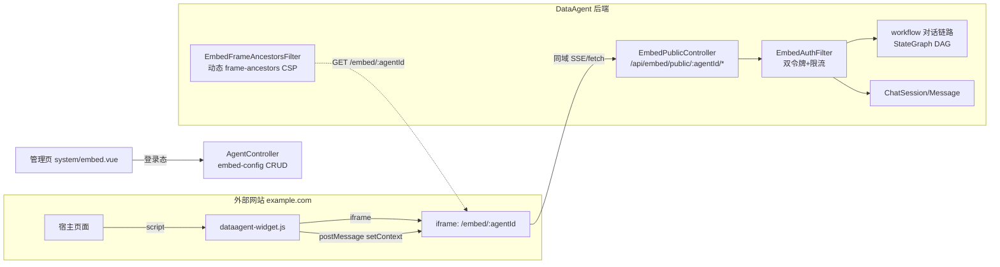
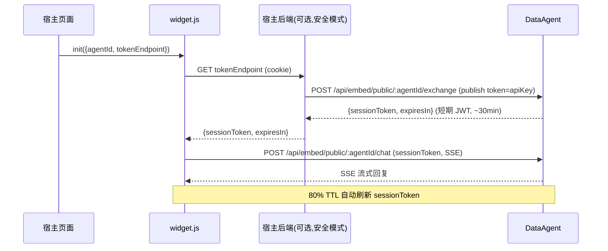

# DataAgent 网页嵌入（Embed）集成功能 — 设计文档

| 项 | 值 |
|---|---|
| 版本 | v0.2 |
| 状态 | Draft（待评审 → R1 实现） |
| 分支 | `v0.2/semantic-layer` |
| 参考系 | WeKnora `main_weknora`（Go+Vue）`platform/integrations?tab=embed` |
| 关联文档 | `V0.2_ARCHITECTURE.md` · `API_INTEGRATION.md` · `ENGINEERING_SYSTEM_THINKING.md` |
| 评审 Gate | 本文 §10 增量路线 R1 启动前需用户确认 |

---

## 1. 背景与目标

### 1.1 业务目标
让任意外部网站通过一行 `<script>` 嵌入 DataAgent 的 AI 对话窗口，对话由 DataAgent 某个 Agent 承接，实现「把 DataAgent 能力对外分发到第三方页面」。对应 WeKnora 的 `platform/integrations?tab=embed`。

### 1.2 设计原则（η 工程控制论映射）
- **η₁ 分类定方法**：先框定 IN/OUT 范围（§3），再选方法。
- **η₂ 去噪 / YAGNI**：复用现有 `Agent.apiKey`、`workflow` 对话链路、`ChatSession`；方案 B（扩展 Agent，非独立渠道表）；MVP 砍非必需字段。
- **η₅ 安全降级**：双令牌 + 域名白名单 + 动态 CSP + 三层限流；fail-open 仅限显式声明的降级路径，绝不静默放行。
- **η₆ 有界**：令牌 TTL、限流上限、会话上限均有上界。
- **η₇ 度量**：每轮交付一个可验证单元，门禁见 §10；宣称完成前用 H2 / 编译 / pnpm-build 验证。
- **根因优于症状 / 复用**：杠杆点见 §9，不重复造轮子。

### 1.3 非目标（OUT）
- 不做 DataAgent 反向嵌入/对接第三方系统（反向集成是另一特性）。
- 不做多租户（DataAgent 当前单租户；WeKnora 的 `TenantID` 不引入）。
- MVP 不做 webhook 回调、不做多渠道（1 agent 1 embed 配置）。

---

## 2. 现状与复用判定（基于源码事实）

| 现有资产 | 位置 | 复用判定 |
|---|---|---|
| `Agent.apiKey` + `apiKeyEnabled` | `entity/Agent.java` + `AgentController` + `ApiKeyUtil` | **复用为发布令牌**。语义本就是「外部访问该 Agent 的凭证」，与 embed 发布令牌同义。已有 `generate/reset/delete` + `mask()` 脱敏。 |
| 对话执行链路 | `workflow/dispatcher/*Dispatcher` + `workflow/node/*Node`（StateGraph DAG，16 节点 + 11 dispatcher） | **复用为 `agent-chat` 后端**。embed 会话走同一 Graph。 |
| `ChatSession` / `ChatMessage` | `entity/` | **复用为会话存储**，加 `source` 区分 embed 来源。 |
| `EncryptedStringTypeHandler`（AES-256-GCM） | `util/` | 复用：若新增敏感字段（如 webhook secret）透明加解密。 |
| MyBatis mapper 体系 | `mapper/` | 新增 `embed_config` 列映射到 `AgentMapper`（方案 B）。 |
| Nuxt + Vuetify + Pinia | `data-agent-frontend-nuxt/` | 新增管理页 + embed 页 + widget SDK。 |
| `chat` store / SSE 消费 | `stores/chat.ts` + `services/chat/` | embed 页复用对话状态逻辑。 |

**关键修正**：`ChatController` 是会话 CRUD（REST），`GraphController.stream/search` 是语义图节点搜索 SSE——**两者都不是对话内容流**。对话内容由 `workflow/` 包驱动。R1 第一步是精确定位对话内容流的对外端点（可能在 `services/chat` 对接的 controller，待实现时确认），embed `agent-chat` 在其上挂一层 embed 鉴权。

---

## 3. 架构总览



### 双令牌时序


---

## 4. 数据模型（方案 B：扩展 Agent）

**决策**：不新建 `embed_channel` 表，给 `Agent` 增加 embed 子配置。理由：DataAgent 发布令牌 = `apiKey`（Agent 级），embed 是「访问该 Agent 的另一种方式」，语义自洽；多渠道为 YAGNI（演进触发条件见 §13 ADR-001）。

### 4.1 `agent` 表新增列

| 列 | 类型 | 默认 | 说明 |
|---|---|---|---|
| `embed_enabled` | TINYINT | 0 | embed 总开关 |
| `embed_config` | JSON / TEXT | NULL | embed 配置（见 4.2） |

### 4.2 `embed_config` JSON 结构

```json
{
  "allowedOrigins": ["https://www.example.com", "https://*.example.com"],
  "welcomeMessage": "你好，我是数据助手",
  "primaryColor": "#07C05F",
  "widgetPosition": "bottom-right",
  "showSuggestedQuestions": true,
  "defaultLocale": "zh-CN",
  "rateLimitPerMinute": 30,
  "rateLimitPerDay": 10000
}
```

### 4.3 `chat_session` 表扩展

| 列 | 类型 | 说明 |
|---|---|---|
| `source` | VARCHAR(16) | `web` \| `embed`，默认 `web`（向后兼容） |

---

## 5. 安全模型（信任边界，η₅ — 不可简化）

### 5.1 双令牌
| 令牌 | 持有方 | 寿命 | 用途 |
|---|---|---|---|
| **发布令牌** = `Agent.apiKey` | 宿主后端 / 仅服务端 | 长期，可轮换 | 换会话令牌 |
| **会话令牌** `das_<payload>.<sig>` | 浏览器 | ~1800s | 实际对话 |

会话令牌实现：**自包含 HMAC-SHA256 签名 token**，零新依赖。
- payload: base64url(`{agentId, iat, exp}`)
- sig: base64url(HMAC-SHA256(payload, `embed-token-hmac-key`))
- 密钥来源：新增 `spring.ai.alibaba.data-agent.embed-token-hmac-key`（启动时校验非空，缺失则 fail-closed 不启动 embed）。
- 校验：验签 + `exp` 检查 + agentId 一致。

### 5.2 域名白名单 `allowedOrigins`
- 生产环境禁用 `*`（强制校验，对齐 WeKnora `validateAllowedOrigins`）。
- 支持 `https://a.com` 精确匹配与 `https://*.a.com` 子域通配。
- 校验同时落地两处：① exchange 时校验 `Origin`/`Referer`；② CSP `frame-ancestors`。

### 5.3 动态 CSP（绕过默认 `X-Frame-Options: SAMEORIGIN` 的关键）
`EmbedFrameAncestorsFilter`：对 `GET /embed/:agentId` 按 `embed_config.allowedOrigins` 注入：
```
Content-Security-Policy: frame-ancestors https://a.com https://b.com
```
通配符或空 → 不限制（与白名单语义一致）。

### 5.4 三层限流（η₆ 有界）
| 层 | 键 | MVP 默认 | 实现 |
|---|---|---|---|
| 每 IP / 分钟 | `embed:ip:<ip>` | 30 | Bucket4j 本地内存（R3） |
| 每 Agent / 分钟 | `embed:agent:<id>` | `perIP × 20`，floor 120 | Bucket4j |
| 每 Agent / 天 | `embed:agent:day:<id>` | 10000 | Bucket4j |

MVP（R1）可先用单层「每 Agent / 分钟」兜底，R3 补全三层。

### 5.5 CORS
- 现有 `@CrossOrigin(origins = "*")`（`ChatController`）不适用于 embed 公开路由。
- embed 公开路由按 `allowedOrigins` 精确放行，**不带 credentials 时方可 `*`**；exchange 走宿主后端代理则同源，无 CORS 问题。

---

## 6. API 契约

### 6.1 公开路由 `/api/embed/public/{agentId}/**`（免登录，经 `EmbedAuthFilter`）
| 方法 | 路径 | 入参 | 出参 |
|---|---|---|---|
| POST | `/exchange` | header `X-Publish-Token` = apiKey | `{sessionToken, expiresIn}` |
| GET | `/config` | — | `embed_config`（**不含任何 token**） |
| GET | `/suggested-questions` | — | 预置问题（复用 `AgentPresetQuestion`） |
| POST | `/sessions` | sessionToken | `{sessionId}`（`source=embed`） |
| POST | `/chat/{sessionId}` | sessionToken, `{query, hostContext}` | SSE 流（复用 workflow） |
| POST | `/chat/{sessionId}/stop` | sessionToken | `{ok:true}` |

`EmbedAuthFilter`：从路径取 `agentId` + 从 `X-Session-Token`/query 取令牌 → 校验 → 注入 `agentId` 到 request attribute → 限流。

### 6.2 管理路由（现有登录鉴权）
| 方法 | 路径 | 说明 |
|---|---|---|
| GET | `/api/agent/{id}/embed-config` | 读 embed 配置（apiKey 脱敏） |
| PUT | `/api/agent/{id}/embed-config` | 写 embed 配置（校验 allowedOrigins） |
| — | `/api/agent/{id}/apiKey/*`（现有） | 复用为发布令牌生成/轮换/删除 |

---

## 7. 前端

### 7.1 宿主端 SDK `dataagent-frontend-nuxt/public/dataagent-widget.js`
从 WeKnora `weknora-widget.js`（434 行零依赖）改造：
- `DataAgent.init({agentId, token|tokenEndpoint, position, primaryColor, title, baseUrl})`
- `open()/close()/toggle()/destroy()/on()/off()`
- `setContext({userId, page, ...})` → postMessage → 宿主上下文前缀拼进 query
- `openWithQuery(q)` / `setLocale()`
- 安全模式 token 自动刷新（80% TTL，floor 30s）
- postMessage 精确 origin 校验（`dataagent-host` / `dataagent-embed` source）

### 7.2 embed 对话页 `app/pages/embed/[agentId].vue`
- 独立 layout（无侧栏/顶栏），路由 `/embed/:agentId`。
- 复用 `stores/chat` 对话逻辑，去掉鉴权依赖，改用 sessionToken。
- 接收 postMessage 的 hostContext，拼进 query。

### 7.3 管理页 `app/pages/system/embed.vue`（或 Agent 编辑页 tab）
- 渠道列表（= 启用 embed 的 agent）。
- 创建/编辑：allowedOrigins（textarea+校验）、UI 配置、限流。
- 预览（`EmbedChannelPreview` 式实时预览）。
- 发布令牌（apiKey）复制 / 轮换 / 删除（复用现有 API）。

---

## 8. 度量与验证（η₇）

| 验证项 | 方法 | 门禁 |
|---|---|---|
| 编译 | `mvn clean compile -pl data-agent-management` | lombok annotationProcessorPaths 就位（根 pom 已有） |
| 后端单测 | `EmbedAuthFilter` / token 签名验签 / origin 校验 | H2 + JUnit |
| 前端构建 | `pnpm build`（data-agent-frontend-nuxt） | 无类型错误 |
| 端到端 | 本地静态页 iframe 嵌入 → 对话 | 能收 SSE 回复 |
| 安全 | 非白名单域被 CSP 拦；过期 token 被拒；限流触发 429 | 手测 + 单测 |

---

## 9. 增量路线（每轮一个可验证单元）

| 轮 | 范围 | 门禁（验证） |
|---|---|---|
| **R1 MVP** | 列迁移 + `embed_config` + `EmbedPublicController`(config/exchange/sessions/chat SSE) + 会话令牌(HMAC) + 静态 widget.js + embed 页 + 单层限流 | 本地静态页能 iframe 出对话 |
| **R2 安全** | 动态 `frame-ancestors` CSP + `allowedOrigins` 校验（生产禁 `*`）+ tokenEndpoint 安全模式 + token 自动刷新 | 非白名单域被拦；token 过期自动续 |
| **R3 限流** | 三层限流（IP / agent-分钟 / agent-天，Bucket4j） | 压测验证 429 |
| **R4 管理 UI** | `system/embed.vue` + 预览 + token 轮换 UI | 端到端配渠道→嵌入→对话 |
| **R5 增强** | hostContext 注入 + 建议问题 + 多语言 + (可选)webhook | 按需 |

---

## 10. 风险登记册

| 风险 | 等级 | 缓解 |
|---|---|---|
| 发布令牌泄露（不安全模式） | 高 | R2 强制安全模式；白名单 + 限流兜底 |
| `frame-ancestors` 未按 agent 下发 → 任意域可 iframe | 高 | 单测覆盖 CSP filter；R2 必做 |
| 会话令牌密钥泄露 | 高 | 密钥不入库不入前端；env 注入；启动 fail-closed |
| 复用 `apiKey` 与既有 API 调用场景混淆 | 中 | 文档明确：apiKey = 该 Agent 对外凭证的统一载体；embed 复用其语义，不引入第二令牌 |
| 对话内容流端点未定位（§2 修正） | 中 | R1 第一步定位并对接；若现无独立端点则新增薄封装 |
| H2 与 MySQL JSON 列差异 | 低 | 用 `embed_config` TEXT + 应用层 JSON 序列化兜底（避开方言） |

---

## 11. 决策记录（ADR）

- **ADR-001：方案 B（扩展 Agent，非独立 `embed_channel` 表）**。复用 `apiKey` 作为发布令牌；1 agent 1 embed 配置。**演进触发条件**：当出现「同一 Agent 需嵌到 N 个不同域名 + 各自独立限流/配色」时，升级为独立 `embed_channel` 表（1 agent 多 channel），届时 apiKey 仍可作为 agent 级主令牌，channel 级另发子令牌。升级成本可控。
- **ADR-002：会话令牌用自包含 HMAC token，不引 JWT 库**。一行 HMAC 即可，符合「能用标准/最小就不引依赖」。payload 自包含 agentId+exp，无需 Redis 存储。
- **ADR-003：MVP 限流用 Bucket4j 本地内存**。上量后换 Redis（与 WeKnora 一致）。R1 先单层兜底，R3 补全。
- **ADR-004：embed 页跑在 DataAgent 同域**。对话 SSE 同域，天然规避 SSE 跨域痛点；宿主页只通过 iframe + postMessage。

---

## 12. 开放问题（实现前确认）

1. **对话内容流端点**：`workflow/` 驱动的对话，其对外 HTTP/SSE 入口在哪？（R1 第 0 步定位）
2. **会话令牌密钥**：用独立 `embed-token-hmac-key` 还是派生自现有 `crypto-aes-key`？（建议独立，职责分离）
3. **embed 会话与现有用户体系**：embed 匿名会话的 `userId` 如何处理？（建议 NULL 或专用匿名标识，`source=embed` 区分）
4. **Agent 编辑页 vs 独立 system/embed 页**：管理入口放哪？（建议 Agent 编辑页加 tab，复用现有上下文）
