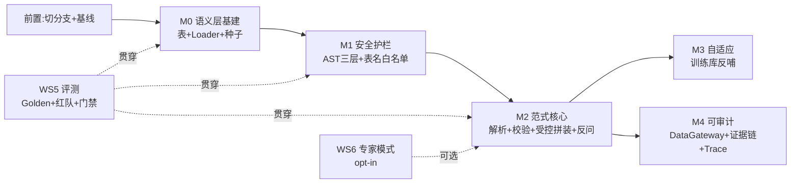

中文 | English (TODO)

# DataAgent v0.2 Task 规划 — 执行编排

> 本文是 [`V0.2_PRD.md`](./V0.2_PRD.md) §4 WBS 的**执行编排版**：依赖图、复杂度估算、执行批次、分支步骤、与 CCG 流程对接。PRD 定义 What/Why，本文定义 How/When/Order。
>
> 控制论骨架：η₅ 先稳后优（M1 安全先于 M2 范式）+ 依赖驱动排序。

---

## 0. 执行前置（M0 之前）

| # | 动作 | 命令 |
|---|---|---|
| P0.1 | 从 `v0.1-integration` 派生 v0.2 工作分支（**勿基于当前 `v0.1/eval`**） | `git checkout v0.1-integration && git checkout -b v0.2/semantic-layer` |
| P0.2 | 确认 v0.1-integration 的 AST 护栏 / g2-ssr / Skills 在本分支可用 | 编译 + 跑现有测试 |
| P0.3 | 评测基线快照（v0.2 改造前对照） | `DataAgentBaselineEvalTest` 跑一次存档 |

---

## 1. 里程碑依赖图

> **硬序**：M0 → M1 → M2（η₅：无护栏的受控拼装 = 模板片段被污染时直打生产库）。M3/M4 可在 M2 后并行。

---

## 2. 执行批次（Batch）

| Batch | 内容 | 里程碑 | 可并行 |
|---|---|---|---|
| **B1 地基** | WS0.1 表+Loader + WS0.4 种子 + WS5.1 Golden 扩充 | M0 | WS0.3 管理 UI 后置 |
| **B2 安全** | WS1.1 AST 三层 + WS1.2 表名白名单 + WS1.3 全局有界 + WS5.2 红队 | M1 | — |
| **B3 范式** | WS2.1 候选过滤 → WS2.2 语义解析 → WS2.3 校验 → WS2.4 受控拼装 → WS2.5 反问 | M2 | WS0.3 管理 UI（与 B3 并行） |
| **B4 网关+自适应** | WS3.1-3 DataGateway/证据链/Trace + WS4.1-3 训练库 | M3+M4 | WS3 ∥ WS4 |
| **B5 收尾** | WS5.3 回归门禁 + WS6.1 专家模式（可选） | — | — |

---

## 3. Task 卡片（ID / 复杂度 / 依赖 / 验收）

### WS0 · 语义层基建
| ID | 标题 | 复杂度 | 依赖 | 验收（η₇） |
|---|---|---|---|---|
| 0.1 | metric/metric_version/semantic_alias/query_log/sql_example 5 表 DDL + Mapper + Entity | M | P0 | 表建成功 + 单测 CRUD |
| 0.2 | SemanticLayerLoader 内存热加载（Map<code,M>）+ clearCache | S | 0.1 | 加载/刷新单测 |
| 0.3 | 语义层管理 CRUD + UI（metric/ver/alias + agent/ds 绑定） | L | 0.1 | UI 可增删改 + 绑定生效 |
| 0.4 | 种子数据：demo ds ≥8 指标 + ≥3 口径版本 + 别名 | S | 0.1 | 种子导入成功 |

### WS1 · 安全护栏
| ID | 标题 | 复杂度 | 依赖 | 验收 |
|---|---|---|---|---|
| 1.1 | SqlGuardNode（jsqlparser 三层：首词/正则/AST+方言函数） | M | 0.1 | 红队用例 100% 拦截 |
| 1.2 | 表名白名单（TablesNamesFinder 重解析 ⊆ 召回表集） | S | 1.1 | 越权表 100% 拦截 |
| 1.3 | 全局有界（重试/超时/行数/成本 统一配置） | S | — | 无超时/死循环 |

### WS2 · 受控拼装流水线（范式核心）
| ID | 标题 | 复杂度 | 依赖 | 验收 |
|---|---|---|---|---|
| 2.1 | SemanticContextFilterNode（按 agent+ds 收敛候选 metric/dim） | M | 0.2 | 候选数 ↓，信道减载 |
| 2.2 | SemanticParseNode（LLM 选指标，BeanOutputConverter 约束 JSON） | L | 2.1 | 输出 SemanticObject，零 SQL |
| 2.3 | ValidateNode + FieldValidateNode（规则校验） | M | 2.2 | 不完整/字段错→反问 |
| 2.4 | BuildSQLNode（受控拼装 + JOIN 路由 logical_relation） | L | 2.3 | 参数化 SQL，口径一致率 100% |
| 2.5 | 反问机制（复用 HumanFeedback interruptBefore） | S | 2.3 | 口径歧义→反问 |

### WS3 · Data Gateway + 证据链
| ID | 标题 | 复杂度 | 依赖 | 验收 |
|---|---|---|---|---|
| 3.1 | DataGateway 执行封装（只读/脱敏/超时/行数/友好错误） | M | 2.4 | 执行边界全部生效 |
| 3.2 | query_log 证据链写入 | S | 3.1 | 每查询落证据链 |
| 3.3 | Run Trace DAG（Web/API 可回放） | M | 3.2 | run 可回看每步依据 |

### WS4 · SQL 训练库
| ID | 标题 | 复杂度 | 依赖 | 验收 |
|---|---|---|---|---|
| 4.1 | sql_example 向量索引 + 成功反哺（hash 去重 + 审核开关） | M | 2.4 | 成功 SQL 入库 |
| 4.2 | EvidenceRecallNode 第三路召回（few-shot 注入） | M | 4.1 | 同题二次命中率 ↑ |
| 4.3 | 训练库治理（脏数据隔离 + 反哺白名单） | S | 4.1 | 脏数据不污染 |

### WS5 · 评测（贯穿）
| ID | 标题 | 复杂度 | 依赖 | 验收 |
|---|---|---|---|---|
| 5.1 | Golden Query Set 扩充（标准/口径歧义/反问/边界） | M | — | 覆盖 4 类 |
| 5.2 | 红队 SQL 用例集（DML/DDL/越权/危险函数/注入） | M | 1.1 | 拦截率 100% |
| 5.3 | 回归门禁（口径一致 + 语义正确 + 安全 + 自适应曲线） | M | 全 | CI 门禁生效 |

### WS6 · 专家模式（可选）
| ID | 标题 | 复杂度 | 依赖 | 验收 |
|---|---|---|---|---|
| 6.1 | 现有 NL2SQL 链路封装 opt-in 专家模式（默认关，AST 贯穿） | M | 2.4 | 可切换，护栏生效 |

---

## 4. 复杂度汇总

| 复杂度 | 数量 | 典型 |
|---|---|---|
| L（跨模块/重逻辑） | 4 | 0.3 管理 UI / 2.2 语义解析 / 2.4 受控拼装 / (2.x 核心) |
| M（单模块多文件） | 13 | 0.1 表 / 1.1 护栏 / 2.1 候选过滤 / 3.1 Gateway / 4.1 训练库 ... |
| S（单文件小改） | 7 | 0.2 Loader / 0.4 种子 / 1.2 表名白名单 / 2.5 反问 / 3.2 证据链 ... |
| **总计** | **24 task** | — |

---

## 5. 与 CCG 流程对接

- **逐 task 执行**：`/ccg:go implement V0.2 task 2.4 受控拼装`（自动选 guided-develop / full-collaborate）
- **里程碑门禁**：每个 M 完成后跑 WS5.3 回归门禁，η₇ 通过才进下一 M
- **批量创建 harness tasks**：开始执行时，可用 `/ccg:spec-impl` 把本表 24 task 灌入 harness task list（v0.1 模式）
- **当前状态**：harness 已建里程碑级锚点（M0-M4 + 前置），详细 WS task 留本文档

---

## 来源

- PRD：[`V0.2_PRD.md`](./V0.2_PRD.md) §4-5（WBS + 里程碑 + 实施顺序）
- 架构：[`V0.2_ARCHITECTURE.md`](./V0.2_ARCHITECTURE.md)（节点改造 + DDL + 拼装引擎）
- 控制论：[`NL2SQL_AGENT_CYBERNETICS.md`](./NL2SQL_AGENT_CYBERNETICS.md)（η₅ 排序依据）
