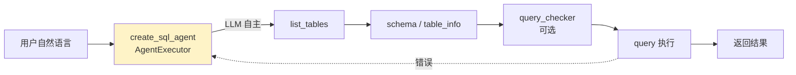

# 路线①：LangChain 开环 SQL Agent 三例

> 路线① · 单步开环 Agent（LLM 自主 tool calling）· 教学级
> 本地路径：`/home/ubuntu/dev/reference/{text-to-sql-agent, LangChain-SQL-Agent-for-dynamic-data-visualization, langchain-sql-agent-guide}`

三个项目都是 **LangChain `SQLDatabaseToolkit` + `create_sql_agent`/`create_agent` 的薄封装**，让 LLM 在一个 agent executor 里自主调用 `list_tables`→`schema`→`query`→`query_checker` 工具链，单轮内完成 NL2SQL。价值低于 vanna/SQLBot/QueryWeaver，故合一卡，每项仅录差异点。

## 共性画像（开环控制：list_tables→schema→query→check 一轮内完成，无显式反馈通道）

- **控制结构**：开环。工具调用顺序、是否重试、何时停，全由 LLM 在 `max_iterations` 内自主决定，**没有独立的「测量-比较-校正」节点**。错了靠模型在剩余 iteration 里自己领悟（`query_checker` 只是工具，是否调用看模型心情）。
- **Schema 投递**：全量塞上下文。`SQLDatabaseToolkit` 默认把表清单 + 每表 DDL + 若干样本行 (`sample_rows_in_table_info`) 打包喂给模型；表多了 token 爆炸、信息密度低。仅 `langchain-sql-agent-guide` 用 `custom_table_info` 手写注释缓解。
- **安全**：靠 system prompt 文本约束「不得 DML」，无强制护栏（对比 QueryWeaver 的 DML/DDL 拦截 + 二次确认）。
- **可观测**：除 `text-to-sql-agent` 接了 LangSmith，另两个只有 `verbose=True` 控制台打印。
- **规模**：每个项目核心代码 < 130 行，单文件 demo，无测试、无鉴权、无生产化。

---

## text-to-sql-agent

- **定位**：Anthropic 官方教程式 demo，CLI + Jupyter。**唯一价值点是 LangSmith trace 可观测性教学**。
- **技术栈**：Python 3.11 · `langchain>=1.2.3` + `langgraph>=1.0.6` + `langchain-anthropic` · SQLite（Chinook 样例库）· Claude Sonnet 4.5（`temperature=0`）· `rich` 终端渲染 · uv 包管理。
- **关键源码路径**：
  - `/home/ubuntu/dev/reference/text-to-sql-agent/agent.py` — 全部逻辑（128 行）：`create_sql_agent()` 连 SQLite→`SQLDatabaseToolkit`→`create_agent(model, tools, system_prompt)`，CLI 入口 `main()` 用 `rich.Panel` 包问答。
  - `/home/ubuntu/dev/reference/text-to-sql-agent/tutorial.ipynb` — 教学笔记本，21 cell：逐步构建 agent + 3 个示例查询 + LangSmith 配置检查 cell。
  - `/home/ubuntu/dev/reference/text-to-sql-agent/text2sql-LangSmithTraceView.png` — LangSmith trace 截图。
  - `SYSTEM_PROMPT`（`agent.py:18-39`）：硬编码「先 list_tables，再 schema，限制 top_k=5，禁 DML」。
- **亮点（可借鉴）**：
  - **LangSmith trace**：仅需 `.env` 配 4 个环境变量（`LANGCHAIN_TRACING_V2=true` / `LANGSMITH_ENDPOINT` / `LANGCHAIN_API_KEY` / `LANGCHAIN_PROJECT`），每次 `agent.invoke` 自动上报，trace 里能看到完整工具调用链、token 用量、耗时、生成的 SQL、错误重试。这是本项目唯一值得抄的点——**Spring AI 侧的对应物是 Spring AI Observability + OpenTelemetry / Langfuse**。
- **局限**：无记忆、无鉴权、无自愈闭环、无 schema 检索（全量塞 prompt）、纯单轮 CLI；`chinook.db` 需手动下载。

---

## LangChain-SQL-Agent-for-dynamic-data-visualization

- **定位**：把 **Plotly 可视化函数注册成 agent 工具**，让 LLM 查完库自己挑图表画。核心创新是「可视化即工具」。
- **技术栈**：Python 3.10 · `langchain` + `langchain-community` + `langchain-openai` · SQLite（运行时从 Eurostat API 拉 TSV→清洗→`to_sql`）· GPT-4o-mini（`temperature=0.1`）· Plotly + pandas。
- **关键源码路径**：
  - `/home/ubuntu/dev/reference/LangChain-SQL-Agent-for-dynamic-data-visualization/run_sql_agent.py` — 主流程（104 行）：`load_and_clean_eurostat_df()` 拉 Eurostat TSV 并宽长透视清洗，`load_sql_database()` 建库，`load_sql_agent()` 用 `create_sql_agent(..., extra_tools=[...])` 注入可视化工具，`max_iterations=15` / `max_execution_time=30`。
  - `/home/ubuntu/dev/reference/LangChain-SQL-Agent-for-dynamic-data-visualization/agent_tools.py` — **本项目的灵魂**（69 行）：三个 `@tool` 装饰器函数 `output_table` / `output_bar_plot` / `output_time_series_plot`，入参是 JSON 字符串，内部 `pd.DataFrame` + Plotly 渲染。工具 docstring 里写清楚数据契约（"data 必须是 dict-formatted string，第一个 key 当 x 轴"）。
  - `/home/ubuntu/dev/reference/LangChain-SQL-Agent-for-dynamic-data-visualization/config.py` — Eurostat 4 数据集 URL + category_map + agent 超参。
- **亮点（可借鉴）**：
  - **可视化作为 agent 工具**：不是"查完表再交给前端画"，而是 LLM 根据问题语义**自主选择图表类型**（pretty table / bar / time-series），并在 docstring 里用结构化示例约束输入格式。这套思路可移植到 Spring AI Graph 的"结果呈现"节点——把 ChartRenderer 注册成 `@Tool`，让模型按问题意图选柱状/折线/表格。
- **局限**：工具入参是 JSON 字符串而非强类型（靠 docstring + LLM 理解，易错）；Plotly `fig.show()` 弹窗式，无 Web 聚合；无 trace、无记忆、无鉴权；`openai_key` 硬编码在 `config.py`（已脱敏但仍是反模式）。

---

## langchain-sql-agent-guide

- **定位**：教学梯度最完整的一个——**同一 bookstore 场景递进演示 4 个能力**：basic → memory → callback → FastAPI 服务化。亮点是 **PG 持久化会话记忆** + **Callback 捕获原始 SQL 结果**。
- **技术栈**：Python 3.9+ · `langchain` + `langchain-community` + `langchain-openai` + `langchain-postgres` · PostgreSQL（bookstore 库，含 `books_with_authors` 视图）· GPT-4（`temperature=0`）· FastAPI + uvicorn · psycopg（异步连接）。
- **关键源码路径**（4 文件构成一条教学梯度）：
  - `/home/ubuntu/dev/reference/langchain-sql-agent-guide/basic_agent.py` — 65 行。最简形态：`SQLDatabase` + `custom_table_info`（手写表注释让 LLM 更准）+ `view_support=True`（含视图）+ `create_sql_agent(..., agent_type="tool-calling")`。
  - `/home/ubuntu/dev/reference/langchain-sql-agent-guide/agent_with_memory.py` — 108 行。**PG 持久化记忆**：`PostgresChatMessageHistory`（`langchain_postgres`）+ `ConversationBufferMemory`，按 `session_id`（UUID）隔离会话；`format_history()` 只取最近 6 条拼进 `custom_prefix`，避免历史无限膨胀；`ainvoke` 全异步。
  - `/home/ubuntu/dev/reference/langchain-sql-agent-guide/agent_with_callback.py` — 80 行。**自定义 `BaseCallbackHandler`**：`SQLResultHandler` 在 `on_tool_start` 识别 `sql_db_query` 工具并记 `run_id`，在 `on_tool_end` 按 `run_id` 配对捕获原始查询结果，绕过 LLM 的自然语言封装，拿到结构化 `raw_sql_result`。
  - `/home/ubuntu/dev/reference/langchain-sql-agent-guide/main.py` — 134 行。前三者合体为 FastAPI `/chat` 端点：`ChatRequest{message, user_id}` → 建带记忆 agent → `ainvoke({...}, {"callbacks":[sql_handler]})` → 返回 `{reply, raw_sql_result}`。
- **亮点（可借鉴）**：
  - **PG 持久化记忆**：`PostgresChatMessageHistory` + 异步 `psycopg.AsyncConnection`，按 `session_id` 隔离多轮上下文，配合 `format_history` 滑动窗口（最近 N 条）。Spring AI 侧对应物是 `ChatMemory` + `JdbcChatMemoryRepository` / Redis 实现，思路一致：**记忆按 sessionId 分桶 + 窗口截断防 token 爆**。
  - **Callback 捕获结构化结果**：`BaseCallbackHandler` 按 `run_id` 精准配对 tool 的 start/end，从黑盒 agent 里"侧通道"抽出原始 SQL 结果，供下游程序化消费（而非只给用户一句话）。Spring AI 对应物是 `ToolCallback` / `AdvisedRequest` 拦截链 / Graph 节点间 state 传递——**Graph 天然显式 state，比 callback 隐式侧通道更干净**。
- **局限**：仍是开环（无自愈）；记忆依赖手写 `custom_prefix` 拼历史，非框架级；Callback 用 `run_id` 集合做配对，多并发同工具易错配；API key 硬编码；无 trace（未接 LangSmith）。

---

## → Spring AI Alibaba Graph 构建启示

- **可借鉴**：
  - **LangSmith 式 trace 可观测**（来自 text-to-sql-agent）：Spring AI 原生支持 [Observability + OTel](https://docs.spring.io/spring-ai/reference/api/observability.html)，配 Langfuse/Arize/Phoenix 即可拿到等价 trace；Graph 每个节点天然是 trace span，比 LangChain agent 的黑盒 invoke 粒度更细。
  - **Callback 侧通道 → Graph 显式 state**（来自 langchain-sql-agent-guide）：开环 agent 要靠 `BaseCallbackHandler` hack 才能拿到中间结果；Graph 把"原始 SQL 结果"放进 `State`，下游节点直接读，**用结构化 state 取代隐式 callback**，这正是路线② 的优势。
  - **记忆持久化思路**（来自 langchain-sql-agent-guide）：`sessionId` 分桶 + 滑动窗口截断，直接落到 Spring AI `ChatMemory` + JDBC/Redis Repository。
  - **可视化即工具**（来自 dynamic-data-visualization）：结果呈现节点可注册 `@Tool`，让模型按问题语义选图表类型。
- **可规避**（这些正是路线② Graph 要解决的）：
  - **开环无自愈**：三例都是 LLM 在 `max_iterations` 内"撞大运"式重试，没有显式的「执行→校验→失败→定向修复」闭环。Graph 应用条件边 + `interruptBefore` + 状态快照恢复，可做 QueryWeaver 式 HealerAgent 多重闭环（见 CYBERNETICS §4.1）。
  - **全量 schema 塞上下文**：`SQLDatabaseToolkit` 默认把所有表 DDL + 样本行全喂给模型，表一多就 token 爆炸 + 信息密度低。Graph 应引入 **schema 检索节点**（向量召回 / 外键子图 / 元数据过滤），只把相关表喂给生成节点——对应 vanna 的 training plan / QueryWeaver 的图检索。
  - **安全仅靠 prompt 文本**：三例都靠 system prompt 说"禁 DML"，无强制。Graph 应在执行节点前加 **SQL 静态校验节点**（AST 解析拦截 DML/DDL，破坏性操作 `interruptBefore` 人工确认）。

## 相关

- 控制论综合分析：[NL2SQL_AGENT_CYBERNETICS.md](../dev/NL2SQL_AGENT_CYBERNETICS.md) §2.1（路线①开环）、§4.1（为什么选 Graph 而非开环）、§5 对照表（第 357-359 行将此三例归为①开环）。
