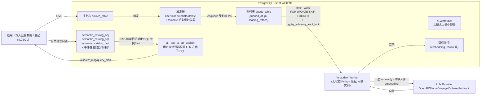

# pgai

> 路线④ · PostgreSQL 原生 AI 扩展 · 本地路径 `/home/ubuntu/dev/reference/pgai`

## 一句话定位

把 embedding 生成/同步、语义检索、以及 text-to-SQL（语义目录）**下沉到 PostgreSQL 内部**，用 DB 原生的触发器、事件触发器、查询计划器作为 AI 工作流的确定性骨架，让"非确定的 LLM"与"确定的数据库机制"分层耦合的参考实现。

## 维护状态

**已停维（已确认）。** README 顶部明确写明：

> `As of February 2026, this project is no longer being maintained or supported.`

git 历史佐证：`f23f237 / 47d74af (2026-05-27) Update README to indicate project is no longer maintained`，最后一次功能性提交是 `3e05485 (2025-12-17)`，此后半年内仅更新停维公告。扩展控制文件版本为 `0.11.3-dev`（`projects/extension/*.control`）。

**对选型的影响**：

- 不可作为生产长期依赖项（无安全补丁、无 PG 新版本适配）。
- 但其**源码与设计模式**是高质量的参考资产（queue + advisory lock、EXPLAIN 校验、semantic catalog 渲染），值得在应用层（Spring AI Alibaba Graph）复刻，而非直接引入二进制依赖。
- 由 Timescale 维护，停维属于公司策略而非技术失败；同类替代可关注 pgvector / pgvectorscale 的后续生态。

## 技术栈与版本

| 维度 | 实际情况（源码核实） |
|------|---------------------|
| 扩展机制 | 标准 PG 扩展，控制文件 `requires='vector, plpython3u'`（依赖 **pgvector** + **PL/Python 3U**），`schema=ai`，`relocatable=false` |
| 是否依赖 TimescaleDB | **不依赖**。grep `timescale/timescaledb` 在 control / pyproject 中无运行时依赖，仅出现在 repo URL 与文档营销语中。可跑在任意 PG（RDS / Supabase / 自建）。 |
| 扩展语言 | PL/pgSQL 为主（`projects/extension/sql/`），部分模型调用走 `plpython3u` |
| 应用层 | Python 库 `pgai`（`projects/pgai/`，PyPI 包名 `pgai`，`requires-python>=3.10`），基于 `psycopg`、`pydantic`、`asyncio` |
| Vectorizer Worker | 独立无状态 Python 进程（`pgai/vectorizer/worker.py`），可选 extra `pgai[vectorizer-worker]` |
| Semantic Catalog | 可选 extra `pgai[semantic-catalog]`，纯 Python + SQL 实现 |

## 核心架构



三个确定性 DB 机制承担"骨架"角色：**触发器**保证数据变更不漏，**advisory lock + SKIP LOCKED**保证多 worker 不抢不阻塞，**EXPLAIN**校验 LLM 产出的 SQL 不幻觉。

## 关键源码路径

| 模块 / 文件 | 职责 |
|-------------|------|
| `projects/extension/sql/idempotent/015-vectorizer-api.sql` | `ai.create_vectorizer(...)` 等 SQL API，声明式定义 loading/embedding/indexing/destination 流水线 |
| `projects/pgai/db/sql/incremental/001-vectorizer.sql` | `ai.vectorizer` 元数据表（source_schema/table/pk、queue_schema/table、trigger_name、config jsonb） |
| `projects/pgai/db/sql/idempotent/011-vectorizer-int.sql` | `_vectorizer_create_queue_table` / `_vectorizer_create_target_table` / `_vectorizer_create_view`：建队列、目标表、统一查询视图 |
| `projects/pgai/db/sql/incremental/026-change_trigger_definition.sql` | 重建每个 vectorizer 的 `after insert or update or delete`（行级）+ `after truncate`（语句级）触发器，把受影响 PK 写入队列 |
| `projects/pgai/pgai/vectorizer/vectorizer.py` → `VectorizerQueryBuilder.fetch_work_query` | **核心调度 SQL**：`FOR UPDATE SKIP LOCKED` + `pg_try_advisory_xact_lock` + `LATERAL` 取源行 |
| `projects/pgai/pgai/vectorizer/worker.py` → `class Worker` | 无状态 worker 主循环：`_get_pgai_version` / `_get_vectorizer` / `_get_vectorizer_ids`（动态发现）/ `_handle_error` / `request_graceful_shutdown` |
| `projects/pgai/pgai/vectorizer/embedders/{openai,ollama,voyageai,litellm}.py` | 各 embedding provider 适配，带限流/失败重试 |
| `projects/extension/sql/idempotent/900..905-semantic-catalog-*.sql` | semantic catalog 表族 + `search_semantic_catalog_obj` 向量检索函数 + 渲染函数 |
| `projects/extension/sql/idempotent/902-semantic-catalog-event-triggers.sql` | `_semantic_catalog_obj_handle_drop` / `_handle_ddl`：**PG 事件触发器**自动跟随 DDL 维护目录 |
| `projects/extension/sql/idempotent/906-text-to-sql-explain.sql` → `ai._text_to_sql_explain` | 用 `explain (verbose, format json)` 校验 LLM SQL，输出 `valid/err_msg/query_plan` |
| `projects/pgai/pgai/semantic_catalog/semantic_catalog.py` → `class SemanticCatalog` | Python 侧编排：`add_object` / `vectorize_all` / `search_objects` / `generate_sql` / `render_objects` |
| `projects/pgai/pgai/semantic_catalog/describe.py` | `describe(...)` / `generate_table_descriptions` / `generate_view_descriptions` / `generate_procedure_descriptions`：自动生成自然语言描述 |
| `projects/pgai/pgai/semantic_catalog/gen_sql.py` → `generate_sql` / `validate_sql_statement` | NL2SQL Agent 主循环：RAG→LLM→工具(搜索/给出SQL)→EXPLAIN 校验→失败回灌 |

## 亮点设计（源码级）

### 1. DB 内 embedding 的一致性：队列 + 双重锁

`VectorizerQueryBuilder.fetch_work_query`（`vectorizer.py:319`）用一条 CTF 实现并发安全的任务派发：

```sql
WITH selected_rows AS (
  SELECT pk_fields FROM queue_table LIMIT %s FOR UPDATE SKIP LOCKED
), locked_items AS (
  SELECT pk_fields,
    pg_try_advisory_xact_lock(%s::int, hashtext(concat_ws('|', ...))::int) AS locked
  FROM (SELECT DISTINCT pk_fields FROM selected_rows ORDER BY pk_fields) ...
), deleted_rows AS (
  DELETE FROM queue_table w USING locked_items l WHERE l.locked AND ...
)
SELECT s.* FROM locked_items l
LEFT JOIN LATERAL (SELECT * FROM source_table s WHERE ...) s ON true
WHERE l.locked = true ORDER BY pk_fields
```

两层锁分工：`SKIP LOCKED` 防止 worker 间互相阻塞；`pg_try_advisory_xact_lock` 按 PK 哈希加锁，**解决同一 PK 在队列里出现多条重复记录时的并发处理问题**（这是比单纯锁队列表更细的粒度）。`ORDER BY pk_fields` 防死锁。`LEFT JOIN LATERAL ... LIMIT 1` 强制运行时分块裁剪。这是"非确定 embedding 过程 + 确定性强一致队列"的范本。

### 2. 数据变更自动同步：触发器是唯一真相源

`026-change_trigger_definition.sql` 对每个 vectorizer 在源表上建两个触发器：

- 行级 `after insert or update or delete` → 把受影响 PK 入队 `queue_table`；
- 语句级 `after truncate` → 处理全表清空。

业务应用**只管写业务表**，完全解耦于 embedding 过程；worker 故障期间，变更堆积在队列，恢复后从断点续做。`ai.vectorizer` 元数据表（`001-vectorizer.sql`）持久化 `trigger_name / queue_schema / queue_table`，使配置是声明式、可重建的。

### 3. Semantic Catalog：自动 schema 描述 + 事件触发器自维护

两段式：

- **生成**（`semantic_catalog/describe.py:742 describe`）：扫描 `pg_catalog` 拿到 table/view/procedure 的 DDL，分批调 LLM 生成自然语言描述，写回 `semantic_catalog_obj`。`generate_table_descriptions` 等带 `record_*_description` 回调，边生成边落库。
- **自维护**（`902-semantic-catalog-event-triggers.sql`）：注册 PG **事件触发器** `on sql_drop`（`_semantic_catalog_obj_handle_drop`）和 DDL 事件（`_semantic_catalog_obj_handle_ddl`）。用户 `DROP TABLE` 时，对应目录行**自动删除**，避免目录与真实 schema 漂移。这是"DB 原生"路线才有的零漂移保证——应用层方案做不到事件级实时。

### 4. 用查询计划器对抗 LLM 幻觉：EXPLAIN 校验闭环

`ai._text_to_sql_explain`（`906-text-to-sql-explain.sql`）：

```sql
explain (verbose, format json) %s  -- 对 LLM 产出的 SQL 只做计划，不执行
-- 捕获 exception → valid=false, err_msg=message_text||pg_exception_detail||pg_exception_hint
```

`gen_sql.py:generate_sql` 的 Agent 循环（与 semantic_catalog/README 的伪代码一致）：RAG 取上下文 → LLM 二选一工具（`search` 找更多上下文 / `answer` 给 SQL）→ `validate_sql_statement` 跑 EXPLAIN → 若 `valid=false`，把 `err_msg` 回灌进 prompt 让 LLM 修正，直到合法或达迭代上限。**用确定性的 PG planner 给非确定的 LLM 兜底**，是这条路线最值得借鉴的控制论设计。

### 5. 上下文渲染：SQL 即 prompt

`render.py` / `semantic_catalog.py:render_objects` 把检索到的对象渲染成带 `<table id=...>` 标签的 SQL 块（含 `CREATE TABLE`、`ALTER ... CONSTRAINT`、`COMMENT ON`、`COPY (SELECT * ... LIMIT 3)` 样本）。理由（README 原文）：LLM 已在 SQL 上训练充分，没有比 SQL 更精确描述库结构的方式，且天然包含结构、注释、样本三重语义。

## 局限

- **单源耦合**：embedding、catalog、EXPLAIN 校验**全部绑定单一 PG 实例**。跨异构数据源（MySQL / Mongo / ES / 文件）无法享受这套机制，需退化为应用层编排。
- **已停维**：见维护状态。无安全补丁，新 PG 版本适配无保障。
- **PL/Python 依赖**：扩展需 `plpython3u`（untrusted），部分托管 PG（如某些 RDS 配置）默认禁用，部署摩擦大。
- **Worker 仍是外部进程**：虽号称"DB 内"，但真正的 embedding 调用仍由 Python worker 拉数据出库处理，并非存储过程内联执行；"下沉"主要指**调度与一致性状态**下沉，不是计算下沉。
- **catalog 对超大规模库**：事件触发器 + 全量描述生成在大规模 DDL 频繁的库上可能有写放大。

## → Spring AI Alibaba Graph 构建启示

### 可借鉴（在应用层复刻 pgai 的"确定性骨架"思想）

1. **Semantic Catalog 自动 schema 描述**：`describe.py` 的"扫 pg_catalog → DDL+样本 → LLM 生成描述 → 落库"流水线，可在 Java 侧用 `DatabaseMetaData` / `INFORMATION_SCHEMA` 复刻，产物存入向量库，作为 NL2SQL Agent 的 RAG 上下文源。
2. **EXPLAIN 校验闭环**：`gen_sql.py` 的"LLM 产出 SQL → EXPLAIN 校验 → 失败回灌"是最该搬进 Graph 节点的模式。Spring AI Graph 里做一个 `validate_sql_node`，用 `EXPLAIN`（或各数据源的 `EXPLAIN/DESCRIBE/验证语法`）做确定性 gate，失败边回流到生成节点，天然形成自纠环。
3. **渲染即 prompt**：`render_objects` 把对象渲染成带 id 的 SQL 块（DDL+约束+注释+样本）的做法，直接可用于 prompt 模板，比拼字符串描述更精确、更省 token。
4. **确定性工具 + 非确定 LLM 分层**：pgai 把"找上下文"和"给 SQL"做成 LLM 工具，而校验交给 DB——映射到 Graph 就是把重试/校验/路由交给图结构（确定性），生成交给 LLM 节点（非确定性）。

### 可规避（不要照搬 pgai 的单源耦合）

1. **勿把 embedding/catalog 状态锁死在单一 PG**：pgai 的优势（触发器、事件触发器、advisory lock）恰好也是它的天花板——只能服务单一 PG。我们的 NL2SQL Agent 面向多异构数据源，catalog 与同步机制应放在**应用层 + 独立存储**，对 PG/MySQL/Mongo 各写 adapter，而不是依赖源库的触发器。
2. **勿依赖停维项目**：不要引入 pgai 二进制/扩展作为运行时依赖；只参考源码模式。如需生产级 PG 向量检索，评估 pgvector / pgvectorscale 等仍在维护的项目。
3. **"DB 内 embedding"是表象**：pgai 的 worker 仍把数据拉出库调 embedding API，真正的计算并未下沉。我们在应用层用 Graph 编排 embedding pipeline，灵活度更高（可换模型、可加缓存、可观测），不必追求"下沉到 DB"的形式正确。

## 相关

- 控制论综合分析：[NL2SQL_AGENT_CYBERNETICS.md](../dev/NL2SQL_AGENT_CYBERNETICS.md) §2.4 / §4.3
