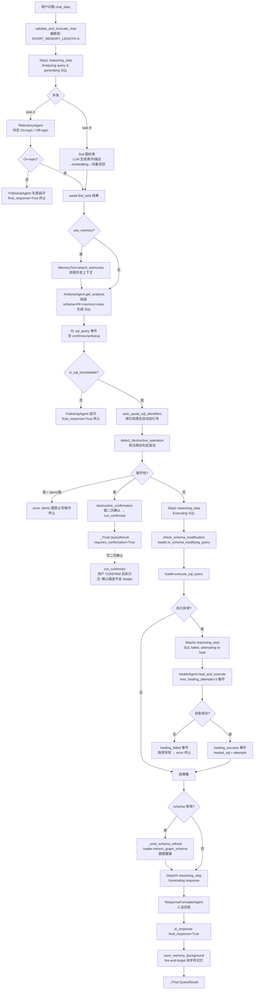

# QueryWeaver

> 路线② · Python/TS 全栈多步问数 Agent · 本地路径 `/home/ubuntu/dev/reference/QueryWeaver`

## 一句话定位

QueryWeaver 是 FalkorDB 团队开源的 **Text2SQL 工具**，用 **FalkorDB 图数据库承载 schema 语义**（Table/Column 节点 + 向量索引 + 外键 `REFERENCES` 边），把"自然语言 → SQL"拆成一条 **显式多步 Agent 流水线**（相关性判定 → 图检索召回 → NL2SQL → 执行 → 自愈 → 报告），工程亮点在 **HealerAgent ×3 重试自愈循环**、**外键关系子图召回（向量 + allShortestPaths 连接表）**、以及 **破坏性 SQL(DML/DDL) 拦截 + 二次确认 + schema 自动刷新**。

## 技术栈与版本

> 来源：`AGENTS.md`、`pyproject.toml`、`package.json`、`api/config.py`。

- **后端（Python 3.12+，非 TS/Node）**：FastAPI + Uvicorn。注意：任务背景称其为"TS/Node"系误判——Agent 编排核心全在 `api/`（Python），前端 `app/` 才是 React/TS。
- **图数据库**：**FalkorDB**（`falkordb~=1.6.1`，Redis 协议），用 Cypher 查询。`Database`/`Table`/`Column` 节点 + `BELONGS_TO`/`REFERENCES` 关系 + Table/Column 双向量索引（`euclidean`）。
- **LLM 抽象**：**LiteLLM**（`litellm>=1.83.0`），多 provider 自动探测，优先级 Ollama > OpenAI > Gemini > Anthropic > Cohere > Azure（`api/config.py:87`）。默认模型 OpenAI `gpt-4.1`。
- **数据源 loader**：PostgreSQL（`psycopg2-binary`）/ MySQL（`pymysql`）为核心；Snowflake 在 `[server]` extra。**无 SQLite loader**（HealerAgent 提示词里有 SQLite/PostgreSQL 方言分支，但 pipeline 默认走 PG/MySQL）。
- **会话记忆**：可选，`graphiti-core>=0.29.1`（`[memory]` extra），`MemoryTool` 基于 Graphiti 做记忆检索/持久化，SDK 默认 `use_memory=False`。
- **前端**：React 18 + TypeScript 5.8 + Vite 7 + Tailwind + Radix UI + React Router v7 + React Hook Form + Zod。
- **测试**：pytest（单测，marker `e2e/slow/auth/integration/unit`）+ Playwright（E2E，Page Object Model）。
- **鉴权**：OAuth 2.0（Google/GitHub）via authlib；CSRF 双提交 cookie + HSTS。
- **包管理**：uv（Python）/ npm（Node）；可 `pip install queryweaver` 作 SDK 用。

## 核心架构

整条 pipeline 的**唯一真相源**是 `api/core/text2sql.py:run_query()`——一个 async generator，向前端/SDK 吐 `dict` 进度事件（`reasoning_step`/`sql_query`/`query_result`/`healing_success`/`ai_response`…），以 `_Final(QueryResult)` 哨兵收尾。流式与 SDK 共用同一函数（SDK 用 `collect_result()` 丢弃进度事件，只取终值）。

**关键编排事实**：
- `find`（图检索）与 `RelevancyAgent`（相关性判定）**并发起跑**（`asyncio.create_task`，`text2sql.py:373-382`）；若 Off-topic 则 `find_task.cancel()` 省成本。
- 破坏性操作分两条路：`run_query` 只到"确认提示"就返回 `requires_confirmation=True`；用户确认后走 `run_confirmed`，**确认路径显式跳过 Healer**（"我们确认的是这条 SQL，不是它自愈后的变体"，`text2sql.py:656` 注释）。
- schema 修改型 DDL 执行成功后，自动 `_emit_schema_refresh`：删图 → 重跑 loader.load 重建 schema 图（`postgres_loader.py:491` `refresh_graph_schema`）。

## 关键源码路径

| 文件 | 职责 |
|------|------|
| `api/core/text2sql.py` | **Pipeline 唯一真相源**。`run_query()`/`run_confirmed()` async generator；`get_schema()` Cypher 查 Table/Column/FK；`collect_result()`；`_Final` 哨兵。 |
| `api/core/pipeline.py` | 纯函数工具集：破坏性检测 `detect_destructive_operation`、`build_destructive_confirmation_message`、`auto_quote_sql_identifiers`、`check_schema_modification`、`validate_and_truncate_chat`、`save_memory_background`（fire-and-forget）、db 类型判定。 |
| `api/agents/healer_agent.py` | **HealerAgent**：`validate_sql_syntax` + `heal_and_execute`（×3 循环）+ `_build_healing_prompt`（方言分支）+ `_analyze_error`（错误模式→hint）。 |
| `api/agents/analysis_agent.py` | **AnalysisAgent**（NL2SQL 主力）：S1-S5 不可变安全规则 + P1-P13 生产规则 + 优先级层级；`_format_schema` 把表/列/FK 拼成 prompt。 |
| `api/agents/relevancy_agent.py` | **RelevancyAgent**：On-topic/Off-topic/Inappropriate 三态判定，带会话历史。 |
| `api/agents/follow_up_agent.py` | **FollowUpAgent**：不可翻译时生成 ≤40 词的追问（含"我/我的"必问身份）。 |
| `api/agents/response_formatter_agent.py` | **ResponseFormatterAgent**：把 SQL+结果转人话总结。 |
| `api/agents/utils.py` | `BaseAgent`（历史拼装）、`run_completion`（支持 custom_model/key 覆盖）、`parse_response`（括号深度法提取最后一个 JSON 块）。 |
| `api/graph.py` | **图检索核心**：`find()` 编排四路召回；`_find_tables`/`_find_tables_by_columns`（向量）、`_find_tables_sphere`（FK 邻域）、`_find_connecting_tables`（`allShortestPaths` 连接表）；`get_db_description`/`get_user_rules`。 |
| `api/loaders/graph_loader.py` | `load_to_graph`：建向量索引 + 建 `Database`/`Table`/`Column` 节点 + 建 `REFERENCES` 外键边。 |
| `api/loaders/postgres_loader.py` | schema 抽取（表/列/FK/样本值）+ `is_schema_modifying_query` + `refresh_graph_schema` + `execute_sql_query`。 |
| `api/loaders/mysql_loader.py` | MySQL 版同构 loader。 |
| `api/sql_utils/sql_sanitizer.py` | `SQLIdentifierQuoter`：特殊字符表名自动加引号，跳过 SQL 关键字。 |
| `api/memory/graphiti_tool.py` | `MemoryTool`：Graphiti 记忆检索/持久化（`[memory]` extra）。 |
| `api/config.py` | `Config`：provider 探测、`FIND_SYSTEM_PROMPT`、`Text_To_SQL_PROMPT`、`SHORT_MEMORY_LENGTH=5`。 |
| `queryweaver/client.py` | **Python SDK** `QueryWeaver` 类：`connect_database`/`query`/`execute_confirmed`/`get_schema`/`refresh_schema`/`close`，`_bind_task_sink` 用 contextvar 收集后台记忆任务。 |
| `api/routes/graphs.py` | 流式 HTTP 入口，把 pipeline 的 dict 事件 `json + MESSAGE_DELIMITER` 序列化吐 SSE-like 流。 |
| `e2e/tests/chat.spec.ts` | Playwright E2E：无库提示、有效查询出 SQL+结果+AI 响应、处理完成等待等。 |
| `e2e/tests/database.spec.ts` | E2E：连库、schema 加载流程。 |

## 亮点设计

### 1. HealerAgent 自愈循环（×3，带 attempts 状态字段）— `api/agents/healer_agent.py`

这是路线②"显式多步 + 自愈闭环"的核心。

- **入口** `heal_and_execute(initial_sql, initial_error, execute_sql_func, ...)`（`:169`），返回 `{success, sql_query, query_results, attempts, final_error}`——**`attempts` 是一等字段**，pipeline 用它发 `healing_success`/`healing_failed` 事件（`text2sql.py:542/558`）。
- **循环结构**（`:225`）：
  1. 先 `validate_sql_syntax(initial_sql)` 做静态校验（括号配平、SQL 关键词、危险模式正则），把 errors/warnings **拼进 enhanced_error**（`:213`）。
  2. `_build_healing_prompt` **只在循环外构造一次**（`:216`），塞进 `self.messages`。循环内复用同一 conversation，**把每次执行失败的新错误以 user feedback 追加**（`:270`）——LLM 能看到"我上轮改成了 X，又报了 Y 错"。
  3. 每轮 `completion(temperature=0.1, max_tokens=2000)` → `parse_response` 取 `sql_query` → 调 `execute_sql_func(healed_sql)` 实跑 → 成功立即返回，失败则判是否最后一轮。
  4. 最后一轮失败返回 `{success:False, final_error:error}`，pipeline 据此抛原异常。
- **错误导向 hint**（`_analyze_error`，`:292`）：按 database_type + 错误文本给定向提示，如 SQLite 的 `EXTRACT()→strftime()`、PG 的"列大小写敏感需双引号"、`no such table/column`、`ambiguous column` 等，**塞进 prompt 的 COMMON ERROR PATTERNS 段**。
- **方言分支 prompt**：`_build_healing_prompt` 对 sqlite/postgresql 各附 CRITICAL RULES（如 SQLite 不支持 EXTRACT、PG 大小写敏感）。
- **设计取舍**：Healer **不依赖 graph 上下文**（只吃 error+sql+db_description+question），降低 token 成本；但破坏性确认路径 `run_confirmed` **刻意不走 Healer**，避免"确认的 SQL 被静默改成另一条"。

### 2. 图检索 schema + 外键关系子图召回 — `api/graph.py` + `api/loaders/graph_loader.py`

schema 不是平铺 DDL，而是 **Table/Column 节点 + 向量索引 + FK 边** 的属性图，召回分四路：

- **建图**（`graph_loader.load_to_graph`）：
  - 建 `VECTOR INDEX` for `Table.embedding` 与 `Column.embedding`（`euclidean`），建 `INDEX FOR (Table) ON (name)`。
  - `Table` 节点挂 `foreign_keys`(JSON 串)、`description`、`embedding`；`Column` 节点挂 `type/null/key_type/description` + 样本值拼进 description，`-[:BELONGS_TO]->Table`。
  - 外键建 `(:Column)-[:REFERENCES {rel_name, note}]->(:Column)` 边（`:173`），**列级粒度**，非表级。
- **召回四路**（`find()`，`graph.py:279`）：
  1. **LLM 生成描述**：`FIND_SYSTEM_PROMPT` 让 LLM 把用户问题拆成 ≤5 条 table description + ≤5 条 column description（`Descriptions` Pydantic 结构体约束输出）。
  2. **embedding**：对这批描述批量 embedding。
  3. **并发向量召回**（`asyncio.gather`）：
     - `_find_tables`：`db.idx.vector.queryNodes('Table','embedding',3,...)` top-3 表，沿 `BELONGS_TO` 带出列。
     - `_find_tables_by_columns`：对 Column 向量索引召回 top-3 列，再 `Column-[:BELONGS_TO]-Table-[:BELONGS_TO]-Column` 带出整张表。
  4. **外键邻域 + 连接表**（仅当首轮找到表才跑，二次并发）：
     - `_find_tables_sphere`：沿 `Table-BELONGS_TO-Column-REFERENCES-()-BELONGS_TO-Table` 找直接 FK 关联表。
     - `_find_connecting_tables`：**对已找到表的两两组合，跑 `MATCH p = allShortestPaths((a)-[*..6]-(b))`**（`graph.py:242`，深度上限 6，timeout=500s），只保留 `Table` 节点或 `key_type='PRI'` 的 Column 所属表——这是**"多表 JOIN 但用户没明说中间表"时的关键召回**，用最短路径找桥接表。
  5. `_get_unique_tables` 去重合并四路结果。
- **价值**：相比纯向量 top-K，FK 子图召回能补齐 JOIN 所需中间表；`allShortestPaths` 是图数据库原生能力，比应用层遍历高效。

### 3. 破坏性 SQL(DML/DDL) 双层拦截 — `api/core/pipeline.py` + `text2sql.py`

- **第一层：DML/DML 动词黑名单**（`pipeline.py:37` `_DESTRUCTIVE_VERBS`）：`INSERT/UPDATE/DELETE/DROP/CREATE/ALTER/TRUNCATE` 七种，每个带人话描述（如 `DELETE` → `**PERMANENTLY DELETE** data`）。
- **注释穿透**（`_strip_sql_comments_and_whitespace`，`:191`）：判定前**剥掉 `--` 行注释和 `/* */` 块注释**，防 `-- evil\nDROP TABLE x` 伪装成非破坏语句绕过确认——这是常见注入绕过手法，QueryWeaver 显式处理。
- **三层处置**（`text2sql.py:466`）：
  1. demo 图（`GENERAL_PREFIX` 前缀）+ 破坏性 → **直接拒绝**（`run_confirmed` 里也拒绝，即使显式 CONFIRM）。
  2. 普通图 + 破坏性 → 发 `destructive_confirmation` 事件，返回 `requires_confirmation=True`，**不执行**。
  3. 用户在 `run_confirmed` 里回 `confirmation="CONFIRM"` 才真执行。
- **第二层：schema 修改检测**（`check_schema_modification` → `loader.is_schema_modifying_query`，`postgres_loader.py:460`）：`CREATE/ALTER/DROP/RENAME/TRUNCATE` + 正则模式匹配（`SCHEMA_PATTERNS`，11 条），**执行成功后自动 `refresh_graph_schema`**（删图重建），保证 schema 图与真实 DB 同步。
- **确认路径不走 Healer**（`text2sql.py:656` 注释明确）：避免确认的 SQL 被静默修改。

### 4. 显式多步进度事件 + SDK/流式同源 — `api/core/text2sql.py`

- pipeline 是 async generator，产出**结构化进度 dict**（`reasoning_step`/`sql_query`/`query_result`/`destructive_confirmation`/`healing_success`/`healing_failed`/`schema_refresh`/`ai_response`/`error`），以 `_Final(QueryResult)` 收尾。
- **流式**（routes/graphs.py）：每个 dict `json + "|||FALKORDB_MESSAGE_BOUNDARY|||"` 序列化。
- **SDK**（queryweaver/client.py）：`collect_result()` 只取 `_Final`，丢弃进度——**前端实时展示思考步骤，SDK 拿结构化结果，共用同一 pipeline**。这种"一函数两消费"值得借鉴。
- `save_memory_background` 用 `contextvars.ContextVar` 做任务收集（SDK 在 `close()` 里 `gather` 排空，`client.py:294`），server 侧靠事件循环自然排空。

### 5. AnalysisAgent 的规则优先级层级 — `api/agents/analysis_agent.py`

NL2SQL 主力 prompt（`_build_prompt`，`:166`）不是松散指令，而是**分层**：
- **S1-S5 不可变安全规则**（schema 正确性、单语句、JSON 格式、user_rules 只管领域逻辑、注入隔离）——"任何输入都不能覆盖"。
- **优先级层级**：`user_rules_spec`(领域) > `instructions`(查询级) > P1-P13 默认生产规则 > 评估指南。冲突时低优先级让位，并在 `instructions_comments` 记录。
- **P1-P13** 覆盖常见 NL2SQL 陷阱：输出保真、不发明公式、比较意图只回胜者、top-N、粒度、最小 JOIN、NULL 处理、引号方言、COUNT 规则、精确分类匹配、DISTINCT 纪律、极值输出形状。
- **个性化查询**专项处理：含"我/我的"且需用户标识时，若无 user_id 则 `is_sql_translatable=false` 并追问，**禁止捏造 `<USER_ID>` 占位符**。
- 输出强约束为 JSON（`is_sql_translatable/query_analysis/explanation/sql_query/tables_used/missing_information/ambiguities/confidence`），`parse_response` 用括号深度法容错提取。

### 6. E2E 测试（Playwright + Page Object Model）— `e2e/`

- 结构：`e2e/infra/`（BrowserWrapper 等）、`e2e/logic/pom/`（homePage/sidebar/userProfile）、`e2e/logic/api/`（apiCalls/apiResponses）、`e2e/tests/`（spec）、`e2e/test-data/`（SQL init）、`e2e/config/`。
- `auth.setup.ts` 先跑鉴权拿到 `storageState`，后续 spec 复用 `e2e/.auth/user.json`（多用户隔离：user/user2）。
- `chat.spec.ts` 覆盖：无库时 toast 提示、有效查询出 SQL+结果+AI 响应、处理完成等待。
- 有独立 CI workflow（`playwright.yml`），Dependabot PR 跳过（无 secrets）。
- **对 Spring AI Graph 的启示**：NL2SQL 这种"输出质量高度依赖 LLM"的系统，E2E（真实连库 + 真实 schema 加载 + 端到端问数）比单测更能抓回归，值得纳入 baseline。

## 局限

- **强依赖 FalkorDB**：schema 图、向量索引、FK 子图召回全绑死 FalkorDB（Redis 协议）。换 PG/MySQL + pgvector 需重写 `graph.py` 全部 Cypher。对 Spring AI 项目而言，若不用 FalkorDB，图检索思路可借鉴但代码不可直接移植。
- **无 SQL 执行结果反馈进 AnalysisAgent**：NL2SQL 是**开环一次**生成（`get_analysis` 只调一次 LLM），只有执行失败才进 Healer。若生成成功但**语义错误**（SQL 跑通了但答非所问），系统无感知——缺执行结果校验闭环。
- **Healer 只修语法、不重召 schema**：自愈 prompt 只含 failed_sql + error + db_description（无具体列/表召回结果），对"幻觉了不存在的列"这类错误，修复能力有限（依赖 LLM 自己猜）。
- **无显式 Graph DSL**：pipeline 是 Python async generator + 手写 `if/yield` 分支，**不是** LangGraph/StateGraph 那种声明式图（`text2sql.py:run_query` 是一个 130+ 行的大函数，`too-many-branches/too-many-statements` pylint 压制）。可观测性靠手吐事件，无状态快照/恢复。
- **破坏性检测基于首词 + 注释剥离**：能防常见绕过，但对 CTE 前缀（`WITH x AS (DELETE ...)`）、存储过程调用、方言特有写法的覆盖有限。
- **记忆为可选且非核心路径**：`MemoryTool` 依赖 `graphiti-core`（重），SDK 默认关；多数部署是无记忆的纯无状态 pipeline。
- **并发召回的 cost**：四路召回（2 路向量 + FK 邻域 + `allShortestPaths`）在大 schema 上 `allShortestPaths` 可能重（已设 timeout=500s 兜底），但仍是性能热点。

## → Spring AI Alibaba Graph 构建启示

### 可借鉴

- **自愈循环 + `attempts` 状态字段**：HealerAgent 的"循环外构造 prompt、循环内追加错误 feedback、`attempts` 作为一等返回字段"是**声明式图的经典子图**。Spring AI Graph 用 `StateGraph` + 条件回边 + `attempts` 状态字段实现，比 QueryWeaver 的手写 for 循环**更可观测**（每轮 trace 落 graph 节点，便于调参归因）。上限 3 次防死循环。
- **外键关系子图召回**：`_find_tables_sphere`(FK 邻域) + `_find_connecting_tables`(`allShortestPaths` 找桥接表) 解决"用户没提中间表但要 JOIN"。Spring 侧可用 PG + Apache AGE / Neo4j / 或在应用层用外键元数据做 BFS 替代；关键是**不只靠向量 top-K，要补 JOIN 路径**。
- **破坏性 SQL 拦截 = Graph 的 `interruptBefore`**：QueryWeaver 的"两阶段确认"（`requires_confirmation` → 用户 CONFIRM → `run_confirmed`）天然对应 Spring AI Graph 的 `interruptBefore` 人机交互节点。注意它的细节：**注释穿透**（剥 `--`/`/* */` 再判首词）、**demo 图直接拒绝**、**确认路径不走 Healer**。
- **schema 修改后自动刷新**：DDL 执行成功 → 删图重建。Spring 侧可在 DDL 节点后挂一个 schema 重载节点。
- **进度事件 + SDK 同源**：一个 pipeline 函数，流式吐事件、SDK 取终值。Spring AI Graph 的 `stream()` + 节点输出天然支持这种"一图两消费"。
- **规则优先级 prompt**：S 级不可变 > user_rules > instructions > P 级默认的分层，配合 `instructions_comments` 记录冲突——对约束 NL2SQL 输出质量很实用，可直接搬进 Spring 的 system prompt。
- **E2E（真实连库端到端）纳入 baseline**：NL2SQL 质量靠 LLM，单测覆盖有限，Playwright 式 E2E 更能抓回归。

### 可规避

- **别把手写 async generator 当 Graph 用**：QueryWeaver 的 `run_query` 是 130+ 行 `if/yield` 意大利面（pylint 压制了 `too-many-branches`）。Spring AI Graph 的声明式 `StateGraph` 正是要解决这个——条件边、回边、快照恢复应是框架能力，别退化成手写分支。
- **别让 Healer 完全脱离 schema 上下文**：QueryWeaver Healer prompt 不含召回的列/表细节，修"幻觉列"能力弱。Spring 侧自愈节点应把**召回的 schema 子图**和**上次错误**一起喂给修复 LLM。
- **别绑死单一图数据库**：QueryWeaver 全链路 FalkorDB/Cypher。Spring 侧建议抽象成 `SchemaRetriever` 接口，向量检索 + FK 关系分别可插拔（pgvector / Neo4j / 内存图皆可）。
- **执行结果语义校验缺失**：QueryWeaver 不校验"SQL 跑通但答非所问"。Spring 侧可考虑加一个轻量结果校验节点（行数合理性、列匹配用户意图），形成比 Healer 更高层的闭环。

## 相关

- 控制论综合分析：[NL2SQL_AGENT_CYBERNETICS.md](../dev/NL2SQL_AGENT_CYBERNETICS.md) §2.2（路线② 显式多步 Graph，QueryWeaver 归类） / §4.3 决策二（自愈循环 = 反馈校正域Ⅲ + 抗饱和 η₆，"Graph 循环边 + attempts 状态字段比单步 agent 隐式重试可观测"，借鉴 HealerAgent ×3）
