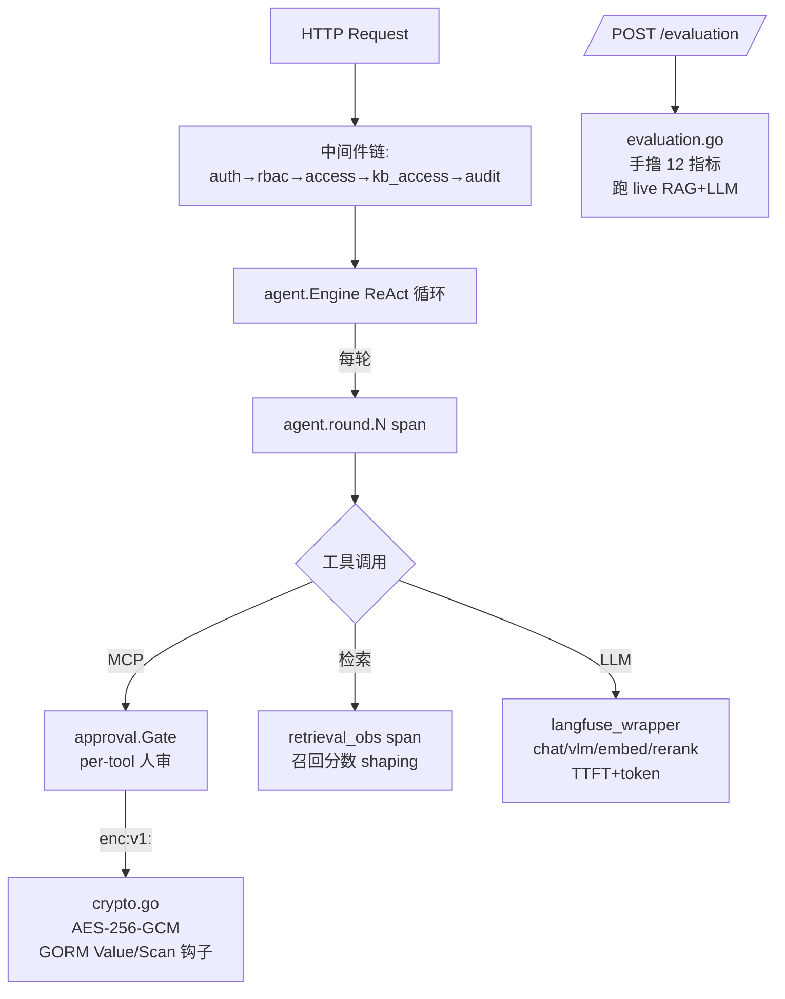

# WeKnora

> 路线②/④（RAG/Agent/Wiki 框架）· Go monorepo · 本地路径 `/home/ubuntu/main_weknora`（Tencent/WeKnora v0.6.3）

> 📌 **本研究卡定位**：WeKnora 不是 NL2SQL 项目（与 DataAgent 不同域），但是一个**工程化程度极高、可观测/安全/评测三件套成熟**的企业级 LLM 框架。对 DataAgent 的价值 = **补 v0.2/v0.3 的工程空白**（凭据加密 / 检索生成评测 / Langfuse 深度插桩），**非 NL2SQL 算法**。6 个机制全部**源码级核实**（非 README 营销），并发现 2 处"README 宣称 vs 源码现实"差距（见下）。

## 一句话定位

WeKnora 是腾讯开源的 RAG + ReAct Agent + Wiki 自治生成一体化知识框架（Go + Vue），核心在**全链路可观测（手撸 Langfuse HTTP 批客户端 + 五级 span）+ 多租户四级 RBAC + 端到端检索/生成评测（手撸 12 个指标）+ AES-256-GCM 凭据加密**——四块都是 DataAgent 的已知空白。

## 技术栈与版本

- **Go 1.26 + Gin + GORM**（monorepo：`internal/` 应用层 / `packages/` 公共库 / `cmd/` 入口 / `mcp-server/` / `frontend/` Vue / `miniprogram/` 微信）
- 模型层抽象：`internal/models/{chat,vlm,embedding,asr,rerank}/`，每类一个接口 + 多 provider + **Langfuse 包装器**
- 持久化：PostgreSQL（versioned migrations `migrations/versioned/`）+ 可插拔向量库（pgvector/Milvus/Weaviate/Qdrant/OpenSearch/Doris/...）
- 异步：asynq（Redis 队列），任务可跨实例 trace-stitching

## 核心架构（DataAgent 视角关心的四块）

## 关键源码路径

| 机制 | 关键文件 |
|---|---|
| RBAC | `internal/types/tenant_member.go`（角色枚举）/ `internal/middleware/{rbac,auth,access,kb_access}.go` / `internal/router/rbac.go`（guard 工厂）/ `internal/types/audit_log.go` + `migrations/versioned/000044_audit_log.up.sql` |
| 评测 | `internal/application/service/{evaluation,metric_hook,dataset}.go` / `internal/application/service/metric/{recall,mrr,map,ndcg,precision,bleu,rouge,rouge_score,common}.go` / `dataset/samples/*.parquet` |
| 凭据加密 | `internal/utils/{crypto.go,crypto_test.go}` / GORM 钩子散落 `internal/types/{model,vectorstore,mcp,mcp_oauth,datasource,tenant,web_search_provider}.go` / `internal/runtime/startup.go:74` |
| Langfuse | `internal/tracing/langfuse/{manager,tracer,client,events,middleware,asynq,retrieval_obs}.go` / 包装器 `internal/models/*/langfuse_wrapper.go` / agent `internal/agent/{engine,act,observe}.go` |
| MCP 人审 | `internal/agent/approval/{gate,gate_test}.go` / `internal/agent/tools/{mcp_tool,tool,exec_context}.go` / `internal/application/repository/mcp_tool_approval_repository.go` / 前端 `frontend/src/views/chat/components/ToolApprovalCard.vue` |
| 自适应分块 | `internal/infrastructure/chunker/{strategy,profiler,splitter,heading_splitter,heuristic_splitter,validator}.go` / `internal/handler/chunker_debug.go` / 前端 `frontend/src/views/knowledge/settings/KBChunkingDebug.vue` |

## 亮点设计（源码级）

### 1. 多租户四级 RBAC（🟡 对 DataAgent 中价值，审计去重高价值）

- 角色阶梯 `TenantRole`：Owner(40)/Admin(30)/Contributor(20)/Viewer(10)，按 `Level() >= required` 比较，**间隔 10 预留未来插入位**。另有 3 级 `OrgMemberRole` 处理跨租户 KB 共享。
- 强制点在 **Gin 中间件**（非 repo 层）：guard 工厂 `rbacGuards` 包裹每条路由，两原语 `RequireRole(min)` + `RequireOwnershipOrRole(min, lookup)`。
- **快路径优化**：角色已够则跳过 DB 查；enforcement 关闭则全跳（休眠模式零 DB 成本）；`EnableRBAC` 配置门控 fail-open/fail-closed 灰度。
- 归属靠 KB/Agent 上的 `creator_id`/`created_by`；子资源（chunk/doc）向上回溯到父 KB 创建者。
- 跨租户共享 `kb_shares` 表，**三维权限封顶**：`effective = MinOrgRole(share.Permission, org_membership.Role)`。
- **`audit_logs` 表**：append-only，**1 分钟滑动窗口去重，key = gin 路由模板 `c.FullPath()`（非原始 URL，防 UUID 枚举洪水）**，90 天清扫。
- API Key 路径**硬编码 TenantRoleAdmin + SystemAdmin=false**——API Key 永远到不了平台管理员操作。`TenantRoleFromContext` 缺失时 **fail-close 到 Viewer**。

> **对 DataAgent**：全量多租户违背 v0.2 单租户范围，但 **角色阶梯 + `creator_id` 归属 + `audit_logs` 路由模板去重** 与租户解耦，是最低扰动的可移植件。DataAgent 未来做审计时直接抄去重模式。

### 2. 检索+生成评测（🟢 对 DataAgent 高价值，填补空白）

- **12 个指标全部手撸 Go 实现**（无外部库）：BLEU 移植自 Python NLTK，ROUGE 移植自 Google Apache-2.0 `rouge_score`，CJK 分词 gojieba。recall/precision/NDCG@3/@10/MRR/MAP（检索）+ BLEU-1/2/4/ROUGE-1/2/L（生成），均为 `MetricInput{RetrievalGT, RetrievalIDs, GeneratedTexts, GeneratedGT}` 上的纯函数。
- 数据集 = MS MARCO Parquet（queries/corpus/qrels/answers/qas），`DefaultDataset()` **硬编码路径**（dataset ID 参数被忽略）。
- 用户触发异步批：`POST /evaluation/` → 建临时 KB → 灌黄金段落 → 每条 QA 跑**真实 RAG 管线 + 真实 LLM**（errgroup 并行，GOMAXPROCS-1）→ 逐条打分 → 滚动均值 → `GET /evaluation/?task_id=` 轮询。
- 任务态在**内存 map**（`evaluationMemoryStorage`）——单实例、易失、无 DB 持久化。
- ⚠️ **"可视化"是营销**：**无调试面板**。逐条 chunk/hit-miss/分数内部算了但**不进 HTTP 响应**（只回聚合均值），前端无评测路由/组件。
- 测试覆盖：recall/precision/MRR/MAP 有测；**BLEU/ROUGE/NDCG 无测**——数值正确性全靠移植忠实度。

> **对 DataAgent（NL2SQL 映射）**：RetrievalGT=黄金 schema/指标 ID，RetrievalIDs=召回 ID（recall@k/MRR/MAP/NDCG）；GeneratedGT=黄金 SQL，GeneratedTexts=生成 SQL（BLEU/ROUGE on SQL 文本，**丢 jieba、加 SQL 归一化**）。直接补 DataAgent "只有 SQL 正确性评测、无检索/生成质量评测" 的空白。**可视化要自建**（WeKnora 没有）——逐查询调试页展示召回 schema vs 黄金，正好收紧 v0.2 语义层回路。

### 3. 凭据加密 AES-256-GCM（🟢 对 DataAgent 高价值，S 工作量）

- **确认 AES-256-GCM**，纯标准库（`crypto/aes` + `cipher.NewGCM`，12 字节 nonce，16 字节 tag）。
- 主密钥 = 环境变量 `SYSTEM_AES_KEY`（恰 32 字节，否则加密静默关闭——`GetAESKey` 返 nil）。**裸字节直用，无 HKDF/KMS/文件**。启动横幅显示密钥是否存在。
- 存储信封：`enc:v1:<base64url(nonce||ciphertext+tag)>`——前缀让任何代码瞬间区分密文 vs 遗留明文。
- 全覆盖：模型 API Key、MCP token/OAuth secret、数据源凭据 map（逐值）、向量库密码、租户 API Key、网页搜索 key。加密在 GORM `Value()`/`BeforeSave` 钩子，解密在 `Scan()`/`AfterFind`。
- **双解密模式**：strict（要用凭据时——密钥轮换后失败炸响）vs lenient（列表端点——字段置空，绝不崩）。
- **幂等守卫**：重复加密 `enc:v1:` 值是 no-op（安全重复保存）。
- ⚠️ **无轮换机制**：`:v1:` 是画饼，无 rewrap 脚本、无版本字节。"轮换" = 运维换 env → 旧密文 GCM 鉴权失败 → lenient 路径置空 → 用户重输。有明文互操作路径（启用无需迁移）。

> **对 DataAgent**：纯 `javax.crypto`（`AES/GCM/NoPadding` + `GCMParameterSpec`），与 WeKnora 信封**字节级互操作**。**DataAgent 用 MyBatis 非 JPA** → 移植件是 **MyBatis `TypeHandler<String>`**（setParameter 加密 / getResult 解密），非 JPA `AttributeConverter`。⚠️ DataAgent 已有 `util/ApiKeyUtil.java`，R12 需先核实其现状（是否已加密/仅脱敏），避免重复。

### 4. Langfuse 可观测深度（🟢 对 DataAgent 高价值，复用现有 OTel）

- **无官方 Langfuse Go SDK**——WeKnora 手撸 HTTP 批客户端，POST `trace/span/generation-create` 到 `/api/public/ingestion`（Basic Auth，异步 worker，队列满丢弃，按 trace 采样，优雅 drain）。
- **装饰器模式**包裹每个模型接口（Chat/VLM/Embedder/ASR/Reranker）——`!mgr.Enabled()` 早返回内层。Nil-safe 单例门面：调用方无条件注入，禁用时成本消失。**非泛型 Tracer 接口**——换后端 = 改一个包。
- **五级 span 层级**：根 trace（HTTP 中间件）→ `agent.execute` span（engine.go:192，input=query+msg 数+KB ID+允许工具）→ `agent.round.N` span（每轮 ReAct）→ `{chat.completion generation + agent.tool.<name> spans + 嵌套 embedding/rerank generations}`。
- **流式感知**：chat 包装器记录 `CompletionStart`（TTFT）。
- 全覆盖：ReAct 循环、每次 LLM 调用、每次工具调用、检索工具（`SummarizeRetrieveOutput`/`SummarizeRankScores` shaping）、embedding/rerank/VLM/ASR，加**异步 trace-stitching**（asynq 中间件在 payload 带 parent trace id，worker 续接）。

> **对 DataAgent**：已有 OTel+OTLP 管道（`OpenTelemetryConfig.java`/`LangfuseService.java`）但只发**每请求一个粗粒度 span**。WeKnora 的五级层级 + 每模型装饰器 + 异步 trace-stitching 正是空白。传输（OTLP/HTTP）已验证；纯插桩广度工作。**直接暴露哪个 Dispatcher 重试回路在烧 token**。

### 5. MCP 工具人审（🟡 对 DataAgent 中价值，粒度不匹配是阻塞）

- **per-MCP-tool 布尔开关**（非风险分级、非 per-server 全局）在 `mcp_tool_approvals` 表，唯一 `(tenant_id, service_id, tool_name)`。管理员 `PUT` 切换。无行 = 免审（默认自动执行）。
- **同步内存 channel 阻塞** + Redis Pub/Sub 扇出（多实例）。`MCPTool.Execute` 调 `gate.RequestAndWait` 铸 UUID `pendingID`，存 `waiter{ch}`，发 `EventToolApprovalRequired`，然后 `select` `<-ch`/超时/ctx-cancel。
- UI 在 SSE 流里浮卡片（可编辑 JSON 参数 + 倒计时 + 批准/拒绝）。用户 POST 决策 → `Resolve` → 本地投递（校验租户 + **用户必须精确匹配**——管理员不能批别人的调用）→ 填 channel。
- 多实例：Resolve 落别的副本 → `ErrPendingNotFound` → 发 Redis `weknora:mcp_approval:resolve` → 持有实例本地投递 + ack。
- **默认**：10 分钟超时**超时自动拒**（非自动批），checker 错 fail-close（opt-in fail-open），`sync.Once` 并发 Resolve 竞态幂等。审后派生**全新 tool-exec ctx**（不带 60s per-tool 超时）拿满窗口。
- ⚠️ **无持久状态机**——等待副本崩溃则 pending 丢失。

> **对 DataAgent**：有对的图原语（`StateGraph.compile(interruptBefore(HUMAN_FEEDBACK_NODE))` + `HumanFeedbackNode`），但**粒度不匹配是阻塞**：WeKnora 在**工具调用内部**审；DataAgent 的 `interruptBefore` 只在**图节点边界**触发。WebFlux 响应式 → 阻塞 `RequestAndWait` 须变 `Mono<Decision>`（`sink` + `ConcurrentHashMap<String,Sink>` 注册表）。v0.3 级工作量。

### 6. 自适应三层分块 + 调试面板（🟡 选择性移植）

- **三层 = 三种切分算法**（非父子、非摘要）：Tier1 标题感知（Markdown `#` 边界 + 面包屑）/ Tier2 启发式（换页符、编号节、多语言章节标记 DE/EN/CN、全大写、视觉分隔；贪心 bin-pack；保护表/代码/LaTeX 区）/ Tier3 遗留递归（`["\n\n","\n","。"]`，永远 appended 兜底）。
- **Profiler** 单遍计数标题/标记/换页/语言 → `SelectStrategy` 启发式 → tier 链。Validator 拒绝（大文档单 chunk、过多碎块、chunk > 2× 目标）→ 链前进并记原因。
- **正交父子模式**（`SplitTextParentChild`，默认 parent=4096/child=384）：大父给上下文，小子给 embedding。独立于三层选择。
- **调试面板 = 分块预览面板**（非检索/召回分页面）：粘样本 → 显示选中 tier + 被拒 tier+原因 + 文档画像网格 + chunk 大小统计 + 逐 chunk 卡片。端点 `POST /api/v1/chunker/preview`（5s 超时，64k 字符上限）。
- ⚠️ **无检索/得分调试面板**——评测内部记 rerank 结果但不暴露 UI。

> **对 DataAgent（元数据 RAG）**：DataAgent 的 RAG 对象是业务元数据（DDL/列文档/指标定义），结构化原子，非叙事 Markdown——标题/启发式 tier 基本不触发（会落到遗留层）。**该抄**：(a) 父子分块（小子=单列/指标定义精检索，大父=整表 schema 给上下文——对元数据 RAG 真有用）；(b) 分块预览调试面板（粘 DDL 看分块再 reindex——便宜有用）。**跳过**标题/启发式 tier 机器。

## ⚠️ 发现的 2 处 "README 宣称 vs 源码现实" 差距

1. **评测"可视化"不存在**——README 宣称"检索+生成全链路可视化"，源码只回聚合均值，无 UI 路由。DataAgent 移植时**自建可视化**。
2. **`enc:v1:` 无轮换**——版本前缀是画饼，无 rewrap。DataAgent 移植时**要么接受"换 key=重输"，要么加版本字节 + rewrap 脚本**。

## → Spring AI Alibaba Graph 构建启示（Ranked Top 3）

| 排名 | 机制 | 判定 | 工作量 | DataAgent 实际要建的 |
|---|---|---|---|---|
| **#1** | **凭据加密**（#3） | 🟢 | **S** | `AesGcmCrypto` 核心（~50 行 `javax.crypto` AES/GCM/NoPadding + `enc:v1:base64url(nonce‖ct+tag)` 信封）+ **MyBatis `TypeHandler<String>`** 透明加解密，挂到 `ModelConfig.apiKey` / 数据源密码 / MCP token。主密钥 env `SYSTEM_AES_KEY`（32B）。半天关掉真安全缺口，零新依赖。**先核实现有 `ApiKeyUtil`**。 |
| **#2** | **检索/生成评测**（#2） | 🟢 | **M** | 12 指标函数移植 Java（recall/MRR/MAP/NDCG trivial；BLEU+ROUGE ~350 行）+ `@Async EvaluationService` 跑 DataAgent 真实检索+NL2SQL 管线过黄金集（问题→黄金 SQL + 黄金 schema/指标 ID）+ `GET /api/eval?task_id=` 轮询。**自建 WeKnora 缺的可视化**——逐查询调试页展示召回 schema vs 黄金，直接收紧 v0.2 语义层回路。 |
| **#3** | **Langfuse 插桩深度**（#4） | 🟢 | **M** | 复用 DataAgent 现有 OTel/OTLP 管道；加 Spring AOP 装饰器：每个图节点 `execute()` 一个 span + 每次 `LlmService`/`EmbeddingModel`/`RerankModel` 调用一个 generation span（模型名、token、流式 TTFT）。给每节点延迟 + 每 LLM 调用 token 归因——直接暴露哪个 Dispatcher 回路在烧 token。 |

**未进 Top 3**：RBAC（#1，🟡 M-L）——按 DataAgent v0.2 单租户范围延后，但做审计时抄 `audit_logs` 路由模板去重。MCP 人审（#5，🟡 L）——高价值但响应式+sink+粒度工作是 v0.3 量级。自适应分块（#6，🟡 选择性）——跳过 profiler，只拿父子 + 预览抽屉。

## 相关

- 控制论总表：[`FULL_CONTROL_THEORY_SURVEY.md`](./FULL_CONTROL_THEORY_SURVEY.md)（17 项目，WeKnora 为本文新增第 18 个，非 NL2SQL 域但工程三件套可鉴）
- Java 同栈参考：[`chat2db.md`](./chat2db.md) / [`../dev/NL2SQL_AGENT_CYBERNETICS.md`](../dev/NL2SQL_AGENT_CYBERNETICS.md) §10.9 Jimi
- v0.2 架构抄录：[`../dev/V0.2_ARCHITECTURE.md`](../dev/V0.2_ARCHITECTURE.md) §10
